# awesome-road-map

awesome road map

[English](README.md) | [简体中文](README.zh-CN.md)

---

   
       

# List

- [Read online](#read-online)
- [Road Map](#road-map)
  - [Microsoft](#microsoft)
  - [Meta](#meta)
  - [Intel](#intel)
  - [Google](#google)
  - [Apple](#apple)
  - [Amazon](#amazon)
  - [NVIDIA](#nvidia)
  - [Kaggle](#kaggle)
  - [HUAWEI-Cloud](#huawei-cloud)
  - [HUAWEI-Mindspore](#huawei-mindspore)
  - [Baidu-PaddlePaddle](#baidu-paddlepaddle)
  - [Baidu-Bit](#baidu-bit)
  - [Alibaba-TianChi](#alibaba-tianchi)
  - [Tencent-Cloud](#alibaba-tianchi)
  - [Mooc](#mooc)
  - [OpenL](#openl)

---

# Read online

- [https://islinxu.github.io/awesome-road-map/](https://islinxu.github.io/awesome-road-map/)

# Road Map

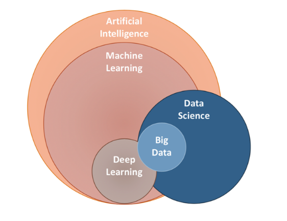

- **PDF file**：[pdf](./docs/pdf/Awesome-Road-Map.pdf)

|  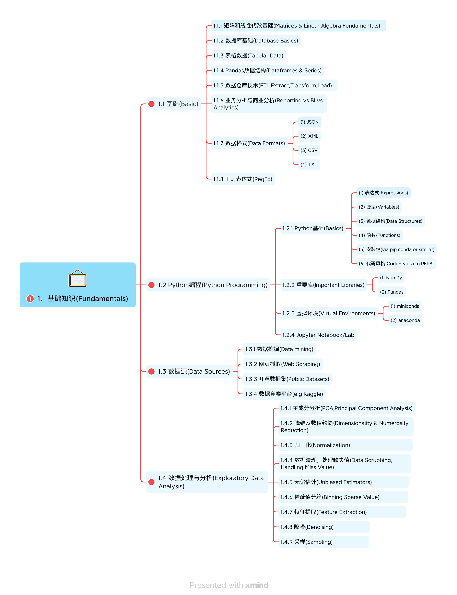   |    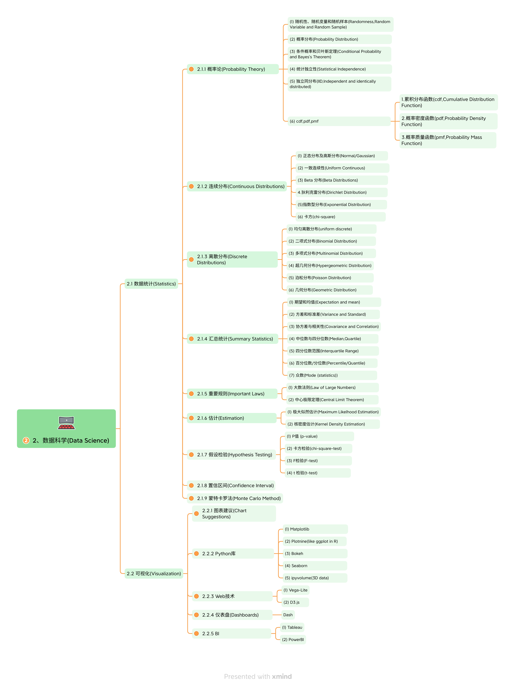    |    |
| :-----------------------------------: | :--------------------------------------: | :--------------------------------------: |
| [pdf](./docs/pdf/1.Fundamentals.pdf)  |   [pdf](./docs/pdf/2.Data_Science.pdf)   | [pdf](./docs/pdf/3.Machine_Learning.pdf) |
|    |  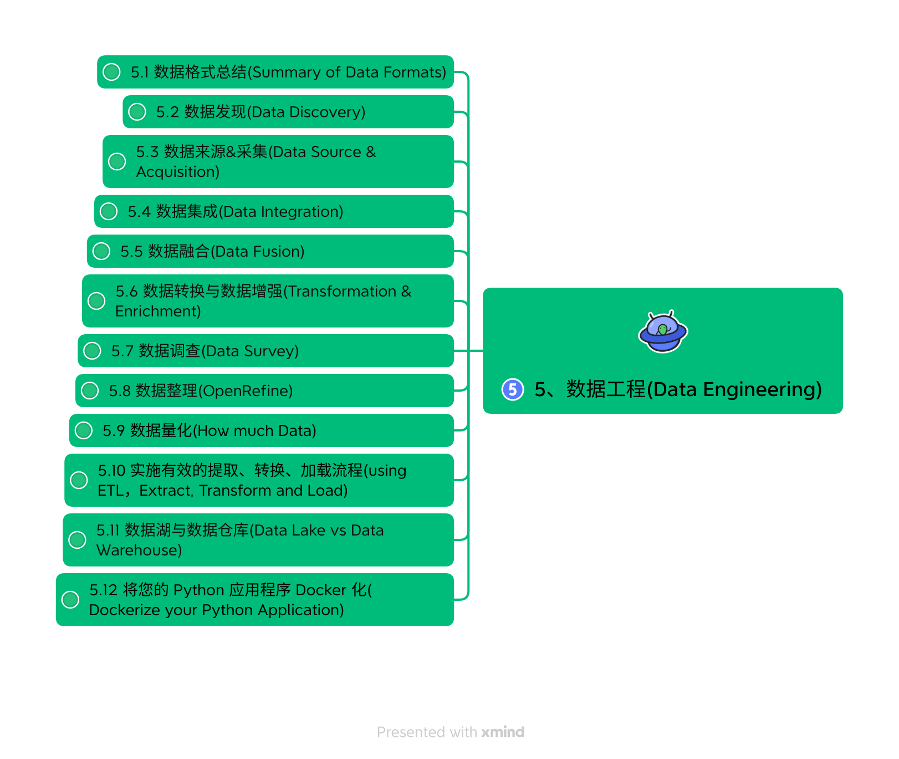  |      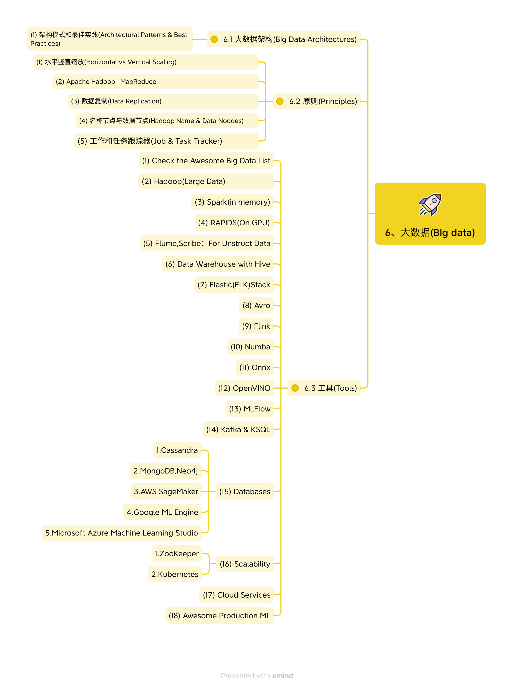      |
| [pdf](./docs/pdf/4.Deep_Learning.pdf) | [pdf](./docs/pdf/5.Data_Engineering.pdf) |     [pdf](./docs/pdf/6.Big_data.pdf)     |

---

## Microsoft

---

- https://learn.microsoft.com/zh-cn/
- https://microsoft.github.io/ai-edu/
- https://microsoft.github.io/ML-For-Beginners/#/
- https://www.coursera.org/learn/microsoft-azure-machine-learning

| Lesson Number | Topic                                                      | Lesson Grouping                                              | Learning Objectives                                          | Linked Lesson                                                | Author                    |
| ------------- | ---------------------------------------------------------- | ------------------------------------------------------------ | :----------------------------------------------------------- | ------------------------------------------------------------ | ------------------------- |
| 01            | Introduction to machine learning                           | [Introduction](https://microsoft.github.io/ML-For-Beginners/#/1-Introduction/README) | Learn the basic concepts behind machine learning             | [Lesson](https://microsoft.github.io/ML-For-Beginners/#/1-Introduction/1-intro-to-ML/README) | Muhammad                  |
| 02            | The History of machine learning                            | [Introduction](https://microsoft.github.io/ML-For-Beginners/#/1-Introduction/README) | Learn the history underlying this field                      | [Lesson](https://microsoft.github.io/ML-For-Beginners/#/1-Introduction/2-history-of-ML/README) | Jen and Amy               |
| 03            | Fairness and machine learning                              | [Introduction](https://microsoft.github.io/ML-For-Beginners/#/1-Introduction/README) | What are the important philosophical issues around fairness that students should consider when building and applying ML models? | [Lesson](https://microsoft.github.io/ML-For-Beginners/#/1-Introduction/3-fairness/README) | Tomomi                    |
| 04            | Techniques for machine learning                            | [Introduction](https://microsoft.github.io/ML-For-Beginners/#/1-Introduction/README) | What techniques do ML researchers use to build ML models?    | [Lesson](https://microsoft.github.io/ML-For-Beginners/#/1-Introduction/4-techniques-of-ML/README) | Chris and Jen             |
| 05            | Introduction to regression                                 | [Regression](https://microsoft.github.io/ML-For-Beginners/#/2-Regression/README) | Get started with Python and Scikit-learn for regression models | [Python](https://microsoft.github.io/ML-For-Beginners/#/2-Regression/1-Tools/README)[R](https://microsoft.github.io/ML-For-Beginners/#/2-Regression/1-Tools/solution/R/lesson_1-R.ipynb) | JenEric Wanjau            |
| 06            | North American pumpkin prices 🎃                            | [Regression](https://microsoft.github.io/ML-For-Beginners/#/2-Regression/README) | Visualize and clean data in preparation for ML               | [Python](https://microsoft.github.io/ML-For-Beginners/#/2-Regression/2-Data/README)[R](https://microsoft.github.io/ML-For-Beginners/#/2-Regression/2-Data/solution/R/lesson_2-R.ipynb) | JenEric Wanjau            |
| 07            | North American pumpkin prices 🎃                            | [Regression](https://microsoft.github.io/ML-For-Beginners/#/2-Regression/README) | Build linear and polynomial regression models                | [Python](https://microsoft.github.io/ML-For-Beginners/#/2-Regression/3-Linear/README)[R](https://microsoft.github.io/ML-For-Beginners/#/2-Regression/3-Linear/solution/R/lesson_3-R.ipynb) | Jen and DmitryEric Wanjau |
| 08            | North American pumpkin prices 🎃                            | [Regression](https://microsoft.github.io/ML-For-Beginners/#/2-Regression/README) | Build a logistic regression model                            | [Python](https://microsoft.github.io/ML-For-Beginners/#/2-Regression/4-Logistic/README)[R](https://microsoft.github.io/ML-For-Beginners/#/2-Regression/4-Logistic/solution/R/lesson_4-R.ipynb) | JenEric Wanjau            |
| 09            | A Web App 🔌                                                | [Web App](https://microsoft.github.io/ML-For-Beginners/#/3-Web-App/README) | Build a web app to use your trained model                    | [Python](https://microsoft.github.io/ML-For-Beginners/#/3-Web-App/1-Web-App/README) | Jen                       |
| 10            | Introduction to classification                             | [Classification](https://microsoft.github.io/ML-For-Beginners/#/4-Classification/README) | Clean, prep, and visualize your data; introduction to classification | [Python](https://microsoft.github.io/ML-For-Beginners/#/4-Classification/1-Introduction/README)[R](https://microsoft.github.io/ML-For-Beginners/#/4-Classification/1-Introduction/solution/R/lesson_10-R.ipynb) | Jen and CassieEric Wanjau |
| 11            | Delicious Asian and Indian cuisines 🍜                      | [Classification](https://microsoft.github.io/ML-For-Beginners/#/4-Classification/README) | Introduction to classifiers                                  | [Python](https://microsoft.github.io/ML-For-Beginners/#/4-Classification/2-Classifiers-1/README)[R](https://microsoft.github.io/ML-For-Beginners/#/4-Classification/2-Classifiers-1/solution/R/lesson_11-R.ipynb) | Jen and CassieEric Wanjau |
| 12            | Delicious Asian and Indian cuisines 🍜                      | [Classification](https://microsoft.github.io/ML-For-Beginners/#/4-Classification/README) | More classifiers                                             | [Python](https://microsoft.github.io/ML-For-Beginners/#/4-Classification/3-Classifiers-2/README)[R](https://microsoft.github.io/ML-For-Beginners/#/4-Classification/3-Classifiers-2/solution/R/lesson_12-R.ipynb) | Jen and CassieEric Wanjau |
| 13            | Delicious Asian and Indian cuisines 🍜                      | [Classification](https://microsoft.github.io/ML-For-Beginners/#/4-Classification/README) | Build a recommender web app using your model                 | [Python](https://microsoft.github.io/ML-For-Beginners/#/4-Classification/4-Applied/README) | Jen                       |
| 14            | Introduction to clustering                                 | [Clustering](https://microsoft.github.io/ML-For-Beginners/#/5-Clustering/README) | Clean, prep, and visualize your data; Introduction to clustering | [Python](https://microsoft.github.io/ML-For-Beginners/#/5-Clustering/1-Visualize/README)[R](https://microsoft.github.io/ML-For-Beginners/#/5-Clustering/1-Visualize/solution/R/lesson_14-R.ipynb) | JenEric Wanjau            |
| 15            | Exploring Nigerian Musical Tastes 🎧                        | [Clustering](https://microsoft.github.io/ML-For-Beginners/#/5-Clustering/README) | Explore the K-Means clustering method                        | [Python](https://microsoft.github.io/ML-For-Beginners/#/5-Clustering/2-K-Means/README)[R](https://microsoft.github.io/ML-For-Beginners/#/5-Clustering/2-K-Means/solution/R/lesson_15-R.ipynb) | JenEric Wanjau            |
| 16            | Introduction to natural language processing ☕️              | [Natural language processing](https://microsoft.github.io/ML-For-Beginners/#/6-NLP/README) | Learn the basics about NLP by building a simple bot          | [Python](https://microsoft.github.io/ML-For-Beginners/#/6-NLP/1-Introduction-to-NLP/README) | Stephen                   |
| 17            | Common NLP Tasks ☕️                                         | [Natural language processing](https://microsoft.github.io/ML-For-Beginners/#/6-NLP/README) | Deepen your NLP knowledge by understanding common tasks required when dealing with language structures | [Python](https://microsoft.github.io/ML-For-Beginners/#/6-NLP/2-Tasks/README) | Stephen                   |
| 18            | Translation and sentiment analysis ♥️                       | [Natural language processing](https://microsoft.github.io/ML-For-Beginners/#/6-NLP/README) | Translation and sentiment analysis with Jane Austen          | [Python](https://microsoft.github.io/ML-For-Beginners/#/6-NLP/3-Translation-Sentiment/README) | Stephen                   |
| 19            | Romantic hotels of Europe ♥️                                | [Natural language processing](https://microsoft.github.io/ML-For-Beginners/#/6-NLP/README) | Sentiment analysis with hotel reviews 1                      | [Python](https://microsoft.github.io/ML-For-Beginners/#/6-NLP/4-Hotel-Reviews-1/README) | Stephen                   |
| 20            | Romantic hotels of Europe ♥️                                | [Natural language processing](https://microsoft.github.io/ML-For-Beginners/#/6-NLP/README) | Sentiment analysis with hotel reviews 2                      | [Python](https://microsoft.github.io/ML-For-Beginners/#/6-NLP/5-Hotel-Reviews-2/README) | Stephen                   |
| 21            | Introduction to time series forecasting                    | [Time series](https://microsoft.github.io/ML-For-Beginners/#/7-TimeSeries/README) | Introduction to time series forecasting                      | [Python](https://microsoft.github.io/ML-For-Beginners/#/7-TimeSeries/1-Introduction/README) | Francesca                 |
| 22            | ⚡️ World Power Usage ⚡️ - time series forecasting with ARIMA | [Time series](https://microsoft.github.io/ML-For-Beginners/#/7-TimeSeries/README) | Time series forecasting with ARIMA                           | [Python](https://microsoft.github.io/ML-For-Beginners/#/7-TimeSeries/2-ARIMA/README) | Francesca                 |
| 23            | ⚡️ World Power Usage ⚡️ - time series forecasting with SVR   | [Time series](https://microsoft.github.io/ML-For-Beginners/#/7-TimeSeries/README) | Time series forecasting with Support Vector Regressor        | [Python](https://microsoft.github.io/ML-For-Beginners/#/7-TimeSeries/3-SVR/README) | Anirban                   |
| 24            | Introduction to reinforcement learning                     | [Reinforcement learning](https://microsoft.github.io/ML-For-Beginners/#/8-Reinforcement/README) | Introduction to reinforcement learning with Q-Learning       | [Python](https://microsoft.github.io/ML-For-Beginners/#/8-Reinforcement/1-QLearning/README) | Dmitry                    |
| 25            | Help Peter avoid the wolf! 🐺                               | [Reinforcement learning](https://microsoft.github.io/ML-For-Beginners/#/8-Reinforcement/README) | Reinforcement learning Gym                                   | [Python](https://microsoft.github.io/ML-For-Beginners/#/8-Reinforcement/2-Gym/README) | Dmitry                    |
| Postscript    | Real-World ML scenarios and applications                   | [ML in the Wild](https://microsoft.github.io/ML-For-Beginners/#/9-Real-World/README) | Interesting and revealing real-world applications of classical ML | [Lesson](https://microsoft.github.io/ML-For-Beginners/#/9-Real-World/1-Applications/README) | Team                      |

## Meta

---

- https://research.facebook.com/blog/

- https://research.facebook.com/blog/2018/05/the-facebook-field-guide-to-machine-learning-video-series/

- https://www.youtube.com/@FacebookAI

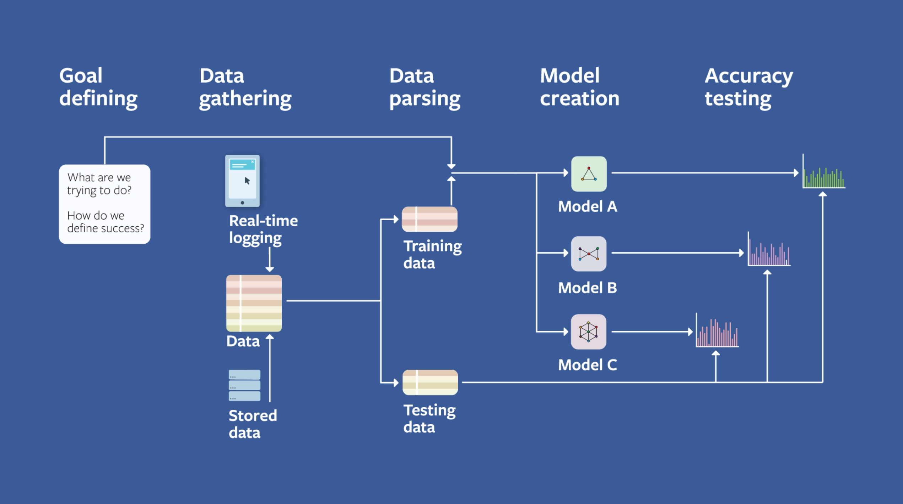

## Intel

- https://www.intel.cn/content/www/cn/zh/developer/topic-technology/artificial-intelligence/overview.html
- https://www.intel.com/content/www/us/en/developer/learn/course-machine-learning.html
- https://github.com/dohahelmy/resources-intel-edge-ai-scholarship-2020

**Learn AI theory and follow hands-on exercises with our free courses from the Intel® AI Academy for software developers, data scientists, and students. These lessons cover AI topics and explore tools and optimized libraries that take advantage of Intel® processors in personal computers and server workstations.**
From the basics of AI to graduate-level topics in technical AI theory, these courses explain the intuition and mathematics behind AI.

### 1. Machine Learning

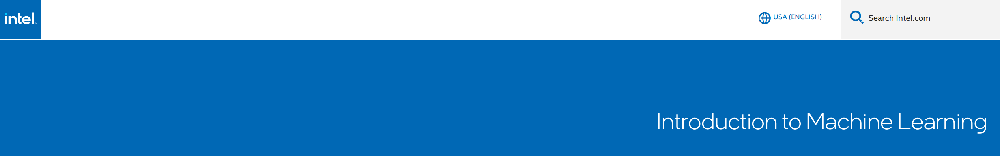

Get an overview of the fundamentals of machine learning on modern Intel® architecture. (12 weeks)
[Get Started](https://software.intel.com/content/www/us/en/develop/training/course-machine-learning.html)

### 2. Deep Learning

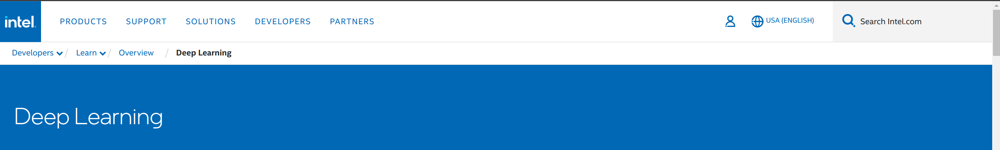

Learn the basic techniques and foundations of deep learning on modern Intel architecture. (12 weeks)
[Get Started](https://software.intel.com/content/www/us/en/develop/training/course-deep-learning.html)

### 3. Introduction to AI

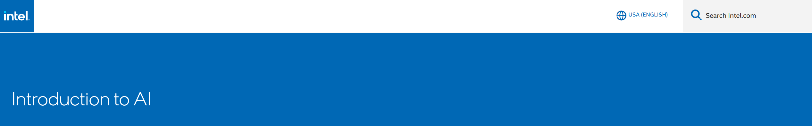

Explore the fundamentals of AI in this introductory course — without the math. (8 weeks)
[Get Started](https://software.intel.com/content/www/us/en/develop/training/course-artificial-intelligence.html)

## Google

---

- https://developers.google.com/machine-learning/crash-course?hl=zh-cn

- https://www.tensorflow.org/resources/learn-ml?hl=zh-cn

  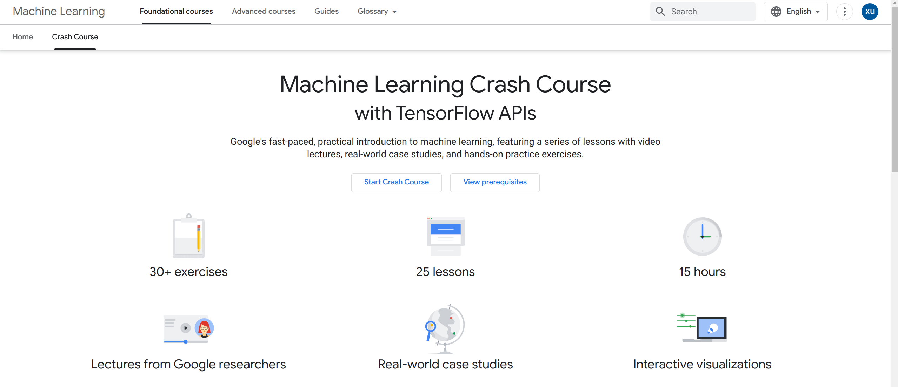

## Apple

---

- https://developer.apple.com/machine-learning/
- https://developer.apple.com/learn/curriculum/

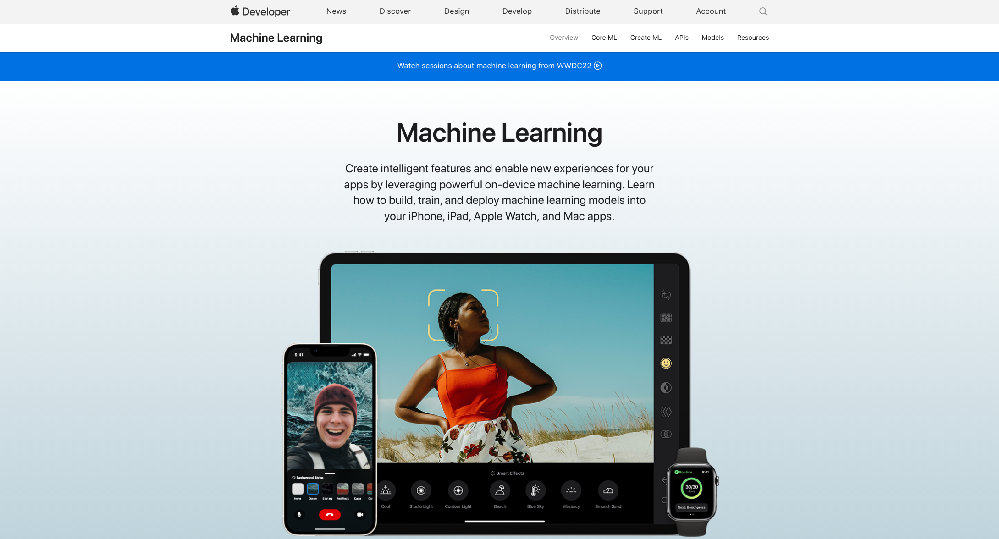

## Amazon

---

- https://aws.amazon.com/cn/training/learn-about/machine-learning/
- https://solutionsreview.com/business-intelligence/the-best-aws-machine-learning-courses/

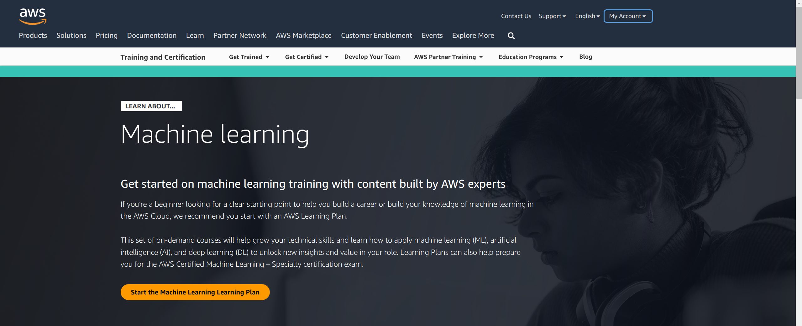

## NVIDIA

---

https://www.nvidia.com/en-us/training/online/

## Kaggle

---

- https://www.kaggle.com/general/217218
- https://www.kaggle.com/learn

| Num  |                                                              |                            Course                            |                             Desc                             | Other |
| :--: | ------------------------------------------------------------ | :----------------------------------------------------------: | :----------------------------------------------------------: | :---: |
|  1   |                      | [Intro to Programming](https://www.kaggle.com/learn/intro-to-programming) | Get starteddd with Python,if you have no coding experience.  |       |
|  2   |                                    |        [Python](https://www.kaggle.com/learn/python)         |     Learn the most important language for data science.      |       |
|  3   |                 | [Intro to Machine  Learning](https://www.kaggle.com/learn/intro-to-machine-learning) | Learn the coree ideaas in machine learrning,and build your firsst models. |       |
|  4   |                                    |        [Pandas](https://www.kaggle.com/learn/pandas)         | Solve short hands-on challenges to perfect your data manipulation skills. |       |
|  5   |             | [Intermediate Machine Learning](https://www.kaggle.com/learn/intermediate-machine-learning) | Handle missing values,non-numerrric values,data leakage,and more. |       |
|  6   |                        | [Data Visualization](https://www.kaggle.com/learn/data-visualization) | Make great data visualizations.A great way to see the power of coding! |       |
|  7   |                       | [Feature Engineering](https://www.kaggle.com/learn/feature-engineering) | Better features make better models. Discover how to get the most out of your data. |       |
|  8   |                              |  [Intro to SQL](https://www.kaggle.com/learn/intro-to-sql)   | Learn SQL for working with databases, using Google BigQuery. |       |
|  9   |                              |  [Advanced SQL](https://www.kaggle.com/learn/advanced-sql)   |           Take your SQL skills to the next level.            |       |
|  10  |                    | [Intro to Deep Learning](https://www.kaggle.com/learn/intro-to-deep-learning) | Use TensorFlow and Keras to build and train neural networks for structured data. |       |
|  11  |                           | [Computerr Vision](https://www.kaggle.com/learn/computer-vision) | Build convolutional neural networks with TensorFlow and Keras. |       |
|  12  |                               |   [Time Series](https://www.kaggle.com/learn/time-series)    |   Apply machine learning to real-world forecasting tasks.    |       |
|  13  |                             | [Data Cleaning](https://www.kaggle.com/learn/data-cleaning)  | Master efficient workflows for cleaning real-world messy data. |       |
|  14  |                        | [Intro to AI Ethics](https://www.kaggle.com/learn/intro-to-ai-ethics) | Explore practical tools to guide the moral design of AI systems. |       |
|  15  |                       | [Geospatial Analysis](https://www.kaggle.com/learn/geospatial-analysis) | Create interactive maps, and discover patterns in geospatial data. |       |
|  16  |           | [Machine Learning Explainabilty](https://www.kaggle.com/learn/machine-learning-explainability) |    Extract human-understandable insights from any model.     |       |
|  17  |  | [Intro to Game AI and Reinforcement Learning](https://www.kaggle.com/learn/intro-to-game-ai-and-reinforcement-learning) | Build your own video game bots, using classic and cutting-edge algorithms. |       |
|      |                                                              |                                                              |                                                              |       |

## HUAWEI-Cloud

---

- https://ilearningx.huawei.com/
- https://edu.huaweicloud.com/courses

| 序号 |                                  |                             课程                             | 说明                                                         | 其他 |
| :--: | -------------------------------- | :----------------------------------------------------------: | ------------------------------------------------------------ | ---- |
|  1   |  | [AI基础课程--概览](https://connect.huaweicloud.com/courses/learn/course-v1:HuaweiX+CBUCNXE072+Self-paced/about?ticket=ST-92004449-x3udUhsMjmpdm3yPdBvvWpWa-sso&locale=zh-cn) | 本课程主要介绍人工智能的概念、层次结构及发展历史，人工智能产业发展与战略规划，并探讨华为全栈全场景AI的战略。 |      |
|  2   |  | [**Python编程基础**](https://ilearningx.huawei.com/portal/courses/HuaweiX+EBGTC00000531/about) | 课程主要内容为Python编程基础。课程以实验为主，通过对Python中基础语法、数据结构、函数与对象和IO操作等帮助学员快速构建Python编程的能力。 |      |
|  3   |  | [AI基础课程--Python编程知识](https://connect.huaweicloud.com/courses/learn/course-v1:HuaweiX+CBUCNXE079+Self-paced/about?ticket=ST-91999911-hHr6ZCa5h0iYGnsNOlV2fnXB-sso&locale=zh-cn) | Python是近几年最为流行的编程语言之一，它有着优雅的语法和丰富的工具库。相比于java和C语言而言，Python的门槛更低、更加灵活易于被人读懂。 |      |
|  4   |  | [**AI 数学基础**](https://ilearningx.huawei.com/portal/micro/course-v1:HuaweiX+EBGTC00000535+microcourse/about?blockID=0852bb8d284143198398459ee2829902) | 课程主要内容为AI相关的数学基础，从理论&实验两个方面，详细介绍了线性代数、概率论、最优化问题的基础知识。 |      |
|  5   |  | [AI基础课程--数学基础知识](https://connect.huaweicloud.com/courses/learn/course-v1:HuaweiX+CBUCNXE066+Self-paced/about?ticket=ST-92003581-T3Vnt7br3DKocPyrQ3oUtUfP-sso&locale=zh-cn) | 数学基础知识蕴含着处理智能问题的基本思想和方法，是理解复杂算法的必要要素。人工智能的技术归根到底都建立在数学模型之上，想要了解人工智能必须先掌握必备的一些数学知识。 |      |
|  6   |  | [**机器学习概览**](https://ilearningx.huawei.com/portal/micro/course-v1:HuaweiX+EBGTC00000554+microcourse/about?blockID=d8166938977c4bc8b8ad0b1a592fb80a) | 通过系统全面的理论介绍、实验演示、案例分析，详细讲解了人工智能技术当前最火热的研究方向——机器学习算法的知识。 |      |
|  7   |  | [人工智能概览](https://connect.huaweicloud.com/courses/learn/course-v1:HuaweiX+CBUCNXE151+Self-paced/about) | HCIA-AI V3.0系列课程。本课程讲述了人工智能的发展历史、相关概念。 |      |
|  8   |  | [AI基础课程-机器学习概览](https://connect.huaweicloud.com/courses/learn/course-v1:HuaweiX+CBUCNXE152+Self-paced/about?ticket=ST-92001045-BmQ4krJy6XPDNZz6OCibLN7p-sso&locale=zh-cn) | HCIA-AI V3.0系列课程。机器学习（包括深度学习分支）是研究“学习算法”的一门学问，本课程讲述机器学习算法、分类、整体流程、重要概念、常见算法。 |      |
|  9   |  | [深度学习概览](https://connect.huaweicloud.com/courses/learn/course-v1:HuaweiX+CBUCNXE153+Self-paced/about?ticket=ST-92004619-dcJmH7Pgd5fQVUcuTVTv1FZe-sso&locale=zh-cn) | HCIA-AI V3.0系列课程。本课程主要讲述深度学习相关的基本知识，其中包括深度学习的发展历程、深度学习神经 网络的部件、深度学习神经网络不同的类型以及深度学习工程中常见的问题。 |      |
|  10  |  | [神经网络基础](https://connect.huaweicloud.com/courses/learn/course-v1:HuaweiX+CBUCNXE174+Self-paced/about) | HCIP-AI EI Developer V2.0系列课程。神经网络是深度学习的重要基础，理解神经网络的基本原理、优化目标与实现方法是学习后面内容的关键，这也是本课程的重点所在。 |      |
|  11  |  | [AI基础课程--概览](https://connect.huaweicloud.com/courses/learn/course-v1:HuaweiX+CBUCNXE072+Self-paced/about) | 本课程主要介绍人工智能的概念、层次结构及发展历史，人工智能产业发展与战略规划，并探讨华为全栈全场景AI的战略。 |      |
|  12  |  | [AI基础课程--常用框架工具](https://connect.huaweicloud.com/courses/learn/course-v1:HuaweiX+CBUCNXE081+Self-paced/about?ticket=ST-92002537-TwjZ6VKlCpm3BWxMzhc0OFvf-sso&locale=zh-cn) | Python作为目前最为流行的一种编程语言，拥有数十万的工具包，包含了非常多的领域，如：用于数据分析和计算的numpy、pandas；数据可视化工具matplotlib等。 |      |
|  13  |  | [AI全栈成长计划-AI基础篇](https://connect.huaweicloud.com/courses/learn/course-v1:HuaweiX+CBUCNXE130+Self-paced/about) | 本课程为AI全栈成长计划第一阶段课程：AI基础篇。本阶段您将学习到：Python语言基础，AI基础概念，并由华为AI专家带您 0 代码开发自己的第一个AI模型。 |      |
|  14  |  | [AI全栈成长计划-AI进阶篇](https://connect.huaweicloud.com/courses/learn/course-v1:HuaweiX+CBUCNXE145+Self-paced/about) | 本课程为AI全栈成长计划第二阶段课程：AI进阶篇。本阶段将由华为AI专家带您学习AI开发两大热门领域：图像分类和物体检测的模型开发，正式入门AI代码开发！ |      |
|  15  |  | [AI全栈成长计划-AI应用篇](https://connect.huaweicloud.com/courses/learn/course-v1:HuaweiX+CBUCNXE172+Self-paced/about) | 本课程为AI全栈成长计划第三阶段课程：AI应用篇。您将学习到行业深度应用的AI领域知识：OCR与NLP的概念及其模型开发 |      |
|  16  |  | [HCIA-AI V3.0 华为认证人工智能工程师在线课程](https://ilearningx.huawei.com/portal/courses/HuaweiX+EBGTC00000530/about) | 课程包含：人工智能概述、机器学习和深度学习的相关知识，业界主流开发框架的使用发方法以及华为的全栈全场景AI战略所包含的Atlas计算平台，HiAI ，EI等内容。 建议你在开始本课程前，先学习 《Python 编程基础》、《AI 数学基础》这两门课程。先夯实关于Python、AI相关的数学基础，再学习本课程，更加容易上手。 |      |
|  17  |  | [业界主流AI开发框架](https://connect.huaweicloud.com/courses/learn/course-v1:HuaweiX+CBUCNXE154+Self-paced/about?ticket=ST-92010419-DeaZJisnzZrhs2h0LXSBbygR-sso&locale=zh-cn) | HCIA-AI V3.0系列课程。本课程将主要讲述为什么是深度学习框架、深度学习框架的优势并介绍二种深度学习 框架，包括Pytorch和TensorFlow。 |      |
|  18  |  | [AI技术领域课程--机器学习](https://connect.huaweicloud.com/courses/learn/course-v1:HuaweiX+CBUCNXE086+Self-paced/about?ticket=ST-92007091-zoz72p7waaPiD5K6Wa3duhIM-sso&locale=zh-cn) | 本课程将会讲解机器学习相关算法，包括监督学习，无监督学习，集成算法等。 |      |
|  19  |  | [AI技术领域课程--深度学习](https://connect.huaweicloud.com/courses/learn/course-v1:HuaweiX+CBUCNXE088+Self-paced/about?ticket=ST-92005529-3ih6QlstCXKBmGSbtEM501DM-sso&locale=zh-cn) | 本课程将会探讨深度学习中的基础理论、算法、使用方法、技巧与不同的深度学习模型。 |      |
|  20  |  | [AI技术领域课程--图网络](https://connect.huaweicloud.com/courses/learn/course-v1:HuaweiX+CBUCNXE082+Self-paced/about?ticket=ST-92011843-iHCWmXTmmBmuEBMNe1sPySmT-sso&locale=zh-cn) | 图网络是表征学习中兴起的一个新方向，为解决逻辑推理问题带来了新的可能的方向。本课程所讲的图网络主要包含对于图嵌入的与图神经网络的介绍 |      |
|  21  |  | [AI技术应用场景--知识图谱](https://connect.huaweicloud.com/courses/learn/course-v1:HuaweiX+CBUCNXE089+Self-paced/about?ticket=ST-92012133-Ahg61DdP5Ugv9bZYpBdS7tTs-sso&locale=zh-cn) | 本课程从知识图谱的概述，知识抽取，知识表示，知识融合，知识加工和知识存放等方面对知识图谱从零到一的构建进行了全面的介绍。 |      |
|  22  |  | [AI技术领域课程--生成对抗网络](https://connect.huaweicloud.com/courses/learn/course-v1:HuaweiX+CBUCNXE085+Self-paced/about?ticket=ST-92004341-6NUNs29NLR2Svgs0ZJSViY3Q-sso&locale=zh-cn) | 生成对抗网络（Generative Adversarial Network，简称GAN）是非监督式学习的一种方法，通过让两个神经网络相互博弈的方式进行学习，迅速成为了最具前景的深度学习模型。 |      |
|  23  |  | [AI技术领域课程--强化学习](https://connect.huaweicloud.com/courses/learn/course-v1:HuaweiX+CBUCNXE073+Self-paced/about?ticket=ST-92006847-jbYUdtO5p5xamFJpHn3K9ezb-sso&locale=zh-cn) | 强化学习是机器学习中与监督学习、无监督学习、半监督学习并驾齐驱的四大算法思想之一，强化学习思想接近人类的学习过程，且在游戏、自动驾驶、电商等领域获得了极大的成功。 |      |
|      |                                  |                                                              |                                                              |      |

- https://edu.huaweicloud.com/programs

### 华为云学习路径

### 人工智能

| 序号 |                                  |                             课程                             | 说明                 | 其他 |
| :--: | -------------------------------- | :----------------------------------------------------------: | -------------------- | ---- |
|  1   |  | [AI专业学习路径](https://edu.huaweicloud.com/roadmap/Aiseries.html) | 不可错过的普惠AI课程 |      |
|  2   |  | [人工智能工程师学习路径](https://edu.huaweicloud.com/roadmap/ai-hcia.html) | HCIA-AI              |      |
|  3   |  | [企业人工智能开发高级工程师学习路径](https://edu.huaweicloud.com/roadmap/ai-ei-developer-hcip.html) | HCIP-AI EI Developer |      |
|  4   |                                  |                                                              |                      |      |

### 大数据

| 序号 |                                  |                             课程                             | 说明                      | 其他 |
| :--: | -------------------------------- | :----------------------------------------------------------: | ------------------------- | ---- |
|  1   |  | [大数据工程师学习路径](https://edu.huaweicloud.com/roadmap/bigdata-hcia.html) | HCIA-Big Data             |      |
|  2   |  | [大数据开发高级工程师学习路径](https://edu.huaweicloud.com/roadmap/bigdatadeveloper-hcip.html) | HCIP-Big Data Development |      |
|  3   |  | [数据仓库高级工程师学习路径](https://edu.huaweicloud.com/roadmap/olap-gaussdb-hcip.html) | HCIP-GaussDB-OLAP         |      |
|  4   |                                  |                                                              |                           |      |

### 物联网

| 序号 |                                  |                             课程                             | 说明 | 其他 |
| :--: | -------------------------------- | :----------------------------------------------------------: | ---- | ---- |
|  1   |  | [物联网高级开发工程师学习路径](https://edu.huaweicloud.com/roadmap/iotdeveloper-hcip.html) |      |      |
|  2   |  | [物联网工程师学习路径](https://edu.huaweicloud.com/roadmap/iot-hcia.html) |      |      |

## HUAWEI-Mindspore

- https://www.mindspore.cn/resources/courses

| 序号 |                               | 阶段 |                             课程                             | 说明                                                         | 其他 |
| :--: | :---------------------------: | :--: | :----------------------------------------------------------: | ------------------------------------------------------------ | ---- |
|  1   |  | 初级 | [MindSpore入门学习](https://www.mindspore.cn/resources/courses/list?id=47) | 课程从基本数字识别到张量、数据处理、创建网络、模型创建等，全方位助力新手入门，让您一小时上手MindSpore！(共1个系列9节课) |      |
|  2   |  | 中级 | [进阶教程](https://www.mindspore.cn/resources/courses/list?id=48#title124) | 本次进阶课程中基于基础课程知识的学习，进一步介绍了线性拟合、数据处理、网络构建和数据评估等四个方面的知识，带你深入了解MindSpore~(共4个系列21节课) |      |
|  3   |  | 中级 | [深度学习理论](https://www.mindspore.cn/resources/courses/list?id=48#title57) | 本课程是一门侧重在深度学习相关理论基础的课程，并对深度学习的典型模型框架的基本原理进行了介绍。(共1个系列15节课) |      |
|  4   |  | 中级 | [实例讲解](https://www.mindspore.cn/resources/courses/list?id=48#title120) | 本课程通过多种实例演示MindSpore实践和使用方法(共1个系列6节课) |      |
|  5   |  | 高级 | [UCL汪军教授课程](https://www.mindspore.cn/resources/courses/list?id=49#title87) | 汪军，伦敦大学学院(UCL)计算机系教授，阿兰·图灵研究所 Turing Fellow，华为诺亚方舟实验室决策推理首席顾问。(共1个系列48节课) |      |
|  6   |  | 其他 | [在线公开课](https://www.mindspore.cn/resources/courses/list?id=50#title54) | 免费开课，主题讲解，在线答疑，项目实践。(共2个系列12节课)    |      |
|  7   |  | 其他 | [两日集训营](https://www.mindspore.cn/resources/courses/list?id=50#title55) | 结合新版本发布特性，讲解实践流程，不定期开课。(共7个系列38节课) |      |
|      |                               |      |                                                              |                                                              |      |
|      |                               |      |                                                              |                                                              |      |

## Baidu-PaddlePaddle

---

- https://aistudio.baidu.com/aistudio/learnmap

### 1、新手入门

| 序号 |                            |   阶段   |                             课程                             | 说明                                                         | 其他 |
| :--: | :------------------------: | :------: | :----------------------------------------------------------: | ------------------------------------------------------------ | ---- |
|  1   |  | 新手入门 | [Python小白从入门到精通](https://aistudio.baidu.com/aistudio/course/introduce/25763) | 本课程主要面向编程零基础，希望掌握Python编程、希望掌握AI思想、数据智能思想的学习者。 |      |
|  2   |  | 新手入门 | [Python小白逆袭大神](https://aistudio.baidu.com/aistudio/course/introduce/1224) | 由中科院一线精英教师团队为大家实力讲解从Python进入人工智能领域，让Python小白快速逆袭AI大神！。 |      |
|  3   |  | 新手入门 | [百度飞桨领航团-零基础Python速成营](https://aistudio.baidu.com/aistudio/course/introduce/7073) | 全覆盖Python知识点、配合项目实战、全程社群答疑，带你吃透Python语言、学透深度学习前置知识点 |      |
|  4   |  | 新手入门 | [数据准备和特征工程](https://aistudio.baidu.com/aistudio/course/introduce/1337) | 本课程是与《数据准备和特征工程》一书配套的公开课。学习者可以参考书上的详细说明，并配合本课程的视频及代码进行学习。 |      |
|  5   |  | 新手入门 | [Python数据分析-案例教程](https://aistudio.baidu.com/aistudio/course/introduce/25741) | 本书从python基础到扩展库，从编程到数据分析，再到机器学习和深度学习，循序渐进，逐步推进知识点的实际应用。首先简要介绍数据分析相关概念和Python基础知识，然后按照数据分析的主要步骤，重点介绍数据获取、数据预处理、数据分析、数据可视化以及机器学习过程相关的扩展库，包括beutifulsoup4、numpy、matplotlib、pandas、pyecharts和sklearn等。 |      |

### 2、初级课程

| 序号 |                                                     |   阶段   |                             课程                             | 说明                                                         | 其他 |
| :--: | :-------------------------------------------------: | :------: | :----------------------------------------------------------: | ------------------------------------------------------------ | ---- |
|  6   |  | 初级课程 | [李宏毅课程-机器学习](https://aistudio.baidu.com/aistudio/education/group/info/1978) | 由台湾大学李宏毅教授亲授的全网最新机器学习课程，手把手带你敲开人工智能世界的大门，探索AI技术的边界！ |      |
|  7   |  | 初级课程 | [人工智能导论：案例与实践](https://aistudio.baidu.com/aistudio/education/group/info/25224) | 本课程是浙江大学吴飞老师的著作《人工智能导论：模型与算法》的配套实验课程，由浙江大学计算机学院朱强老师和飞桨教材编写组共同撰写，同时也邀请了头部高校人工智能领域专家和博士生参与课程的撰写和审校。 |      |
|  8   |                           | 初级课程 | [从零入门数据竞赛](https://aistudio.baidu.com/aistudio/education/group/info/26319) | 本课程主要面向入门数据竞赛的同学，并通过课程掌握数据竞赛的基本技巧与能力，不断取得数据竞赛的成绩。 |      |
|  9   |                           | 初级课程 | [30分钟搞懂AI数据处理](https://aistudio.baidu.com/aistudio/course/introduce/26682) | 工业相机镜头如何选择、样本采集需要注意什么、数据标注如何规范……30分钟带你搞懂AI数据处理！ |      |
|  10  |                           | 初级课程 | [飞桨领航团实战速成营](https://aistudio.baidu.com/aistudio/course/introduce/16606) | 带你一周上手全流程实战产业级项目，可将项目写进简历！         |      |
|  11  |                           | 初级课程 | [飞桨领航团图像分类零基础训练营](https://aistudio.baidu.com/aistudio/course/introduce/11939) | 课程内容完全覆盖图像分类知识点，用国际头部赛事signate柠檬图像分类题目做实例，全流程实战讲解，知识学透、实战用透、学会即用！ |      |
|      |                                                     |          |                                                              |                                                              |      |
|  12  |  | 中级课程 | [李宏毅课程-机器学习进阶](https://aistudio.baidu.com/aistudio/education/group/info/1979) | 机器学习的下一步是什么？”宝可梦训练家”李宏毅为你揭秘机器学习前沿技术，玩转多元化应用场景。 |      |
|  13  |  | 中级课程 | [李宏毅课程-人类语言处理](https://aistudio.baidu.com/aistudio/course/introduce/2060) | 大热的自然语言处理就该这么学！台大教授李宏毅为你定制系统化学习课程，一步步带你掌握NLP技术。 |      |
|  14  |  | 中级课程 | [李宏毅课程-强化学习](https://aistudio.baidu.com/aistudio/course/introduce/2062) | AI机器人与人类的博弈总能擦出火花，赶快加入课程了解强化学习的奥秘，用人类的智慧探索新世纪。 |      |
|  15  |  | 中级课程 | [李宏毅课程-生成对抗网络](https://aistudio.baidu.com/aistudio/course/introduce/2061) | 想要学习热门的视频、图像特效技术，又苦于没有门路。别担心，在这里你将收获最好的生成对抗网络教程，抓紧撸起袖子”GAN”起来。 |      |
|      |                                                     |          |                                                              |                                                              |      |

### 3、计算机视觉

| 序号 |                                                     | 阶段 |                             课程                             | 说明                                                         | 其他 |
| :--: | :-------------------------------------------------: | :--: | :----------------------------------------------------------: | ------------------------------------------------------------ | ---- |
|  1   |  | 中级 | [神经网络与深度学习](https://aistudio.baidu.com/aistudio/course/introduce/25876) | 本课程为复旦大学邱锡鹏老师著作《神经网络与深度学习》（蒲公英书）的配套理论课程。飞桨配套实践实践内容请见《神经网络与深度学习：案例与实践》。 |      |
|  2   |  | 中级 | [从零开始学视觉Transformer](https://aistudio.baidu.com/aistudio/course/introduce/25102) | 论文分析+逐行coding，从零开始带你掌握视觉Transformer前沿技术。 |      |
|  3   |  | 中级 | [Transformer原理和实践系列课](https://aistudio.baidu.com/aistudio/course/introduce/24683) | Transformer原理和实践系列课                                  |      |
|  4   |  | 中级 | [目标检测之YOLO系列](https://aistudio.baidu.com/aistudio/course/introduce/27345) | 目标检测之YOLO系列，YOLOv1-v3、后YOLO时代系列                |      |
|  5   |  | 中级 | [飞桨领航团-AI达人养成营](https://aistudio.baidu.com/aistudio/course/introduce/25038) | 百度飞桨开发者技术专家（PPDE）手把手教学，带你快速入门深度学习 |      |
|  6   |  | 中级 | [飞桨领航团-实战速成营](https://aistudio.baidu.com/aistudio/course/introduce/16606) | 带你一周上手全流程实战产业级项目，可将项目写进简历！         |      |
|  7   |  | 中级 | [飞桨领航团-AI达人特训营](https://aistudio.baidu.com/aistudio/course/introduce/26207) | 通过线上课程培训+技术专家1v1项目指导，快速提升AI项目实践能力。 |      |
|  8   |                           | 中级 | [图像分割7日打卡营](https://aistudio.baidu.com/aistudio/course/introduce/1767) | 顶会论文审稿人亲自授课，从基础理论到前沿技术，配套5次实战打卡，带你入门到精通，7日攻克图像分割。 |      |
|  9   |                           | 中级 | [生成对抗网络7日打卡营](https://aistudio.baidu.com/aistudio/course/introduce/16651) | PaddlePaddle研发团队直播授课，详解多种常用 GAN 模型脉络及代码。 |      |
|  10  |                           | 中级 | [图神经网络7日打卡营](https://aistudio.baidu.com/aistudio/course/introduce/1956) | 百度PGL全球冠军团队亲自授课，7日打卡手把手教学，5大实战，带你实践图神经网络！ |      |
|  11  |                           | 中级 | [飞桨论文复现打卡营](https://aistudio.baidu.com/aistudio/course/introduce/24681) | 飞桨一线研发直播授课，框架底层到模型开发全程助攻，玩转深度学习模型复现！ |      |
|  12  |                           | 中级 | [百度顶会论文复现营第2期](https://aistudio.baidu.com/aistudio/course/introduce/21696) | 百度顶会论文复现营第2期-Vision Transformer                   |      |
|      |                                                     |      |                                                              |                                                              |      |

### 4、自然语言处理

| 序号 |                                            | 阶段 |                             课程                             | 说明                                                         | 其他 |
| :--: | :----------------------------------------: | :--: | :----------------------------------------------------------: | ------------------------------------------------------------ | ---- |
|  1   |  | 初级 | [基于深度学习的自然语言处理](https://aistudio.baidu.com/aistudio/course/introduce/24177) | 最实用NLP开源教程，12课助你掌握NLP主流技术与应用！           |      |
|  2   |                  | 初级 | [EasyDL产业系列NLP信息处理](https://aistudio.baidu.com/aistudio/course/introduce/1443) | 1-文本智能标注方案设计思路、知识密集型企业智能处理数据结构化思路，了解行业最新AI应用动态的干货内容 |      |
|  3   |                  | 初级 | [零门槛搞懂基于大模型的AIGC应用及技术要点](https://aistudio.baidu.com/aistudio/course/introduce/26723) | 7小时上车热门赛道AIGC 百度专家团队直播带学 零代码畅玩大模型  |      |
|  4   |  | 中级 | [李宏毅课程-人类语言处理](https://aistudio.baidu.com/aistudio/course/introduce/2060) | 台大教授李宏毅为你定制系统化学习课程，一步步带你掌握NLP技术。 |      |
|  5   |                  | 中级 | [PaddleNLP实战教程](https://aistudio.baidu.com/aistudio/course/introduce/25604) | 三行代码、一键预测，30分钟体验PaddleNLP11大任务              |      |
|  6   |  | 中级 | [Transformer原理和实践系列课](https://aistudio.baidu.com/aistudio/course/introduce/24683) | Transformer原理和实践系列课                                  |      |
|  7   |                  | 中级 | [AI快车道PaddleNLP系列直播课](https://aistudio.baidu.com/aistudio/course/introduce/24902) | 主要讲解PaddleNLP的最新进展、算法原理、应用方法。            |      |
|  8   |  | 高级 | [飞桨论文复现打卡营](https://aistudio.baidu.com/aistudio/course/introduce/24681) | 飞桨一线研发直播授课，框架底层到模型开发全程助攻，玩转深度学习模型复现！ |      |

### 5、推理/部署/硬件

| 序号 |                                                         | 阶段 |                             课程                             | 说明                                                         | 其他 |
| :--: | :-----------------------------------------------------: | :--: | :----------------------------------------------------------: | ------------------------------------------------------------ | ---- |
|  1   |  | 初级 | [飞桨领航团AI达人创造营](https://aistudio.baidu.com/aistudio/course/introduce/24607) | 百度飞桨领航团全新推出“AI达人创造营”，十位飞桨开发者技术专家（PPDE）手把手教大家完成项目从idea思考到部署落地的全流程实战，最终让每位参与者都有一个可以给自己简历加分的项目。 |      |
|  2   |  | 初级 | [飞桨领航团AI达人创造营第二期](https://aistudio.baidu.com/aistudio/course/introduce/25259) | 12位飞桨开发者技术专家和一线工程师手把手带你实现项目创意思考到部署落地全流程 |      |
|  3   |  | 初级 | [飞桨领航团AI达人创造营第三期](https://aistudio.baidu.com/aistudio/course/introduce/26711) | 百度飞桨将提供部署课程培训、专属导师指导、免费硬件支持、优秀项目激励大奖等丰富权益，帮助大家打通AI项目落地部署最后一公里。 |      |
|  4   |  | 初级 | [AI快车道-FastDeploy推理部署套件系列直播课](https://aistudio.baidu.com/aistudio/course/introduce/27800) | 此课程联合10大硬件公司共同打造，覆盖云边端全场景部署方式，旨在解决企业AI部署难题 |      |
|  5   |  | 初级 | [EasyDL产业应用系列英伟达专场](https://aistudio.baidu.com/aistudio/education/group/info/1441) | 1-全新技术和解决方案介绍，了解行业最新AI应用动态的干货内容 2-采用全程直播+答疑+录播回放+作业相结合的形式，“学练赛”全面加持，快速Get新技能 3-与百度和NVIDIA专家直播互动切磋交流 4-从业务解析到AI开发实战，零门槛入门到资深AI应用部署专家的必修课 |      |
|  6   |  | 初级 | [AI模型自动化压缩工具PaddleSlim](https://aistudio.baidu.com/aistudio/education/group/info/26913) | PaddleSlim推出全新自动化压缩工具（Auto Compression Toolkit, ACT），旨在通过Source-Free的方式，自动对预测模型进行压缩，压缩后模型可直接部署应用。 |      |
|  7   |  | 中级 | [2021AI快车道服务器部署课](https://aistudio.baidu.com/aistudio/course/introduce/19084) | 详细解读如何在上述各种不同GPU硬件场景下如何利用飞桨框架更便利的启用TensorRT |      |
|  8   |  | 中级 | [2021AI快车道端侧部署系列课](https://aistudio.baidu.com/aistudio/course/introduce/22690) | 百度飞桨端侧AI部署月，带你全面解析飞桨端侧部署               |      |
|  9   |  | 中级 | [使用 PaddlePaddle 与 TensorRT 完成深度学习优化与部署](https://aistudio.baidu.com/aistudio/education/group/info/27647) | 使用 PaddlePaddle 与 TensorRT 完成深度学习优化与部署         |      |
|  10  |  | 中级 | [AI快车道2020-昆仑芯片](https://aistudio.baidu.com/aistudio/education/group/info/1982) | “百度昆仑”-中国第一款云端全功能AI（人工智能）芯片，也是业内设计算力最高的AI芯片。它的运算能力比最新基于FPGA的AI加速器，性能提升了近30倍。 |      |
|  11  |  | 高级 | [深度学习框架开发指南-飞桨黑客松2.0](https://aistudio.baidu.com/aistudio/education/group/info/25520) | 全新一期飞桨黑客松系列课程，从 GitHub Git 操作开始，带你快速上手深度学习框架开发 |      |
|  12  |  | 高级 | [深度学习框架开发指南-飞桨黑客松3.0](https://aistudio.baidu.com/aistudio/education/group/info/26351) | 深度学习框架开发指南-飞桨黑客松3.0                           |      |
|  13  |  | 高级 | [深度学习开发指南——黑客松4.0](https://aistudio.baidu.com/aistudio/education/group/info/28186) | 深度学习开发指南——黑客松4.0                                  |      |

### 6、学术前沿

| 序号 |                                                   | 阶段 |                             课程                             | 说明                                                         | 其他 |
| :--: | :-----------------------------------------------: | :--: | :----------------------------------------------------------: | ------------------------------------------------------------ | ---- |
|  1   |  | 初级 | [两小时玩转大模型创意应用](https://aistudio.baidu.com/aistudio/course/introduce/26374) | 解析大模型基础知识与技术原理，手把手实践大模型创意应用。     |      |
|  2   |  | 中级 | [百度顶会论文复现营](https://aistudio.baidu.com/aistudio/course/introduce/1340) | 精选热门领域顶会论文，顶级教师团队手把手教学，帮你夯实理论基础，提升深度学习实践能力。 |      |
|  3   |  | 中级 | [百度顶会论文复现营第二期](https://aistudio.baidu.com/aistudio/course/introduce/21696) | 百度顶会论文复现营第2期-Vision Transformer                   |      |
|  4   |  | 中级 | [飞桨AI for Science流体力学公开课第一期](https://aistudio.baidu.com/aistudio/education/group/info/27926) | 百度飞桨AI for Science流体力学公开课第一期，邀请深海技术科学太湖实验室、北京航空航天大学、西湖大学等学术界开发者与飞桨的研发工程师一起分享PaddlePaddle在计算流体力学方面的支撑能力、应用套件以及典型场景，分别从深度学习神经网络模型算法、数理驱动与物理机理集合等多维度进行讲解说明。旨在帮助学员提升流体力学及科学计算相关技术能力，提升科研效率。 |      |
|  5   |  | 高级 | [从零开始学视觉Transformer](https://aistudio.baidu.com/aistudio/course/introduce/25102) | 论文分析+逐行coding，从零开始带你掌握视觉Transformer前沿技术。 |      |
|  6   |  | 高级 | [飞桨论文复现打卡营](https://aistudio.baidu.com/aistudio/course/introduce/24681) | 飞桨一线研发直播授课，框架底层到模型开发全程助攻，玩转深度学习模型复现！ |      |
|  7   |  | 高级 | [AI前沿-飞桨博士会分享](https://aistudio.baidu.com/aistudio/course/introduce/25717) | 飞桨博士会是由百度开源深度学习平台飞桨（PaddlePaddle）发起的中国深度学习技术俱乐部，旨在打造深度学习核心开发者交流圈，成员皆为博士，且具备深度学习多年研究和实践经验。此前飞桨博士会已举办多期线下沙龙，组织会员共同研讨自然语言处理（NLP）、计算机视觉（CV）、AutoDL自动深度学习建模技术、AI+科学计算等前沿技术。 |      |
|      |                                                   |      |                                                              |                                                              |      |

### 7、AI行业案例

| 序号 |                                                         |   阶段   |                             课程                             | 说明                                                         | 其他 |
| :--: | :-----------------------------------------------------: | :------: | :----------------------------------------------------------: | ------------------------------------------------------------ | ---- |
|  1   |  | 新手入门 | [EasyDL智慧零售商品销量预测方案解析](https://aistudio.baidu.com/aistudio/course/introduce/25773) | 智慧零售销量预测应用方案解析，-让零售更高效 让成本更可控-    |      |
|  2   |  | 新手入门 | [EasyDL电商UGC海量图像分类](https://aistudio.baidu.com/aistudio/course/introduce/25754) | 电商UGC数据识别应用方案解析                                  |      |
|  3   |  | 新手入门 | [人工智能技术趋势与产业发展](https://aistudio.baidu.com/aistudio/course/introduce/25789) | 分享主题演讲《人工智能技术趋势与产业发展——让强大的AI人人可用》 |      |
|  4   |  |   初级   | [零门槛搞懂基于大模型的AIGC应用及技术要点](https://aistudio.baidu.com/aistudio/course/introduce/26723) | 7小时上车热门赛道AIGC 百度专家团队直播带学 零代码畅玩大模型  |      |
|  5   |  |   初级   | [飞桨智慧金融行业系列课程](https://aistudio.baidu.com/aistudio/course/introduce/26849) | 覆盖金融行业智能风控、智能运营、智能营销、智能客服4大主流场景，10+产业实践范例 |      |
|  6   |  |   中级   | [飞桨产业实践范例库](https://aistudio.baidu.com/aistudio/education/group/info/24994) | 飞桨产业实践范例库（Industrial Applications of PaddlePaddle）为飞桨官方打造，包含智慧城市、智能制造、智慧金融、泛交通、泛互联网、智慧农业等多个领域AI典型产业应用案例投射，直达产业落地的“自动导航”。 |      |
|  7   |  |   中级   | [飞桨产业实践范例](https://aistudio.baidu.com/aistudio/course/introduce/25314) | 飞桨产业实践范例：典型产业应用案例投射，直达产业落地的“自动导航” |      |
|      |                                                         |          |                                                              |                                                              |      |

### 8、AI快车道

- https://ai.baidu.com/tech/paddle/AIfastlane

| 序号 |                                                         | 阶段 |                             课程                             | 说明                                                         | 其他 |
| :--: | :-----------------------------------------------------: | :--: | :----------------------------------------------------------: | ------------------------------------------------------------ | ---- |
|  1   |  | 初级 | [AI快车道PaddleClas系列直播课](https://aistudio.baidu.com/aistudio/education/group/info/24519) | 百度飞桨重磅推出全球首个开源图像识别系统，本次直播课不仅带大家了解「图像识别」与分类、检测的本质区别；也对度量学习、图像检索等高阶内容进行详细解析；并用三步教大家掌握图像识别系统构建的核心技术方案。 |      |
|  2   |  | 初级 | [AI快车道-**PaddleDetection**系列直播课](https://aistudio.baidu.com/aistudio/education/group/info/23670) | AI快车道PaddleDetection                                      |      |
|  3   |  | 初级 | [AI快车道-**PaddleSeg**系列直播课](https://aistudio.baidu.com/aistudio/course/introduce/24590) | 全球冠军解析产业级图像分割： ①语义分割算法及百度全新Transformer算法大揭秘； ②剖析实时人像分割技术难点，Web端超轻量模型方案+精细化分割Matting技术方案解析； ③交互式分割算法及优化技巧传授，10分钟get高效智能标注功能。 |      |
|  4   |  | 初级 | [飞桨PaddleOCR系列直播课](https://aistudio.baidu.com/aistudio/education/group/info/6758) | 该课程主要对PaddleOCR算法和模型进行深度解析，帮助开发者了解PaddleOCR最新进展。 2021年1月，PaddleOCR重磅发布数据合成工具和数据标注工具，最新升级多语言识别模型效果和PP-OCR开发体验。 2021年4月，PaddleOCR最新发版：AAAI 2021 顶会论文开源，怒刷80+多语言模型全新升级！ |      |
|  5   |  | 初级 | [AI快车道PaddleNLP系列直播课](https://aistudio.baidu.com/aistudio/education/group/info/24902) | 主要讲解PaddleNLP的最新进展、算法原理、应用方法。            |      |
|  6   |  | 初级 | [PaddleNLP实战教程](https://aistudio.baidu.com/aistudio/education/group/info/25604) | 三行代码、一键预测，30分钟体验PaddleNLP11大任务              |      |
|  7   |  | 初级 | [AI快车道-时序建模算法库PaddleTS系列直播课](https://aistudio.baidu.com/aistudio/education/group/info/27798) | PaddleTS 是一个易用的深度时序建模的Python库，它基于飞桨深度学习框架PaddlePaddle，专注业界领先的深度模型，旨在为领域专家和行业用户提供可扩展的时序建模能力和便捷易用的用户体验。 |      |
|  8   |  | 初级 | [AI快车道-遥感影像智能解译开发套件PaddleRS](https://aistudio.baidu.com/aistudio/education/group/info/27835) | AI快车道-遥感影像智能解译开发套件PaddleRS                    |      |
|  9   |  | 初级 | [AI快车道-如何在端侧高效部署AI模型](https://aistudio.baidu.com/aistudio/education/group/info/24904) | 由于端侧硬件、系统种类繁多,各种加速芯片层出不穷,端侧部署开发工作仍存在实实在在的挑战,成为开发者将AI模型真正用起来的“拦路虎”。 |      |
|  10  |  | 初级 | [AI快车道2020全国巡回课程](https://aistudio.baidu.com/aistudio/course/introduce/1958) | AI快车道：10000家企业AI即学即用实战营，为企业一线开发者提供快速、实用的AI落地干货课程。 2020年10月启动全国巡回，从开发全流程、部署工具及昆仑芯片、目标检测、金牌推荐算法、“全能”OCR，扫清AI技术应用的一切难题。 |      |
|  11  |  | 初级 | [AI快车道- 百度BML线上课程](https://aistudio.baidu.com/aistudio/education/group/info/24674) | 本次课程基于飞桨企业版-BML全功能AI开发平台演示和实操。       |      |
|  12  |  | 初级 | [AI快车道2020-推理部署](https://aistudio.baidu.com/aistudio/education/group/info/1435) | 飞桨提供了全平台、全场景、高性能的工业级推理部署方案，覆盖服务器端、移动端、IoT嵌入式硬件、网页、小程序等多样化推理部署环境，满足各行各业AI应用快速上线的需求。 |      |
|  13  |  | 初级 | [AI快车道-深度学习加持的工业AI质检](https://aistudio.baidu.com/aistudio/education/group/info/24905) | AI快车道-深度学习加持的工业AI质检                            |      |
|  14  |  | 初级 | [AI快车道X网易云音乐案例课](https://aistudio.baidu.com/aistudio/education/group/info/14868) | 国民级音乐APP如何提升推荐效果？如何应对冷启动+稀疏性+大规模训练等挑战？图学习框架如何解决业务问题？ 让我们一起看飞桨图学习框架如何助力网易云音乐直播推荐业务 |      |
|  15  |  | 初级 | [百度AI产业应用](https://aistudio.baidu.com/aistudio/course/introduce/1561) | 百度致力于让AI技术平等赋能开发者及企业伙伴们，让AI落地各行各业。这里有交通、物流、质检、安防、巡检、遥感、零售、医疗、教育、金融等行业实际应用场景，沉淀的产业实际经验，并提供丰富的案例实践教程，全程助力开发者产业实践落地。 |      |
|  16  |  | 中级 | [2021AI快车道服务器部署课](https://aistudio.baidu.com/aistudio/education/group/info/19084) | 详细解读如何在上述各种不同GPU硬件场景下如何利用飞桨框架更便利的启用TensorRT |      |
|  17  |  | 中级 | [2021AI快车道端侧部署系列直播课](https://aistudio.baidu.com/aistudio/education/group/info/22690) | 百度飞桨端侧AI部署月，带你全面解析飞桨端侧部署               |      |
|  18  |  | 中级 | [AI快车道-PLSC系列直播课](https://aistudio.baidu.com/aistudio/education/group/info/25103) | 人脸识别与大规模分类库核心技术深入解读                       |      |
|  19  |  | 中级 | [AI快车道-PaddleVideo](https://aistudio.baidu.com/aistudio/education/group/info/6742) | PaddleVideo最新发布：支持3000种短视频分类，搞定足球精彩动作定位等。 |      |
|  20  |  | 中级 | [AI快车道深度学习产业落地系列直播课](https://aistudio.baidu.com/aistudio/education/group/info/24531) | 深度剖析工业质检、安防及智慧城市的典型场景及经典案例，详解选型调优、高性能部署等产业难点及对应策略方案。 |      |
|  21  |  | 中级 | [智慧城市行业系列课程](https://aistudio.baidu.com/aistudio/education/group/info/25620) | 智慧城市行业系列课程                                         |      |
|  22  |  | 中级 | [AI快车道2020-昆仑芯片](https://aistudio.baidu.com/aistudio/education/group/info/1982) | “百度昆仑”-中国第一款云端全功能AI（人工智能）芯片，也是业内设计算力最高的AI芯片。它的运算能力比最新基于FPGA的AI加速器，性能提升了近30倍。 |      |
|  23  |  | 中级 | [飞桨深度学习加持的工业智能质检](https://aistudio.baidu.com/aistudio/education/group/info/15903) | 飞桨行业专家分享：工业质检典型应用场景剖析；专业技术方案解读；飞桨深度学习框架介绍。 |      |
|  24  |  | 中级 | [AI快车道-PLSC系列直播课](https://aistudio.baidu.com/aistudio/education/group/info/25103) | 人脸识别与大规模分类库核心技术深入解读                       |      |
|  25  |  | 中级 | [AI快车道-链桨直播课](https://aistudio.baidu.com/aistudio/education/group/info/25246) | AI快车道-链桨直播课                                          |      |
|      |                                                         |      |                                                              |                                                              |      |

### 9、名师课程

| 序号 |                                                         | 阶段 |                             课程                             | 说明                                                         | 其他 |
| :--: | :-----------------------------------------------------: | :--: | :----------------------------------------------------------: | ------------------------------------------------------------ | ---- |
|  1   |  | 初级 | [神经网络与深度学习：案例与实践](https://aistudio.baidu.com/aistudio/education/group/info/25793) | 本课程为复旦大学邱锡鹏老师著作《神经网络与深度学习》（蒲公英书）的配套实践课程，包括在线运行notebook和讲解视频。同名书籍《神经网络与深度学习：案例与实践》由邱锡鹏老师和飞桨教材编写组共同撰写。 |      |
|  2   |  | 初级 | [李宏毅课程-深度学习理论](https://aistudio.baidu.com/aistudio/education/group/info/2059) | 深度学习的优势在于何处？网络结构又该如何选择？带着这些问题让我们继续出发，领略深度学习的魅力。 |      |
|  3   |  | 初级 | [动手学深度学习（飞桨版）](https://aistudio.baidu.com/aistudio/education/group/info/25851) | 本课程是李沐老师《动手学深度学习》的飞桨版本，由飞桨特殊兴趣小组（PPSIG）和飞桨工程师联合打造。内容与原书籍（在线课程）保持一致，原书中的代码部分改编为飞桨实现。 |      |
|  4   |  | 初级 | [神经网络与深度学习](https://aistudio.baidu.com/aistudio/education/group/info/25876) | 本课程为复旦大学邱锡鹏老师著作《神经网络与深度学习》（蒲公英书）的配套理论课程。飞桨配套实践实践内容请见《神经网络与深度学习：案例与实践》。 |      |
|  5   |  | 初级 | [人工智能导论：案例与实践](https://aistudio.baidu.com/aistudio/education/group/info/25224) | 本课程是浙江大学吴飞老师的著作《人工智能导论：模型与算法》的配套实验课程，由浙江大学计算机学院朱强老师和飞桨教材编写组共同撰写，同时也邀请了头部高校人工智能领域专家和博士生参与课程的撰写和审校。 |      |
|  6   |  | 中级 | [李宏毅课程-机器学习进阶](https://aistudio.baidu.com/aistudio/education/group/info/1979) | 机器学习的下一步是什么？”宝可梦训练家”李宏毅为你揭秘机器学习前沿技术，玩转多元化应用场景。 |      |
|  7   |  | 中级 | [李宏毅课程-人类语言处理](https://aistudio.baidu.com/aistudio/course/introduce/2060) | 大热的自然语言处理就该这么学！台大教授李宏毅为你定制系统化学习课程，一步步带你掌握NLP技术。 |      |
|  8   |  | 中级 | [李宏毅课程-强化学习](https://aistudio.baidu.com/aistudio/education/group/info/2062) | AI机器人与人类的博弈总能擦出火花，赶快加入课程了解强化学习的奥秘，用人类的智慧探索新世纪。 |      |
|  9   |  | 中级 | [李宏毅课程-生成对抗网络](https://aistudio.baidu.com/aistudio/education/group/info/2061) | 想要学习热门的视频、图像特效技术，又苦于没有门路。别担心，在这里你将收获最好的生成对抗网络教程，抓紧撸起袖子”GAN”起来。 |      |
|      |                                                         |      |                                                              |                                                              |      |

## Baidu-Bit

- https://bit.baidu.com/index

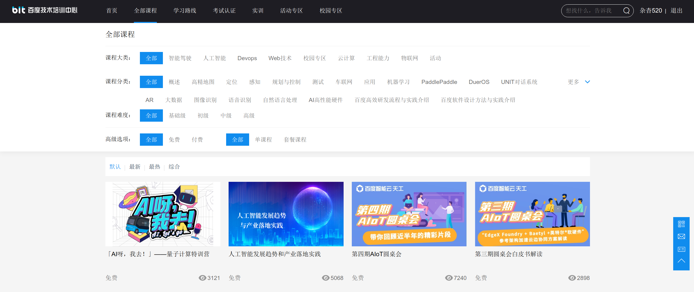

## Alibaba-TianChi

----

- https://tianchi.aliyun.com/course
- https://developer.aliyun.com/learning/course/

### 1、AI小白

| 序号 |                                                              |   阶段   |                             课程                             | 说明                                                         | 其他 |
| :--: | :----------------------------------------------------------: | :------: | :----------------------------------------------------------: | ------------------------------------------------------------ | ---- |
|  1   |                      |  AI小白  | [**天池**-入门与实践](https://tianchi.aliyun.com/course/288?spm=5176.21206777.J_3641663050.1.698717c9js5gSD) | 天池新手必备：轻松入门天池实验室、天池docker提交             |      |
|  2   |                                    |  AI小白  | [**Python**-入门与实践](https://tianchi.aliyun.com/course/308?spm=5176.21206777.J_3641663050.2.698717c9js5gSD) | 3大任务，带你开启编程人生                                    |      |
|  3   |                      |  AI小白  | [**在线编程**-入门与实践](https://tianchi.aliyun.com/course/932?spm=5176.21206777.J_3641663050.3.698717c9js5gSD) | Leetcode小白成长记：从小白到熟练刷题的必经之路               |      |
|  4   |                              |  AI小白  | [**SQL**-入门与实践](https://tianchi.aliyun.com/course/309?spm=5176.21206777.J_3641663050.4.698717c9js5gSD) | 4大任务，掌握数据分析技能                                    |      |
|  5   |                 |  AI小白  | [**机器学习**-入门与实践](https://tianchi.aliyun.com/course/310?spm=5176.21206777.J_3641663050.5.698717c9js5gSD) | 3个基础算法结合有趣场景，实现机器学习初体验                  |      |
|  6   |                    |  AI小白  | [**深度学习**-入门与实践](https://tianchi.aliyun.com/course/311?spm=5176.21206777.J_3641663050.6.698717c9js5gSD) | 3大任务，搞定CNN人脸识别                                     |      |
|  7   |  |  AI小白  | [**强化学习**-入门与实践](https://tianchi.aliyun.com/course/313?spm=5176.21206777.J_3641663050.7.698717c9js5gSD) | 4大任务，成为强化学习通关达人                                |      |
|  8   |                        |  AI小白  | [**趣味视觉AI应用**-入门与实战](https://tianchi.aliyun.com/course/336?spm=5176.21206777.J_3641663050.8.698717c9js5gSD) | 4位达摩产品、算法专家带你入门视觉AI技术                      |      |
|      |                                                              |          |                                                              |                                                              |      |

### 2、AI新手

| 序号 |                                               |   阶段   |                             课程                             | 说明                                                         | 其他 |
| :--: | :-------------------------------------------: | :------: | :----------------------------------------------------------: | ------------------------------------------------------------ | ---- |
|  9   |                     |  AI新手  | [**Python语法**](https://tianchi.aliyun.com/course/260?spm=5176.21206777.J_3641663050.9.698717c9js5gSD) | 用notebook、交互式方法，Python语法学习+实践一次搞定          |      |
|  10  |                       |  AI新手  | [**AI数学基础**](https://tianchi.aliyun.com/course/277?spm=5176.21206777.J_3641663050.10.698717c9js5gSD) | 一次点出人工智能需要的线性代数、微积分、概率论等数学知识     |      |
|  11  |                     |  AI新手  | [**Pytorch实战**](https://tianchi.aliyun.com/course/337?spm=5176.21206777.J_3641663050.11.698717c9js5gSD) | 边看边实践，一站式搞定Pytorch                                |      |
|  12  |  |  AI新手  | [**机器学习**-原理与实践](https://tianchi.aliyun.com/course/278?spm=5176.21206777.J_3641663050.12.698717c9js5gSD) | 告诉你什么是机器学习，如何玩转机器学习                       |      |
|  13  |     |  AI新手  | [**深度学习**-原理与实践](https://tianchi.aliyun.com/course/279?spm=5176.21206777.J_3641663050.13.698717c9js5gSD) | 告诉你深度学习的历史和应用，带你实践深度学习算法             |      |
|  14  |                     |  AI新手  | [**数据挖掘**-入门与实践](https://tianchi.aliyun.com/course/314?spm=5176.21206777.J_3641663050.14.698717c9js5gSD) | 学、练、赛模式带你轻松入门数据挖掘                           |      |
|  15  |            |  AI新手  | [**计算机视觉**-入门与实践](https://tianchi.aliyun.com/course/315?spm=5176.21206777.J_3641663050.15.698717c9js5gSD) | 学、练、赛模式带你轻松入门计算机视觉                         |      |
|  16  |                     |  AI新手  | [**自然语言处理**-入门与实践](https://tianchi.aliyun.com/course/316?spm=5176.21206777.J_3641663050.16.698717c9js5gSD) | 学、练、赛模式带你轻松入门自然语言处理                       |      |
|  17  |                   |  AI新手  | [**金融风控**-入门与实践](https://tianchi.aliyun.com/course/317?spm=5176.21206777.J_3641663050.17.698717c9js5gSD) | 学、练、赛模式带你轻松入门金融风控                           |      |
|      |                                               |          |                                                              |                                                             |      |

### 3、AI工程师

| 序号 |                                        |   阶段   |                             课程                             | 说明                                                         | 其他 |
| :--: | :------------------------------------: | :------: | :----------------------------------------------------------: | ------------------------------------------------------------ | ---- |
|  18  |              | AI工程师 | [**数据挖掘类**-比赛](https://tianchi.aliyun.com/course/322?spm=5176.21206777.J_3641663050.18.698717c9js5gSD) | 汇总了天池平台**数据挖掘类**相关的大赛视频，包括专家分享、决赛答辩、颁奖 |      |
|  19  |              | AI工程师 | [**自然语言处理类**-比赛](https://tianchi.aliyun.com/course/318?spm=5176.21206777.J_3641663050.19.698717c9js5gSD) | 汇总了天池平台**自然语言类**相关的大赛视频，包括专家分享、决赛答辩、颁奖 |      |
|  20  |     | AI工程师 | [**计算机视觉类**-比赛](https://tianchi.aliyun.com/course/319?spm=5176.21206777.J_3641663050.20.698717c9js5gSD) | 汇总了天池平台**计算机视觉类**相关的大赛视频，包括专家分享、决赛答辩、颁奖 |      |
|  21  |              | AI工程师 | [**程序设计类**-比赛](https://tianchi.aliyun.com/course/320?spm=5176.21206777.J_3641663050.21.698717c9js5gSD) | 汇总了天池平台**程序设计类**相关的大赛视频，包括专家分享、决赛答辩、颁奖 |      |
|  22  |  | AI工程师 | [**创新应用类**-比赛](https://tianchi.aliyun.com/course/321?spm=5176.21206777.J_3641663050.22.698717c9js5gSD) | 汇总了天池平台**创新应用类**相关的大赛视频，包括专家分享、决赛答辩、颁奖 |      |
|  23  |                                        |          |                                                              |                                                              |      |

### 4、AI科学家

| 序号 |                                               |   阶段   |                             课程                             | 说明                                                         | 其他 |
| :--: | :-------------------------------------------: | :------: | :----------------------------------------------------------: | ------------------------------------------------------------ | ---- |
|  24  |       | AI科学家 | [AAAI2021](https://tianchi.aliyun.com/course/326?spm=5176.21206777.J_3641663050.23.698717c9js5gSD) | AAAI 2021是人工智能领域的国际顶级学术会议，历史悠久，由美国美国人工智能协会主办（Association for the Advance of Artificial Intelligence），覆盖了机器学习、视觉、NLP等人工智能多个重点领域。据悉，AAAI 2021于2月2日到2月9日在线上举办，大会一共收到9034篇论文，竞争激烈，其中有效审稿有7911篇，最终录取1692篇，接收率为21.4%。 |      |
|  25  |  | AI科学家 | [CVPR2020](https://tianchi.aliyun.com/course/307?spm=5176.21206777.J_3641663050.24.698717c9js5gSD) | 本届CVPR 2020会议共收到投稿5865篇，最终收录1470篇，接受率22%，历年最低。线上会议 CVPR2020 注册人数仍达到 7000人，其中华人占比 39.2%，阿里云支持了CVPR线上会议的中国所有访问。本届会议阿里巴巴共18篇论文被大会收录，达摩院机器视觉实验室主办RetailVision Workshop 以及Ali Product Workshop Challenge ， 比赛吸引688个队伍报名。竞赛方面，达摩院视觉智能在 DAVIS Semi-supervised Challenge和HACS ActivitNet 两项比赛中获得第一， 淘宝技术团队在Deepfashion 比赛中获得第一。 |      |
|  26  |                     | AI科学家 | [ACL2020](https://tianchi.aliyun.com/course/306?spm=5176.21206777.J_3641663050.25.698717c9js5gSD) | ACL年会是计算语言学和自然语言处理领域最重要的顶级国际会议，CCF A类会议，由计算语言学协会主办，每年举办一次。其接收的论文覆盖了对话交互系统、语义分析、摘要生成、信息抽取、问答系统、文本挖掘、机器翻译、语篇语用学、情感分析和意见挖掘、社会计算等自然语言处理领域众多研究方向。本届ACL2020阿里18篇论文被大会收录，数量国内第一，阿里线上参与会议的展示介绍NLP研究。 |      |
|  27  |     | AI科学家 | [VLDB2020](https://tianchi.aliyun.com/course/305?spm=5176.21206777.J_3641663050.26.698717c9js5gSD) | VLDB是数据库领域三大顶级会议之一，其内容范围广，思路开阔。除传统的优化器、引擎、分布式执行、事务并发控制等内容以外，还有大量的大数据处理、图数据、空间数据、文本及半结构化数据、流数据、数据挖掘和分析、众包、社交网络分析、可视化等方面的内容 。 2020年，VLDB收到750篇论文投稿，共95篇被接收，接受率不到18%（其中，PHD Workshop 13篇；Industrial Track 31篇；Demo Track 51篇）整体内容覆盖traditional database system、data analysis、data management、spatial and graph和machine leaning等领域，SQL的运用仍被多篇论文关注。整体上看，数据库领域研究呈现出两个研究热点：其一是基于新硬件特性的数据库原型系统（新硬件在多和计算、执行计划、储存架构等方面的研究）；其二是传统关系数据库技术在大数据处理平台的应用，在提高处理性能同时降低门槛。 数据库顶会VLDB 2020 中, 来自数据库产品事业部、计算平台事业部、新零售智能引擎智计算团队的13篇论文被大会收录，国内第一。 |      |
|  28  |     | AI科学家 | [EMNLP2020](https://tianchi.aliyun.com/course/304?spm=5176.21206777.J_3641663050.27.698717c9js5gSD) | EMNLP是计算语言学和自然语言处理领域顶级国际会议之一，EMNLP 2020接收的论文覆盖了对话交互系统、信息抽取、信息检索和文档分析、词法语义、语言学理论、认知建模和心理语言学、用于NLP的机器学习、机器翻译与多语言、问答、句子级语义学、情感分析和论点挖掘、文本挖掘和NLP应用、文本推理等自然语言处理领域众多研究方向。本届会议阿里巴巴被收录28篇论文，在数量上实现了突破 。 |      |
|  29  |     | AI科学家 | [ECCV2020](https://tianchi.aliyun.com/course/303?spm=5176.21206777.J_3641663050.28.698717c9js5gSD) | 2020年国际三大计算机视觉顶尖会议之一的ECCV （欧洲计算机视觉国际会议）已经在8月23日线上拉开帷幕。大会官方公布了2020年论文收录结果，2020投稿量再创新高，共5025篇有效投稿，相较上届翻了一倍多。投稿激增的同时，接收率却大幅下降，今年ECCV共接收发表文章1361篇，接收率为27%，相比上届降低近5%，其中Oral论文接收率仅为2%，堪称史上最难ECCV。 |      |
|  30  |     | AI科学家 | [NeurlPS2020](https://tianchi.aliyun.com/course/297?spm=5176.21206777.J_3641663050.29.698717c9js5gSD) | NeurIPS作为学术界、工业界公认的人工智能领域国际顶级会议，代表着当今人工智能研究的最高水平。今年，NeurIPS的论文投稿量增加了38%，共提交了12115篇论文摘要，9467篇论文，其中11%的论文被直接拒绝，最终接收论文1900篇，接收率约20.1%，创历史新低。NeurIPS 2020阿里巴巴有23篇论文被大会收录，数量刷新了阿里的记录。 |      |
|      |                                               |          |                                                              |                                                              |      |
|      |                                               |          |                                                              |                                                              |      |
|      |                                               |          |                                                              |                                                              |      |

## Alibaba-Cloud

### 1、Python学习路径

#### 第 1 章：Python 基础

| 课程列表                        | 学习效益                                                     | 视频课程                                                 | 测验                                                        | 课程内容                                                 |
| ------------------------------- | ------------------------------------------------------------ | -------------------------------------------------------- | ----------------------------------------------------------- | -------------------------------------------------------- |
| 第一讲：Python入门（一）        | Python编程语言介绍及开发环境                                 | [开始学习](https://edu.alibabacloud.com/lesson_404_2291) | [测验](https://edu.alibabacloud.com/clouder/exam/intro/475) | [课程内容](https://edu.alibabacloud.com/lesson_404_2292) |
| 第 2 讲：Python 入门（2）       | 学习Python编程的基本概念、数据结构、控制结构和基本的读写操作 | [开始学习](https://edu.alibabacloud.com/lesson_404_2293) | [测验](https://edu.alibabacloud.com/clouder/exam/intro/476) | [课程内容](https://edu.alibabacloud.com/lesson_404_2294) |
| 第 3 讲：高级 Python 编程（一） | 学习 Python 编程中错误和异常处理、字符编码、函数和变量的概念 | [开始学习](https://edu.alibabacloud.com/lesson_404_2295) | [测验](https://edu.alibabacloud.com/clouder/exam/intro/477) | [课程内容](https://edu.alibabacloud.com/lesson_404_2296) |
| 第4讲：高级Python编程（2）      | 学习Python的模块概念、面向对象编程知识、正则表达式和数据处理方法 | [开始学习](https://edu.alibabacloud.com/lesson_404_2298) | [测验](https://edu.alibabacloud.com/clouder/exam/intro/478) | [课程内容](https://edu.alibabacloud.com/lesson_404_2298) |

#### 第 2 章：使用 Python 进行 Web 开发

| 课程列表                                | 学习效益                                                     | 视频课程                                                 | 测验                                                        | 课程内容                                                 |
| --------------------------------------- | ------------------------------------------------------------ | -------------------------------------------------------- | ----------------------------------------------------------- | -------------------------------------------------------- |
| 第 1 讲：Web 开发基础                   | WEB开发常识介绍，学习前端开发框架基础和后端开发基础          | [开始学习](https://edu.alibabacloud.com/lesson_405_2299) | [测验](https://edu.alibabacloud.com/clouder/exam/intro/479) | [课程内容](https://edu.alibabacloud.com/lesson_405_2300) |
| 第2讲：数据库操作基础                   | 关系型数据库基础知识介绍，学习SQL语法，MySQL和PostgreSQL数据库基础知识 | [开始学习](https://edu.alibabacloud.com/lesson_405_2301) | [测验](https://edu.alibabacloud.com/clouder/exam/intro/480) | [课程内容](https://edu.alibabacloud.com/lesson_405_2302) |
| 第 3 讲：ORM 框架 SQLAlchemy            | 介绍ORM的基本概念，通过实例，学习Python ORM框架SQLAIChemy的通用知识、原理和用例 | [开始学习](https://edu.alibabacloud.com/lesson_405_2332) | [测验](https://edu.alibabacloud.com/clouder/exam/intro/485) | [课程内容](https://edu.alibabacloud.com/lesson_405_2333) |
| 第 4 讲：网络安全                       | 网络安全概论，学习网络安全的主要组成部分，网络服务器、脚本语言和网络浏览器的安全；阿里云Web应用防火墙实践 | [开始学习](https://edu.alibabacloud.com/lesson_405_2334) | [测验](https://edu.alibabacloud.com/clouder/exam/intro/486) | [课程内容](https://edu.alibabacloud.com/lesson_405_2335) |
| 第 5 讲：Flask 框架                     | 介绍Flask框架的基本概念，学习Flask的安装、定义、模板应用，以及应用测试、配置管理、命令行界面和应用部署。能够利用 Flask 开发和部署项目。 | [开始学习](https://edu.alibabacloud.com/lesson_405_2342) | [测验](https://edu.alibabacloud.com/clouder/exam/intro/495) | [课程内容](https://edu.alibabacloud.com/lesson_405_2337) |
| 第 6 讲：Django 框架                    | 了解Django框架的基本概念、安装和项目，学习Django模板、模型和ORM。介绍Django中间件和视图的使用。能够使用Django构建项目。 | [开始学习](https://edu.alibabacloud.com/lesson_405_2340) | [测验](https://edu.alibabacloud.com/clouder/exam/intro/497) | [课程内容](https://edu.alibabacloud.com/lesson_405_2341) |
| 第 7 讲：在云上部署 Python Web 应用程序 | 学习将Python开源项目与GitHub同步，按照步骤在本地部署项目     | [开始学习](https://edu.alibabacloud.com/lesson_405_2394) | [测验](https://edu.alibabacloud.com/clouder/exam/intro/504) | [课程内容](https://edu.alibabacloud.com/lesson_405_2395) |

#### 第 3 章：使用 Python 进行科学计算

| 课程列表                                   | 学习效益                                                     | 视频课程                                                     | 测验                                                        | 课程内容                                                 |
| ------------------------------------------ | ------------------------------------------------------------ | ------------------------------------------------------------ | ----------------------------------------------------------- | -------------------------------------------------------- |
| 第 1 讲：Numpy、Pandas 和 Scipy 的基础知识 | 了解Python科学计算基础知识，学习Numpy、Pandas、Scipy的基本用法 | [开始学习](https://edu.alibabacloud.com/course/428/learn#lesson/2396) | [测验](https://edu.alibabacloud.com/clouder/exam/intro/505) | [课程内容](https://edu.alibabacloud.com/lesson_428_2397) |

#### 第四章：Python与网络爬虫项目

| 课程列表                                | 学习效益                                                     | 视频课程                                                 | 测验                                                        | 课程内容                                                 |
| --------------------------------------- | ------------------------------------------------------------ | -------------------------------------------------------- | ----------------------------------------------------------- | -------------------------------------------------------- |
| 第 1 讲：网络爬虫和 HTML 解析的基础知识 | 了解网络爬虫及其流程，通过学习真实的网络爬虫案例，完成地址解析、内容抓取、数据存储等各个模块，最终掌握网络爬虫技术 | [开始学习](https://edu.alibabacloud.com/lesson_432_2407) | [测验](https://edu.alibabacloud.com/clouder/exam/intro/507) | [课程内容](https://edu.alibabacloud.com/lesson_432_2408) |
| 第2讲：网络爬虫真实世界项目             | 了解网络爬虫及其流程，通过学习真实的网络爬虫案例，完成地址解析、内容抓取、数据存储等各个模块，最终掌握网络爬虫技术 | [开始学习](https://edu.alibabacloud.com/lesson_432_2409) | [测验](https://edu.alibabacloud.com/clouder/exam/intro/508) | [课程内容](https://edu.alibabacloud.com/lesson_432_2410) |

#### 第 5 章：使用 Python 进行 DevOps

| 课程列表                                | 学习效益                                         | 视频课程                                                 | 测验                                                        | 课程内容                                                     |
| --------------------------------------- | ------------------------------------------------ | -------------------------------------------------------- | ----------------------------------------------------------- | ------------------------------------------------------------ |
| 第 1 讲：使用 Python 的 DevOps 基础知识 | 将运维任务自动化，学习一些常用的自动化运维工具。 | [开始学习](https://edu.alibabacloud.com/lesson_436_2457) | [测验](https://edu.alibabacloud.com/clouder/exam/intro/523) | [课程内容](https://edu.alibabacloud.com/course/436/learn#lesson/2454) |
| 第二讲：运营编排服务                    | 利用阿里巴巴运维编排服务自动化您的运维任务。     | [开始学习](https://edu.alibabacloud.com/lesson_436_2453) | [测验](https://edu.alibabacloud.com/clouder/exam/intro/524) | [课程内容](https://edu.alibabacloud.com/lesson_436_2455)     |

### 2、人工智能学习路径

- https://edu.alibabacloud.com/learningpath/ai_learning_path

> 在本课程中，我们将从上到下回顾机器学习和人工智能。从对该领域的历史进行概述开始，然后我们继续介绍机器学习中的基本概念和过程。从那里，我们详细解释了一般机器学习和自然语言处理 (NLP) 等其他领域的常见算法。到课程结束时，学生不仅熟悉常见的算法，而且还将获得使用 TensorFlow（一种常见的开源人工智能和机器学习框架）以及人工智能机器学习平台 (PAI) 的宝贵实践经验，阿里云复杂但简单的拖放式机器学习工具。

>在本课程中，我们将向您介绍各种机器学习和人工智能材料，包括：
>- 机器学习和人工智能的早期历史
>- 常见的机器学习算法及其应用
>- 常用的深度学习工具和方法（Neural Networks、TensorFlow）
>- 自然语言处理：算法与应用
>- TensorFlow 和阿里云人工智能机器学习平台 (PAI) 的实践练习

#### 第 1 章：机器学习概述：概念和历史

| 课程列表                          | 学习目标                                       | 视频课程                                                    | 课程内容                                                 |
| --------------------------------- | ---------------------------------------------- | ----------------------------------------------------------- | -------------------------------------------------------- |
| 第 1 讲：机器学习和人工智能       | 在高层次上对机器学习和人工智能有一个简单的了解 | [开始学习](https://edu.alibabacloud.com/lesson_397_2214)    | [课程内容](https://edu.alibabacloud.com/lesson_397_2225) |
| 第 2 讲：Bacis 机器学习概念和过程 | 高层次地理解机器学习技术                       | [开始学习](https://edu.alibabacloud.com/lesson_397_2215)    | [课程内容](https://edu.alibabacloud.com/lesson_397_2226) |
| 第3讲：机器学习方法的分类         | 了解云原生的概念、本质和主流技术               | [开始学习](https://edu.alibabacloud.com/lesson_397_2216)    | [课程内容](https://edu.alibabacloud.com/lesson_397_2216) |
| 第四讲：机器学习发展史            | 了解机器学习和人工智能技术的早期历史           | [开始学习](https://edu.alibabacloud.com/lesson_397_2217)    | [课程内容](https://edu.alibabacloud.com/lesson_397_2228) |
| 测验                              | 测试整个章节并获得认证                         | [测验](https://edu.alibabacloud.com/clouder/exam/intro/460) |                                                          |

#### 第 2 章：机器学习算法简介

| 课程列表                    | 学习效益                       | 视频课程                                                    | 课程内容                                                 |
| --------------------------- | ------------------------------ | ----------------------------------------------------------- | -------------------------------------------------------- |
| 第 1 讲：感知器             | 理解感知器算法                 | [开始学习](https://edu.alibabacloud.com/lesson_398_2219)    | [课程内容](https://edu.alibabacloud.com/lesson_398_2235) |
| 第2讲：KNN（K-最近邻）      | 了解KNN算法                    | [开始学习](https://edu.alibabacloud.com/lesson_398_2220)    | [课程内容](https://edu.alibabacloud.com/lesson_398_2236) |
| 第 3 讲：朴素贝叶斯         | 了解朴素贝叶斯算法             | [开始学习](https://edu.alibabacloud.com/lesson_398_2221)    | [课程内容](https://edu.alibabacloud.com/lesson_398_2237) |
| 第 4 讲：决策树             | 了解决策树算法                 | [开始学习](https://edu.alibabacloud.com/lesson_398_2222)    | [课程内容](https://edu.alibabacloud.com/lesson_398_2238) |
| 第 5 讲：层次聚类           | 了解层次聚类算法               | [开始学习](https://edu.alibabacloud.com/lesson_398_2223)    | [课程内容](https://edu.alibabacloud.com/lesson_398_2239) |
| 第 6 讲：K 均值聚类         | 了解 K-Means 聚类算法          | [开始学习](https://edu.alibabacloud.com/lesson_398_2224)    | [课程内容](https://edu.alibabacloud.com/lesson_398_2240) |
| 第 7 讲：动手（实验室）部分 | 动手尝试一些基本的机器学习算法 | [开始学习](https://edu.alibabacloud.com/lesson_398_2241)    |                                                          |
| 测验                        | 测试整个章节并获得认证         | [测验](https://edu.alibabacloud.com/clouder/exam/intro/473) |                                                          |

#### 第 3 章：神经网络基础和深度学习

| 课程列表                      | 学习目标                                      | 视频课程                                                    | 课程内容                                                 |
| ----------------------------- | --------------------------------------------- | ----------------------------------------------------------- | -------------------------------------------------------- |
| 第 1 讲：神经网络：基本概念   | 从高层次理解神经网络                          | [开始学习](https://edu.alibabacloud.com/lesson_400_2243)    | [课程内容](https://edu.alibabacloud.com/lesson_400_2250) |
| 第 2 讲：神经网络：结构       | 从高层次理解神经网络的架构                    | [开始学习](https://edu.alibabacloud.com/lesson_400_2244)    | [课程内容](https://edu.alibabacloud.com/lesson_400_2251) |
| 第 3 讲：神经网络：优化       | 了解用于神经网络的优化算法                    | [开始学习](https://edu.alibabacloud.com/lesson_400_2245)    | [课程内容](https://edu.alibabacloud.com/lesson_400_2252) |
| 第 4 讲：深度学习：基本概念   | 了解所谓“深度学习”背后的一般思想              | [开始学习](https://edu.alibabacloud.com/lesson_400_2246)    | [课程内容](https://edu.alibabacloud.com/lesson_400_2253) |
| 第5讲：卷积神经网络及其应用   | 了解 CNN 的应用，这是最常见的神经网络类型之一 | [开始学习](https://edu.alibabacloud.com/lesson_400_2247)    | [课程内容](https://edu.alibabacloud.com/lesson_400_2254) |
| 第 6 讲：递归神经网络及其应用 | 了解 RNN 的应用                               | [开始学习](https://edu.alibabacloud.com/lesson_400_2248)    | [课程内容](https://edu.alibabacloud.com/lesson_400_2255) |
| 第 7 讲：动手实践             | 获得神经网络的动手实践                        | [开始学习](https://edu.alibabacloud.com/lesson_400_2249)    | [课程内容](https://edu.alibabacloud.com/lesson_400_2256) |
| 测验                          | 测试整个章节并获得认证                        | [测验](https://edu.alibabacloud.com/clouder/exam/intro/462) |                                                          |

#### 第 4 章：自然语言处理

| 课程列表              | 学习目标                     | 视频课程                                                    | 课程内容                                                 |
| --------------------- | ---------------------------- | ----------------------------------------------------------- | -------------------------------------------------------- |
| 第 1 讲：统计语言模型 | 了解统计语言模型             | [开始学习](https://edu.alibabacloud.com/lesson_401_2257)    | [课程内容](https://edu.alibabacloud.com/lesson_401_2264) |
| 第 2 讲：Word2Vec     | 理解 Word2Vec 模型           | [开始学习](https://edu.alibabacloud.com/lesson_401_2258)    | [课程内容](https://edu.alibabacloud.com/lesson_401_2265) |
| 第 3 讲：变压器       | 理解 Transformer 模型        | [开始学习](https://edu.alibabacloud.com/lesson_401_2259)    | [课程内容](https://edu.alibabacloud.com/lesson_401_2266) |
| 第 4 讲：BERT         | 理解BERT语言模型             | [开始学习](https://edu.alibabacloud.com/lesson_401_2260)    | [课程内容](https://edu.alibabacloud.com/lesson_401_2267) |
| 第 5 讲：情绪分析     | 了解情绪分析的基础知识       | [开始学习](https://edu.alibabacloud.com/lesson_401_2261)    | [课程内容](https://edu.alibabacloud.com/lesson_401_2268) |
| 第 6 讲：聊天机器人   | 了解智能聊天机器人的基础知识 | [开始学习](https://edu.alibabacloud.com/lesson_401_2262)    | [课程内容](https://edu.alibabacloud.com/lesson_401_2269) |
| 第 7 讲：机器翻译     | 了解机器翻译的基础知识       | [开始学习](https://edu.alibabacloud.com/lesson_401_2263)    | [课程内容](https://edu.alibabacloud.com/lesson_401_2270) |
| 测验                  | 测试整个章节并获得认证       | [测验](https://edu.alibabacloud.com/clouder/exam/intro/472) |                                                          |

#### 第 5 章：TensorFlow 简介

| 课程列表                | 学习目标                               | 视频课程                                                    | 课程内容                                                 |
| ----------------------- | -------------------------------------- | ----------------------------------------------------------- | -------------------------------------------------------- |
| 第 1 讲：架构和工作原理 | 了解 TensorFlow 的高层次工作原理       | [开始学习](https://edu.alibabacloud.com/lesson_402_2271)    | [课程内容](https://edu.alibabacloud.com/lesson_402_2275) |
| 第 2 讲：基本语法       | 理解 TensorFlow 的语法和句法           | [开始学习](https://edu.alibabacloud.com/lesson_402_2272)    | [课程内容](https://edu.alibabacloud.com/lesson_402_2276) |
| 第 3 讲：开发过程       | 了解如何设置 TensorFlow 并开始编写代码 | [开始学习](https://edu.alibabacloud.com/lesson_402_2273)    | [课程内容](https://edu.alibabacloud.com/lesson_402_2277) |
| 第四讲：机器学习发展史  | 了解神经网络模型开发的基础知识         | [开始学习](https://edu.alibabacloud.com/lesson_402_2274)    | [课程内容](https://edu.alibabacloud.com/lesson_402_2304) |
| 测验                    | 测试整个章节并获得认证                 | [测验](https://edu.alibabacloud.com/clouder/exam/intro/464) |                                                          |

#### 第6章：阿里云人工智能机器学习平台（PAI）

| 课程列表                                 | 学习目标                                  | 视频课程                                                    | 课程内容                                                 |
| ---------------------------------------- | ----------------------------------------- | ----------------------------------------------------------- | -------------------------------------------------------- |
| 第一讲：PAI简介                          | 了解 PAI 是什么以及它能做什么             | [开始学习](https://edu.alibabacloud.com/lesson_403_2284)    | [课程内容](https://edu.alibabacloud.com/lesson_403_2278) |
| 第 2 讲：使用 PAI 进行视觉（工作室）开发 | 了解如何使用PAI的可视化开发界面           | [开始学习](https://edu.alibabacloud.com/lesson_403_2285)    | [课程内容](https://edu.alibabacloud.com/lesson_403_2279) |
| 第 3 讲：使用 PAI 进行笔记本开发         | 了解如何使用 PAI 的 Jupyter notebook 界面 | [开始学习](https://edu.alibabacloud.com/lesson_403_2286)    | [课程内容](https://edu.alibabacloud.com/lesson_403_2280) |
| 第 4 讲：应用：图像分类                  | 了解如何使用 PAI 对图像进行分类           | [开始学习](https://edu.alibabacloud.com/lesson_403_2287)    | [课程内容](https://edu.alibabacloud.com/lesson_403_2281) |
| 第 5 讲：应用：情感分析                  | 了解如何使用 PAI 构建情绪分析工具         | [开始学习](https://edu.alibabacloud.com/lesson_403_2288)    | [课程内容](https://edu.alibabacloud.com/lesson_403_2282) |
| 第 6 讲：应用：产品推荐                  | 了解如何使用 PAI 构建推荐系统             | [开始学习](https://edu.alibabacloud.com/lesson_403_2289)    | [课程内容](https://edu.alibabacloud.com/lesson_403_2283) |
| 测验                                     | 测试整个章节并获得认证                    | [测验](https://edu.alibabacloud.com/clouder/exam/intro/471) |                                                          |

## Tencent-Cloud

---

- https://cloud.tencent.com/edu/learning/courses?cid=10182
- https://cloud.tencent.com/edu/learning/courses
- https://cloud.tencent.com/edu/paths/series/CODING%20DevOps

### 1、数学及AI基础

- https://cloud.tencent.com/edu/learning/courses?cid=10192

| 序号 |                                               |   阶段   |                             课程                             | 说明                                                         | 其他 |
| :--: | :-------------------------------------------: | :------: | :----------------------------------------------------------: | ------------------------------------------------------------ | ---- |
|  1   |       | 数学基础 | [5分钟一个人工智能小知识](https://cloud.tencent.com/edu/learning/course-1461-8217) | 本课程以轻松的手绘方式，讲述一些基础的AI概念。首先介绍了什么是机器学习、深度学习、神经网络、人工智能以及它们之间的关系；然后详细讲解了贝叶斯、神经网络、随机森林等概念的原理和应用，以及如何评价一个预测模型的好坏；同时，还聊到了AlphaGo、因果关系、面相等贴近生活的有趣话题。 |      |
|  2   |       | 数学基础 | [10分钟机器学习数学课](https://cloud.tencent.com/edu/learning/course-1462) | 本课程首先介绍了一阶优化法（梯度下降法）的流程，并对比讲解了需要计算二阶导数的二阶优化法（牛顿法）；接着解释了向量及其相关概念，比如：矩阵、标量、张量等；然后是神经网络，展示了4种类型神经网络的构建并讲解了它背后数学原理；接着介绍了用于发现数据中非线性和非局部的关系的降维，包括：特征选择、特征提取、主成分分析等内容；最后通过垃圾邮件分类器的案例展示了概率论在机器学习的应用，同时对比了几种模型调参的策略。 |      |
|  3   |       | 数学基础 | [人工智能数学基础](https://cloud.tencent.com/edu/learning/course-2457) | 人工智能数学基础的在线文档                                   |      |
|      |                     |  AI基础  | [Python 基础和编码规范](https://cloud.tencent.com/edu/learning/course-1109-2215) | Python是一种清晰且功能强大的、面向对象的编程语言，广泛应用于Web开发、GUI开发、科学计算等领域。 |      |
|  4   |  |  AI基础  | [【独家授权】神经网络系列课——Google Brain Hugo Larochelle](https://cloud.tencent.com/edu/learning/course-1038) | 本课程是Python语言的入门课程，首先介绍了Python语言的特点以及安装部署方式；接着依次讲解了标准数据类型、条件和循环语句、函数、异常等知识点，部分知识点的讲解辅以现场编码演示的方式进行，直观易懂；最后，讲解了一些对初学者非常重要的编码规范，比如：缩进、函数命名等。 |      |
|  5   |  |  AI基础  | [深度学习入门基础——算法工程师带你读AI圣经《Deep Learning》](https://cloud.tencent.com/edu/learning/course-1042) | 本课程首先介绍了深度学习的发展历史、优势、应用领域及其与机器学习的关系，建立整体认识；接下来从数学基础和深度学习算法两方面进行展开，数学基础部分包含线性代数、概率、信息论、数值计算、机器学习基础等内容，深度学习算法部分包含深度前馈网络、正则化、优化、卷积神经网络CNN、循环神经网络RNN等。 |      |
|  6   |  |  AI基础  | [斯坦福大学公开课CS231n:深度学习视觉识别](https://cloud.tencent.com/edu/learning/course-1039) | 本课程是斯坦福大学的CS231n深度视觉识别课程。课程从算法到公式到实践进行了全面的介绍。课程首先介绍了计算机视觉的历史，随后开始讲解图像识别中的关键算法，如k近邻算法和线性分类。课程将重点介绍卷积神经网络，从简单的神经网络和反向传播算法到卷积、池化等概念。课程将介绍神经网络训练过程中的一些细节，比如如何在建立神经网络，选择什么样的激活函数，怎样做数据预处理、权重初始化、正则化和梯度检查。课程还会介绍训练过程中的动态监控，以及怎样做参数的优化。除此之外，课程还会介绍深度学习的软件，如Caffe、Torch、Tensorflow等。课程还将进一步介绍递归神经网络，并讲解神经网络进行图像识别的原理。 |      |
|  7   |  |  AI基础  | [牛津大学xDeepMind自然语言处理](https://cloud.tencent.com/edu/learning/course-1035) | 本课程讲述了语言的计算机处理方式以及语言和人工智能的关系，是一门关于自然语言处理的高阶课程，需要有线性代数、微积分、概率论等高等数学基础以及机器学习相关的知识储备。课程内容包含：基础的机器学习和神经网络知识，比如：第一性原理、反向传播算法BP等；循环神经网络RNN、语言模型和模型的应用；运行模型的计算设备GPU以及GPU对模型的重要性；模型在翻译、语音、语言理解方面的应用等。 |      |
|      |                                               |          |                                                              |                                                              |      |

### 2、机器学习与大数据

| 序号 |                                                              |   阶段    |                             课程                             | 说明                                                         | 其他 |
| :--: | :----------------------------------------------------------: | :-------: | :----------------------------------------------------------: | ------------------------------------------------------------ | ---- |
|  1   |  | 理论基础  | [统计学习](https://cloud.tencent.com/edu/learning/course-2362) | 统计学习的在线文档                                           |      |
|  2   |  | 机器学习  | [进化算法Evolutionary Algorithms](https://cloud.tencent.com/edu/learning/course-1525) | 本课程首先介绍了进化算法的概念和范畴，并展示了一些使用进化算法实现的项目的效果；然后开始讲解第一种进化算法——遗传算法，通过句子配对、旅行商人等案例展示了遗传算法不同构造和搭配方式，同时讲解了遗传算法的进化版本——微生物遗传算法的原理；接着介绍了进化策略算法，包括它与遗传算法的异同、(1+1)-ES、Natural ES等内容；最后讲解了如何将进化算法应用到神经网络中。 |      |
|  3   |  | 机器学习  | [机器学习Scikit-Learn教学](https://cloud.tencent.com/edu/learning/course-1545) | 本课程首先简单介绍了什么是机器学习、什么是Scikit-learn以及如何安装Scikit-learn；然后讲解了如何选择合适的机器学习方法，并以iris数据集为例展示了Scikit-learn的通用学习模式，同时分享了一些有用的数据集及其用法；接着是Scikit-learn模型的讲解，包括其常用属性和功能；最后结合案例详细讲解了如何进行数据标准化，以及如何通过交叉验证选择合适的模型。 |      |
|  4   |  | 机器学习  | [Xgboost使用指南](https://cloud.tencent.com/edu/learning/course-2414) | Xgboost 使用指南(在线文档)                                   |      |
|  5   |  | 机器学习  | [LightGBM使用指南](https://cloud.tencent.com/edu/learning/course-2439) | LightGBM 使用指南(在线文档)                                  |      |
|  6   |  | 机器学习  | [Pytorch tutorials神经网络](https://cloud.tencent.com/edu/learning/course-1529) | 本课程首先介绍了什么是PyTorch以及如何安装它，接着讲解了PyTorch神经网络相关的基础知识，比如：变量、激励函数等；然后展示了如何建造神经网络，包括回归和分类两种类型；接着讲解了一些高级神经网络结构，包括卷积神经网络CNN、循环神经网络RNN、自编码AutoEncoder、DQN加强学习、生成对抗网络GAN等，并给出了具体的实现案例；最后是PyTorch相关的高阶内容，包括：GPU加速运算、过拟合及缓解、批标准化等。 |      |
|  7   |  | 机器学习  | [知乎KOL阿萨姆：机器学习实践经验分享](https://cloud.tencent.com/edu/learning/course-1041-822) | 本课程围绕机器学习的实践展开，首先分享了一些使用机器学习的经验和建议，包含确定最小预测单元、确定最优框架、依赖性分析、从回归到分类、舍弃和切分数据等；然后详细讲解了如何选择并处理数据、如何选择和评估模型、如何进行模型调试和提升，并对每个主题给出了相应的流程或建议；最后对一些常见的问题做了解释，比如如何快速掌握机器学习基础知识、TensorFlow对普通机器学习使用者的意义、神经网络是否可以代替据册数模型等。 |      |
|  8   |  | 强化学习  | [强化学习(Reinforcement Learning)Python教学](https://cloud.tencent.com/edu/learning/course-1527) | 本课程首先介绍了什么是强化学习，并展示了使用强化学习可以实现的效果；然后结合具体案例分别展示了Q Learning、Sarsa、将Q Learining优势与神经网络结合的DQN、Policy Gradients等算法的原理和实现，一般包含算法更新和思维决策两个环节；最后，扩展讲解了Actor Critic、DDPG、A3C、PPO/DPPO等强化学习算法。 |      |
|  9   |  |  大数据   | [快速上手Greenplum系列课程-Greenplum 的介绍、安装与部署](https://cloud.tencent.com/edu/learning/course-2840-53907) | 快速上手 Greenplum 系列课程之一Greenplum 的介绍、安装与部署  |      |
|  10  |  |  大数据   | [快速上手Greenplum系列课程-Greenplum生态与工具](https://cloud.tencent.com/edu/learning/course-3118-56023) | 快速上手Greenplum系列课程-生态与工具                         |      |
|  11  |  |  大数据   | [快速上手Greenplum系列课程-Greenplum备份、安全与高可用](https://cloud.tencent.com/edu/learning/course-2968-55172) | 快速上手Greenplum系列课程-Greenplum备份、安全与高可用        |      |
|  12  |  |  大数据   | [基于 Greenplum 的机器学习算法与实践-数据分析扩展语言](https://cloud.tencent.com/edu/learning/course-2917-54797) | 本课程将讲解数据分析拓展语言，包括R语言，Python语言等，并将结合实例介绍如何利用GreenplumR, plcontainer进行Greenplum中的数据分析。 |      |
|  13  |  |  大数据   | [快速上手Greenplum系列课程-Greenplum快速调优](https://cloud.tencent.com/edu/learning/course-3271-57101) | 快速上手Greenplum系列课程-Greenplum快速调优                  |      |
|  14  |  | 大数据&ML | [基于 Greenplum 的机器学习算法与实践-机器学习的前世今生](https://cloud.tencent.com/edu/learning/course-2650-51312) | 本课程会讲解机器学习的历史发展脉络，当前进展，以及未来发展，以及机器学习需要的数学准备。 |      |
|  15  |  | 大数据&ML | [基于 Greenplum 的机器学习算法与实践-朴素贝叶斯分类](https://cloud.tencent.com/edu/learning/course-2672-51861) | 本课程将结合例子讲解朴素贝叶斯的数学原理公式，以及在Greenplum MADlib中的实现。 |      |
|  16  |  | 大数据&ML | [基于 Greenplum 的机器学习算法与实践-回归算法](https://cloud.tencent.com/edu/learning/course-2651-51319) | 本课程将介绍回归基本原理，结合MADlib介绍若干典型回归算法，包括Logistic回归，线性回归等。 |      |
|  17  |  | 大数据&ML | [基于 Greenplum 的机器学习算法与实践-图算法](https://cloud.tencent.com/edu/learning/course-2881-54262) | 本课程将结合Greenplum机器学习库MADlib介绍大数据集上的图算法。 |      |
|  18  |  | 大数据&ML | [基于 Greenplum 的机器学习算法与实践-基于树的分类](https://cloud.tencent.com/edu/learning/course-2714-52599) | 决策树（Decision Tree）是一种基本的分类与回归方法，当决策树用于分类时称为分类树，用于回归时称为回归树。本章节将讲解树的学习算法及思想，包括决策树和随机森林。 |      |
|  19  |  | 大数据&ML | [基于 Greenplum 的机器学习算法与实践-非监督学习算法](https://cloud.tencent.com/edu/learning/course-2778-53393) | 本课程将通过一系列实例介绍Greenplum机器学习库MADlib中若干无监督学习算法及其实现k-means算法和关联规则的思路和实现。 |      |
|  20  |  | 大数据&ML | [基于 Greenplum 的机器学习算法与实践-支持向量机](https://cloud.tencent.com/edu/learning/course-2754-53285) | 本课程将介绍 Greenplum 机器学习库 MADlib 中的 SVM 回归算法。 |      |
|  21  |  | 大数据&ML | [基于 Greenplum 的机器学习算法与实践-时间序列经典算法](https://cloud.tencent.com/edu/learning/course-2839-53897) | 本课程将结合实例 Greenplum 机器学习库 MADlib 介绍基于时间序列的分析 ARIMA。 |      |
|  22  |  | 大数据&ML | [基于 Greenplum 的机器学习算法与实践-人工神经网路与深度学习](https://cloud.tencent.com/edu/learning/course-2838-53884) | 本课程将理论加实例介绍 Keras 及图片预处理。                  |      |
|      |                                                              |           |                                                              |                                                              |      |
|      |                                                              |           |                                                              |                                                              |      |

### 3、深度学习

| 序号 |                                                              |   阶段   |                             课程                             | 说明                                                         | 其他 |
| :--: | :----------------------------------------------------------: | :------: | :----------------------------------------------------------: | ------------------------------------------------------------ | ---- |
|  1   |  | 深度学习 | [硅谷技术大牛Siraj带你入门深度学习](https://cloud.tencent.com/edu/learning/course-1040) | 本课程首先讲解了机器学习、神经网络和深度学习的概念和关系，并展示了如何利用监督学习实现根据大脑重量预测其对应体重；然后介绍了神经网络的架构和类型，并展示了如何使用TFLearn搭建神经网络实现电影数据情感分类器；接着讲解了一些深度学习所需要的数学知识，包含线性代数、统计学和数值计算方法等，同时还讲解了数据集预处理的流程和方法；最后展示了几个有趣的案例，比如图像分类器、股市变动预测、艺术作品和音乐生成等。 |      |
|  2   |  | 深度学习 | [麻省理工学院公开课6.S094：深度学习与自动驾驶](https://cloud.tencent.com/edu/learning/course-1034) | 本课程将介绍一些深度学习的方法，比如卷积神经网络CNN、循环神经网络RNN等，并学习如何利用这些方法来帮助提高自动驾驶的各个组件，包括知觉、视觉、定位、映射、控制规划、驾驶状态检测等。同时，课程中包含两个实战项目，第一个是“DeepTraffic”，它的目的是通过控制和设计神经网络的各种参数，来控制模拟小车的驾驶；第二个项目是“DeepTesla”，它的目的是使用端到端学习，将特斯拉汽车驾驶中关于前行道路的数据放入卷积神经网络，以预测汽车的转向角。 |      |
|  3   |  | 深度学习 | [Pytorch Handbook](https://cloud.tencent.com/edu/learning/course-2348) | PyTorch Handbook(在线文档)                                   |      |
|  4   |  | 深度学习 | [英特尔OpenVINO工具包新特性介绍](https://cloud.tencent.com/edu/learning/course-2731) | OpenVINO是英特尔提供的AI开源工具包，本课程将介绍深度学习的突破和基础，部署深度学习的挑战以及英特尔OpenVINO在2020年发布的2020.1和2020.2新功能特性。 |      |
|      |                                                              |          |                                                              |                                                              |      |

### 4、应用实战

- https://cloud.tencent.com/edu/learning/courses?p=1&cid=10169

## Mooc

---

- 智慧教育平台：https://higher.smartedu.cn/

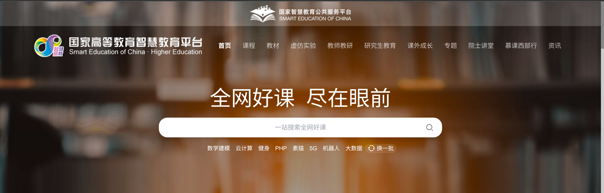

## OpenL

---

- https://openi.org.cn/course/

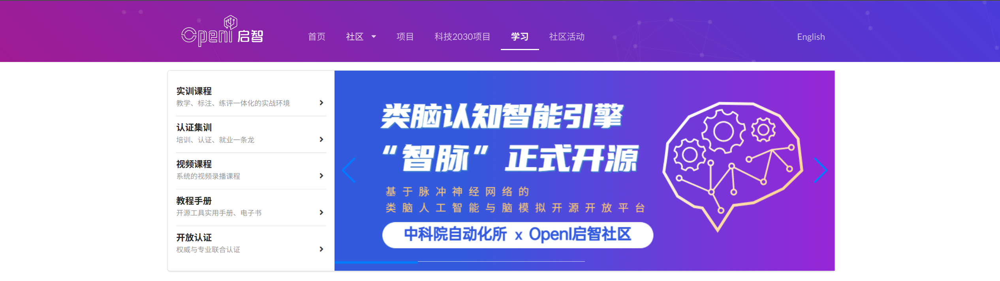

- [1].https://towardsdatascience.com/a-road-map-for-deep-learning-b9aee0b2919f
- [2].https://www.mltut.com/best-online-courses-for-machine-learning-and-data-science/
- [3].https://campus.datacamp.com/courses/
- [4].https://i.am.ai/roadmap
- [5].https://github.com/AMAI-GmbH/AI-Expert-Roadmap
- [6].https://becominghuman.ai/road-map-to-machine-learning-deep-learning-8b26fd7279bb
- [7].https://github.com/mrdbourke/machine-learning-roadmap
- [8].https://github.com/dformoso/machine-learning-mindmap
- [9].https://www.youtube.com/watch?v=pHiMN_gy9mk
- [10].https://whimsical.com/machine-learning-roadmap-2020-CA7f3ykvXpnJ9Az32vYXva
- [11].https://www.kdnuggets.com/2022/12/complete-machine-learning-study-roadmap.html
- [12].https://www.projectpro.io/article/machine-learning-learning-path/551
- [13].https://medium.datadriveninvestor.com/machine-learning-road-map-in-2022-1a856fb71bf9
- [14].https://myriadbrain.com/machine-learning-roadmap/
- [15].https://omdena.com/blog/data-science-road-map/

# Learn

---

