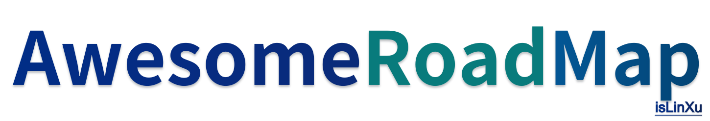

# awesome-road-map

awesome road map

[English](README.md) | [简体中文](README.zh-CN.md)

---

   
       

# Road Map

---

## Microsoft

---

- https://learn.microsoft.com/zh-cn/

## Meta(facebook)

---

- https://research.facebook.com/blog/

- https://research.facebook.com/blog/2018/05/the-facebook-field-guide-to-machine-learning-video-series/

## Intel

- https://www.intel.cn/content/www/cn/zh/developer/topic-technology/artificial-intelligence/overview.html

- https://github.com/dohahelmy/resources-intel-edge-ai-scholarship-2020

## Google

---

- https://developers.google.com/machine-learning/crash-course?hl=zh-cn

## Apple

---

- https://developer.apple.com/machine-learning/
- https://developer.apple.com/learn/curriculum/

## Amazon

---

- https://aws.amazon.com/cn/training/learn-about/machine-learning/
- https://solutionsreview.com/business-intelligence/the-best-aws-machine-learning-courses/

## NVIDIA

---

https://www.nvidia.com/en-us/training/online/

## Kaggle

---

- https://www.kaggle.com/general/217218
- https://www.kaggle.com/learn

| Num  |                                                              |                            Course                            |                             Desc                             | Other |
| :--: | ------------------------------------------------------------ | :----------------------------------------------------------: | :----------------------------------------------------------: | :---: |
|  1   |                      | [Intro to Programming](https://www.kaggle.com/learn/intro-to-programming) | Get starteddd with Python,if you have no coding experience.  |       |
|  2   |                                    |        [Python](https://www.kaggle.com/learn/python)         |     Learn the most important language for data science.      |       |
|  3   |                 | [Intro to Machine  Learning](https://www.kaggle.com/learn/intro-to-machine-learning) | Learn the coree ideaas in machine learrning,and build your firsst models. |       |
|  4   |                                    |        [Pandas](https://www.kaggle.com/learn/pandas)         | Solve short hands-on challenges to perfect your data manipulation skills. |       |
|  5   |             | [Intermediate Machine Learning](https://www.kaggle.com/learn/intermediate-machine-learning) | Handle missing values,non-numerrric values,data leakage,and more. |       |
|  6   |                        | [Data Visualization](https://www.kaggle.com/learn/data-visualization) | Make great data visualizations.A great way to see the power of coding! |       |
|  7   |                       | [Feature Engineering](https://www.kaggle.com/learn/feature-engineering) | Better features make better models. Discover how to get the most out of your data. |       |
|  8   |                              |  [Intro to SQL](https://www.kaggle.com/learn/intro-to-sql)   | Learn SQL for working with databases, using Google BigQuery. |       |
|  9   |                              |  [Advanced SQL](https://www.kaggle.com/learn/advanced-sql)   |           Take your SQL skills to the next level.            |       |
|  10  |                    | [Intro to Deep Learning](https://www.kaggle.com/learn/intro-to-deep-learning) | Use TensorFlow and Keras to build and train neural networks for structured data. |       |
|  11  |                           | [Computerr Vision](https://www.kaggle.com/learn/computer-vision) | Build convolutional neural networks with TensorFlow and Keras. |       |
|  12  |                               |   [Time Series](https://www.kaggle.com/learn/time-series)    |   Apply machine learning to real-world forecasting tasks.    |       |
|  13  |                             | [Data Cleaning](https://www.kaggle.com/learn/data-cleaning)  | Master efficient workflows for cleaning real-world messy data. |       |
|  14  |                        | [Intro to AI Ethics](https://www.kaggle.com/learn/intro-to-ai-ethics) | Explore practical tools to guide the moral design of AI systems. |       |
|  15  |                       | [Geospatial Analysis](https://www.kaggle.com/learn/geospatial-analysis) | Create interactive maps, and discover patterns in geospatial data. |       |
|  16  |           | [Machine Learning Explainabilty](https://www.kaggle.com/learn/machine-learning-explainability) |    Extract human-understandable insights from any model.     |       |
|  17  |  | [Intro to Game AI and Reinforcement Learning](https://www.kaggle.com/learn/intro-to-game-ai-and-reinforcement-learning) | Build your own video game bots, using classic and cutting-edge algorithms. |       |
|      |                                                              |                                                              |                                                              |       |

## HUAWEI

---

- https://ilearningx.huawei.com/

| 序号 |                                               |                             课程                             | 说明                                                         | 其他 |
| :--: | --------------------------------------------- | :----------------------------------------------------------: | ------------------------------------------------------------ | ---- |
|      |                                               | [AI基础课程--概览](https://connect.huaweicloud.com/courses/learn/course-v1:HuaweiX+CBUCNXE072+Self-paced/about?ticket=ST-92004449-x3udUhsMjmpdm3yPdBvvWpWa-sso&locale=zh-cn) | 本课程主要介绍人工智能的概念、层次结构及发展历史，人工智能产业发展与战略规划，并探讨华为全栈全场景AI的战略。 |      |
|      |                     | [**Python编程基础**](https://ilearningx.huawei.com/portal/courses/HuaweiX+EBGTC00000531/about) | 课程主要内容为Python编程基础。课程以实验为主，通过对Python中基础语法、数据结构、函数与对象和IO操作等帮助学员快速构建Python编程的能力。 |      |
|      |                                               | [AI基础课程--Python编程知识](https://connect.huaweicloud.com/courses/learn/course-v1:HuaweiX+CBUCNXE079+Self-paced/about?ticket=ST-91999911-hHr6ZCa5h0iYGnsNOlV2fnXB-sso&locale=zh-cn) | Python是近几年最为流行的编程语言之一，它有着优雅的语法和丰富的工具库。相比于java和C语言而言，Python的门槛更低、更加灵活易于被人读懂。 |      |
|      |                     | [**AI 数学基础**](https://ilearningx.huawei.com/portal/micro/course-v1:HuaweiX+EBGTC00000535+microcourse/about?blockID=0852bb8d284143198398459ee2829902) | 课程主要内容为AI相关的数学基础，从理论&实验两个方面，详细介绍了线性代数、概率论、最优化问题的基础知识。 |      |
|      |                                               | [AI基础课程--数学基础知识](https://connect.huaweicloud.com/courses/learn/course-v1:HuaweiX+CBUCNXE066+Self-paced/about?ticket=ST-92003581-T3Vnt7br3DKocPyrQ3oUtUfP-sso&locale=zh-cn) | 数学基础知识蕴含着处理智能问题的基本思想和方法，是理解复杂算法的必要要素。人工智能的技术归根到底都建立在数学模型之上，想要了解人工智能必须先掌握必备的一些数学知识。 |      |
|      |  | [**机器学习概览**](https://ilearningx.huawei.com/portal/micro/course-v1:HuaweiX+EBGTC00000554+microcourse/about?blockID=d8166938977c4bc8b8ad0b1a592fb80a) | 通过系统全面的理论介绍、实验演示、案例分析，详细讲解了人工智能技术当前最火热的研究方向——机器学习算法的知识。 |      |
|      |                                               | [人工智能概览](https://connect.huaweicloud.com/courses/learn/course-v1:HuaweiX+CBUCNXE151+Self-paced/about) | HCIA-AI V3.0系列课程。本课程讲述了人工智能的发展历史、相关概念。 |      |
|      |                                               | [AI基础课程-机器学习概览](https://connect.huaweicloud.com/courses/learn/course-v1:HuaweiX+CBUCNXE152+Self-paced/about?ticket=ST-92001045-BmQ4krJy6XPDNZz6OCibLN7p-sso&locale=zh-cn) | HCIA-AI V3.0系列课程。机器学习（包括深度学习分支）是研究“学习算法”的一门学问，本课程讲述机器学习算法、分类、整体流程、重要概念、常见算法。 |      |
|      |                                               | [深度学习概览](https://connect.huaweicloud.com/courses/learn/course-v1:HuaweiX+CBUCNXE153+Self-paced/about?ticket=ST-92004619-dcJmH7Pgd5fQVUcuTVTv1FZe-sso&locale=zh-cn) | HCIA-AI V3.0系列课程。本课程主要讲述深度学习相关的基本知识，其中包括深度学习的发展历程、深度学习神经 网络的部件、深度学习神经网络不同的类型以及深度学习工程中常见的问题。 |      |
|      |                                               | [神经网络基础](https://connect.huaweicloud.com/courses/learn/course-v1:HuaweiX+CBUCNXE174+Self-paced/about) | HCIP-AI EI Developer V2.0系列课程。神经网络是深度学习的重要基础，理解神经网络的基本原理、优化目标与实现方法是学习后面内容的关键，这也是本课程的重点所在。 |      |
|      |                                               | [AI基础课程--概览](https://connect.huaweicloud.com/courses/learn/course-v1:HuaweiX+CBUCNXE072+Self-paced/about) | 本课程主要介绍人工智能的概念、层次结构及发展历史，人工智能产业发展与战略规划，并探讨华为全栈全场景AI的战略。 |      |
|      |                                               | [AI基础课程--常用框架工具](https://connect.huaweicloud.com/courses/learn/course-v1:HuaweiX+CBUCNXE081+Self-paced/about?ticket=ST-92002537-TwjZ6VKlCpm3BWxMzhc0OFvf-sso&locale=zh-cn) | Python作为目前最为流行的一种编程语言，拥有数十万的工具包，包含了非常多的领域，如：用于数据分析和计算的numpy、pandas；数据可视化工具matplotlib等。 |      |
|      |                                               | [AI全栈成长计划-AI基础篇](https://connect.huaweicloud.com/courses/learn/course-v1:HuaweiX+CBUCNXE130+Self-paced/about) | 本课程为AI全栈成长计划第一阶段课程：AI基础篇。本阶段您将学习到：Python语言基础，AI基础概念，并由华为AI专家带您 0 代码开发自己的第一个AI模型。 |      |
|      |                                               | [AI全栈成长计划-AI进阶篇](https://connect.huaweicloud.com/courses/learn/course-v1:HuaweiX+CBUCNXE145+Self-paced/about) | 本课程为AI全栈成长计划第二阶段课程：AI进阶篇。本阶段将由华为AI专家带您学习AI开发两大热门领域：图像分类和物体检测的模型开发，正式入门AI代码开发！ |      |
|      |                                               | [AI全栈成长计划-AI应用篇](https://connect.huaweicloud.com/courses/learn/course-v1:HuaweiX+CBUCNXE172+Self-paced/about) | 本课程为AI全栈成长计划第三阶段课程：AI应用篇。您将学习到行业深度应用的AI领域知识：OCR与NLP的概念及其模型开发 |      |
|      |     | [HCIA-AI V3.0 华为认证人工智能工程师在线课程](https://ilearningx.huawei.com/portal/courses/HuaweiX+EBGTC00000530/about) | 课程包含：人工智能概述、机器学习和深度学习的相关知识，业界主流开发框架的使用发方法以及华为的全栈全场景AI战略所包含的Atlas计算平台，HiAI ，EI等内容。 建议你在开始本课程前，先学习 《Python 编程基础》、《AI 数学基础》这两门课程。先夯实关于Python、AI相关的数学基础，再学习本课程，更加容易上手。 |      |
|      |                                               | [业界主流AI开发框架](https://connect.huaweicloud.com/courses/learn/course-v1:HuaweiX+CBUCNXE154+Self-paced/about?ticket=ST-92010419-DeaZJisnzZrhs2h0LXSBbygR-sso&locale=zh-cn) | HCIA-AI V3.0系列课程。本课程将主要讲述为什么是深度学习框架、深度学习框架的优势并介绍二种深度学习 框架，包括Pytorch和TensorFlow。 |      |
|      |                                               | [AI技术领域课程--深度学习](https://connect.huaweicloud.com/courses/learn/course-v1:HuaweiX+CBUCNXE088+Self-paced/about?ticket=ST-92005529-3ih6QlstCXKBmGSbtEM501DM-sso&locale=zh-cn) | 本课程将会探讨深度学习中的基础理论、算法、使用方法、技巧与不同的深度学习模型。 |      |
|      |                                               |                                                              |                                                              |      |
|      |                                               |                                                              |                                                              |      |
|      |                                               |                                                              |                                                              |      |
|      |                                               |                                                              |                                                              |      |

- https://edu.huaweicloud.com/courses

## Baidu-PaddlePaddle

---

- https://aistudio.baidu.com/aistudio/learnmap

### 1、新手入门

| 序号 |                            |   阶段   |                             课程                             | 说明                                                         | 其他 |
| :--: | :------------------------: | :------: | :----------------------------------------------------------: | ------------------------------------------------------------ | ---- |
|  1   |  | 新手入门 | [Python小白从入门到精通](https://aistudio.baidu.com/aistudio/course/introduce/25763) | 本课程主要面向编程零基础，希望掌握Python编程、希望掌握AI思想、数据智能思想的学习者。 |      |
|  2   |  | 新手入门 | [Python小白逆袭大神](https://aistudio.baidu.com/aistudio/course/introduce/1224) | 由中科院一线精英教师团队为大家实力讲解从Python进入人工智能领域，让Python小白快速逆袭AI大神！。 |      |
|  3   |  | 新手入门 | [百度飞桨领航团-零基础Python速成营](https://aistudio.baidu.com/aistudio/course/introduce/7073) | 全覆盖Python知识点、配合项目实战、全程社群答疑，带你吃透Python语言、学透深度学习前置知识点 |      |
|  4   |  | 新手入门 | [数据准备和特征工程](https://aistudio.baidu.com/aistudio/course/introduce/1337) | 本课程是与《数据准备和特征工程》一书配套的公开课。学习者可以参考书上的详细说明，并配合本课程的视频及代码进行学习。 |      |
|  5   |  | 新手入门 | [Python数据分析-案例教程](https://aistudio.baidu.com/aistudio/course/introduce/25741) | 本书从python基础到扩展库，从编程到数据分析，再到机器学习和深度学习，循序渐进，逐步推进知识点的实际应用。首先简要介绍数据分析相关概念和Python基础知识，然后按照数据分析的主要步骤，重点介绍数据获取、数据预处理、数据分析、数据可视化以及机器学习过程相关的扩展库，包括beutifulsoup4、numpy、matplotlib、pandas、pyecharts和sklearn等。 |      |

### 2、初级课程

| 序号 |      |   阶段   |                             课程                             | 说明                                                         | 其他 |
| :--: | :--: | :------: | :----------------------------------------------------------: | ------------------------------------------------------------ | ---- |
|  6   |      | 初级课程 | [李宏毅课程-机器学习](https://aistudio.baidu.com/aistudio/education/group/info/1978) | 由台湾大学李宏毅教授亲授的全网最新机器学习课程，手把手带你敲开人工智能世界的大门，探索AI技术的边界！ |      |
|  7   |      | 初级课程 | [人工智能导论：案例与实践](https://aistudio.baidu.com/aistudio/education/group/info/25224) | 本课程是浙江大学吴飞老师的著作《人工智能导论：模型与算法》的配套实验课程，由浙江大学计算机学院朱强老师和飞桨教材编写组共同撰写，同时也邀请了头部高校人工智能领域专家和博士生参与课程的撰写和审校。 |      |
|  8   |      | 初级课程 | [从零入门数据竞赛](https://aistudio.baidu.com/aistudio/education/group/info/26319) | 本课程主要面向入门数据竞赛的同学，并通过课程掌握数据竞赛的基本技巧与能力，不断取得数据竞赛的成绩。 |      |
|  9   |      | 初级课程 | [30分钟搞懂AI数据处理](https://aistudio.baidu.com/aistudio/course/introduce/26682) | 工业相机镜头如何选择、样本采集需要注意什么、数据标注如何规范……30分钟带你搞懂AI数据处理！ |      |
|  10  |      | 初级课程 | [飞桨领航团实战速成营](https://aistudio.baidu.com/aistudio/course/introduce/16606) | 带你一周上手全流程实战产业级项目，可将项目写进简历！         |      |
|  11  |      | 初级课程 | [飞桨领航团图像分类零基础训练营](https://aistudio.baidu.com/aistudio/course/introduce/11939) | 课程内容完全覆盖图像分类知识点，用国际头部赛事signate柠檬图像分类题目做实例，全流程实战讲解，知识学透、实战用透、学会即用！ |      |
|      |      |          |                                                              |                                                              |      |
|  12  |      | 中级课程 | [李宏毅课程-机器学习进阶](https://aistudio.baidu.com/aistudio/education/group/info/1979) | 机器学习的下一步是什么？”宝可梦训练家”李宏毅为你揭秘机器学习前沿技术，玩转多元化应用场景。 |      |
|  13  |      | 中级课程 | [李宏毅课程-人类语言处理](https://aistudio.baidu.com/aistudio/course/introduce/2060) | 大热的自然语言处理就该这么学！台大教授李宏毅为你定制系统化学习课程，一步步带你掌握NLP技术。 |      |
|  14  |      | 中级课程 | [李宏毅课程-强化学习](https://aistudio.baidu.com/aistudio/course/introduce/2062) | AI机器人与人类的博弈总能擦出火花，赶快加入课程了解强化学习的奥秘，用人类的智慧探索新世纪。 |      |
|  15  |      | 中级课程 | [李宏毅课程-生成对抗网络](https://aistudio.baidu.com/aistudio/course/introduce/2061) | 想要学习热门的视频、图像特效技术，又苦于没有门路。别担心，在这里你将收获最好的生成对抗网络教程，抓紧撸起袖子”GAN”起来。 |      |
|      |      |          |                                                              |                                                              |      |

### 3、计算机视觉

| 序号 |      | 阶段 |                             课程                             | 说明 | 其他 |
| :--: | :--: | :--: | :----------------------------------------------------------: | ---- | ---- |
|  1   |      |      | [神经网络与深度学习](https://aistudio.baidu.com/aistudio/course/introduce/25876) |      |      |
|  2   |      |      | [从零开始学视觉Transformer](https://aistudio.baidu.com/aistudio/course/introduce/25102) |      |      |
|  3   |      |      | [Transformer原理和实践系列课](https://aistudio.baidu.com/aistudio/course/introduce/24683) |      |      |
|  4   |      |      | [目标检测之YOLO系列](https://aistudio.baidu.com/aistudio/course/introduce/27345) |      |      |
|  5   |      |      | [飞桨领航团-AI达人养成营](https://aistudio.baidu.com/aistudio/course/introduce/25038) |      |      |
|  6   |      |      | [飞桨领航团-实战速成营](https://aistudio.baidu.com/aistudio/course/introduce/16606) |      |      |
|  7   |      |      | [飞桨领航团-AI达人特训营](https://aistudio.baidu.com/aistudio/course/introduce/26207) |      |      |
|  8   |      |      | [AI快车道-**PaddleClas**系列直播课](https://aistudio.baidu.com/aistudio/course/introduce/24519) |      |      |
|  9   |      |      | [AI快车道-**PaddleDetection**系列直播课](https://aistudio.baidu.com/aistudio/education/group/info/23670) |      |      |
|  10  |      |      | [AI快车道-**PaddleSeg**系列直播课](https://aistudio.baidu.com/aistudio/course/introduce/24590) |      |      |
|  11  |      |      | [AI快车道-**PaddleOCR**系列直播课](https://aistudio.baidu.com/aistudio/education/group/info/1519) |      |      |
|  12  |      |      | [AI快车道2020-**PaddleOCR**系列直播课](https://aistudio.baidu.com/aistudio/education/group/info/1519) |      |      |
|  13  |      |      | [AI快车道-遥感影像智能解译开发套件PaddleRS](https://aistudio.baidu.com/aistudio/education/group/info/1519) |      |      |
|      |      |      | [AI快车道-**PLSC**系列直播课](https://aistudio.baidu.com/aistudio/course/introduce/25103) |      |      |
|      |      |      |                                                              |      |      |
|      |      |      |                                                              |      |      |
|      |      |      |                                                              |      |      |
|      |      |      |                                                              |      |      |
|      |      |      |                                                              |      |      |
|      |      |      |                                                              |      |      |
|      |      |      |                                                              |      |      |
|      |      |      |                                                              |      |      |
|      |      |      |                                                              |      |      |
|      |      |      |                                                              |      |      |

### 4、自然语言处理

| 序号 |      | 阶段 | 课程 | 说明 | 其他 |
| :--: | :--: | :--: | :--: | ---- | ---- |
|  1   |      |      |      |      |      |
|  2   |      |      |      |      |      |
|  3   |      |      |      |      |      |
|  4   |      |      |      |      |      |
|  5   |      |      |      |      |      |
|  6   |      |      |      |      |      |

### 5、推理/部署/硬件

| 序号 |      | 阶段 | 课程 | 说明 | 其他 |
| :--: | :--: | :--: | :--: | ---- | ---- |
|  1   |      |      |      |      |      |
|  2   |      |      |      |      |      |
|  3   |      |      |      |      |      |
|  4   |      |      |      |      |      |
|  5   |      |      |      |      |      |
|  6   |      |      |      |      |      |

### 6、学术前沿

| 序号 |      | 阶段 | 课程 | 说明 | 其他 |
| :--: | :--: | :--: | :--: | ---- | ---- |
|  1   |      |      |      |      |      |
|  2   |      |      |      |      |      |
|  3   |      |      |      |      |      |
|  4   |      |      |      |      |      |
|  5   |      |      |      |      |      |
|  6   |      |      |      |      |      |

### 7、AI行业案例

| 序号 |      | 阶段 | 课程 | 说明 | 其他 |
| :--: | :--: | :--: | :--: | ---- | ---- |
|  1   |      |      |      |      |      |
|  2   |      |      |      |      |      |
|  3   |      |      |      |      |      |
|  4   |      |      |      |      |      |
|  5   |      |      |      |      |      |
|  6   |      |      |      |      |      |

### 8、AI快车道

| 序号 |      | 阶段 | 课程 | 说明 | 其他 |
| :--: | :--: | :--: | :--: | ---- | ---- |
|  1   |      |      |      |      |      |
|  2   |      |      |      |      |      |
|  3   |      |      |      |      |      |
|  4   |      |      |      |      |      |
|  5   |      |      |      |      |      |
|  6   |      |      |      |      |      |

### 9、推件系统/语音

| 序号 |      | 阶段 | 课程 | 说明 | 其他 |
| :--: | :--: | :--: | :--: | ---- | ---- |
|  1   |      |      |      |      |      |
|  2   |      |      |      |      |      |
|  3   |      |      |      |      |      |
|  4   |      |      |      |      |      |
|  5   |      |      |      |      |      |
|  6   |      |      |      |      |      |

## Baidu-Bit

## Alibaba-TianChi

----

- https://tianchi.aliyun.com/course
- https://developer.aliyun.com/learning/course/

### 1、AI小白

| 序号 |                                                              |   阶段   |                             课程                             | 说明                                                         | 其他 |
| :--: | :----------------------------------------------------------: | :------: | :----------------------------------------------------------: | ------------------------------------------------------------ | ---- |
|  1   |                      |  AI小白  | [**天池**-入门与实践](https://tianchi.aliyun.com/course/288?spm=5176.21206777.J_3641663050.1.698717c9js5gSD) | 天池新手必备：轻松入门天池实验室、天池docker提交             |      |
|  2   |                                    |  AI小白  | [**Python**-入门与实践](https://tianchi.aliyun.com/course/308?spm=5176.21206777.J_3641663050.2.698717c9js5gSD) | 3大任务，带你开启编程人生                                    |      |
|  3   |                      |  AI小白  | [**在线编程**-入门与实践](https://tianchi.aliyun.com/course/932?spm=5176.21206777.J_3641663050.3.698717c9js5gSD) | Leetcode小白成长记：从小白到熟练刷题的必经之路               |      |
|  4   |                              |  AI小白  | [**SQL**-入门与实践](https://tianchi.aliyun.com/course/309?spm=5176.21206777.J_3641663050.4.698717c9js5gSD) | 4大任务，掌握数据分析技能                                    |      |
|  5   |                 |  AI小白  | [**机器学习**-入门与实践](https://tianchi.aliyun.com/course/310?spm=5176.21206777.J_3641663050.5.698717c9js5gSD) | 3个基础算法结合有趣场景，实现机器学习初体验                  |      |
|  6   |                    |  AI小白  | [**深度学习**-入门与实践](https://tianchi.aliyun.com/course/311?spm=5176.21206777.J_3641663050.6.698717c9js5gSD) | 3大任务，搞定CNN人脸识别                                     |      |
|  7   |  |  AI小白  | [**强化学习**-入门与实践](https://tianchi.aliyun.com/course/313?spm=5176.21206777.J_3641663050.7.698717c9js5gSD) | 4大任务，成为强化学习通关达人                                |      |
|  8   |                        |  AI小白  | [**趣味视觉AI应用**-入门与实战](https://tianchi.aliyun.com/course/336?spm=5176.21206777.J_3641663050.8.698717c9js5gSD) | 4位达摩产品、算法专家带你入门视觉AI技术                      |      |
|      |                                                              |          |                                                              |                                                              |      |

### 2、AI新手

| 序号 |                                               |   阶段   |                             课程                             | 说明                                                         | 其他 |
| :--: | :-------------------------------------------: | :------: | :----------------------------------------------------------: | ------------------------------------------------------------ | ---- |
|  9   |                     |  AI新手  | [**Python语法**](https://tianchi.aliyun.com/course/260?spm=5176.21206777.J_3641663050.9.698717c9js5gSD) | 用notebook、交互式方法，Python语法学习+实践一次搞定          |      |
|  10  |                       |  AI新手  | [**AI数学基础**](https://tianchi.aliyun.com/course/277?spm=5176.21206777.J_3641663050.10.698717c9js5gSD) | 一次点出人工智能需要的线性代数、微积分、概率论等数学知识     |      |
|  11  |                     |  AI新手  | [**Pytorch实战**](https://tianchi.aliyun.com/course/337?spm=5176.21206777.J_3641663050.11.698717c9js5gSD) | 边看边实践，一站式搞定Pytorch                                |      |
|  12  |  |  AI新手  | [**机器学习**-原理与实践](https://tianchi.aliyun.com/course/278?spm=5176.21206777.J_3641663050.12.698717c9js5gSD) | 告诉你什么是机器学习，如何玩转机器学习                       |      |
|  13  |     |  AI新手  | [**深度学习**-原理与实践](https://tianchi.aliyun.com/course/279?spm=5176.21206777.J_3641663050.13.698717c9js5gSD) | 告诉你深度学习的历史和应用，带你实践深度学习算法             |      |
|  14  |                     |  AI新手  | [**数据挖掘**-入门与实践](https://tianchi.aliyun.com/course/314?spm=5176.21206777.J_3641663050.14.698717c9js5gSD) | 学、练、赛模式带你轻松入门数据挖掘                           |      |
|  15  |            |  AI新手  | [**计算机视觉**-入门与实践](https://tianchi.aliyun.com/course/315?spm=5176.21206777.J_3641663050.15.698717c9js5gSD) | 学、练、赛模式带你轻松入门计算机视觉                         |      |
|  16  |                     |  AI新手  | [**自然语言处理**-入门与实践](https://tianchi.aliyun.com/course/316?spm=5176.21206777.J_3641663050.16.698717c9js5gSD) | 学、练、赛模式带你轻松入门自然语言处理                       |      |
|  17  |                   |  AI新手  | [**金融风控**-入门与实践](https://tianchi.aliyun.com/course/317?spm=5176.21206777.J_3641663050.17.698717c9js5gSD) | 学、练、赛模式带你轻松入门金融风控                           |      |
|      |                                               |          |                                                              |                                                             |      |

### 3、AI工程师

| 序号 |                                               |   阶段   |                             课程                             | 说明                                                         | 其他 |
| :--: | :-------------------------------------------: | :------: | :----------------------------------------------------------: | ------------------------------------------------------------ | ---- |
|  18  |                     | AI工程师 | [**数据挖掘类**-比赛](https://tianchi.aliyun.com/course/322?spm=5176.21206777.J_3641663050.18.698717c9js5gSD) | 汇总了天池平台**数据挖掘类**相关的大赛视频，包括专家分享、决赛答辩、颁奖 |      |
|  19  |                                               | AI工程师 | [**自然语言处理类**-比赛](https://tianchi.aliyun.com/course/318?spm=5176.21206777.J_3641663050.19.698717c9js5gSD) | 汇总了天池平台**自然语言类**相关的大赛视频，包括专家分享、决赛答辩、颁奖 |      |
|  20  |            | AI工程师 | [**计算机视觉类**-比赛](https://tianchi.aliyun.com/course/319?spm=5176.21206777.J_3641663050.20.698717c9js5gSD) | 汇总了天池平台**计算机视觉类**相关的大赛视频，包括专家分享、决赛答辩、颁奖 |      |
|  21  |                                               | AI工程师 | [**程序设计类**-比赛](https://tianchi.aliyun.com/course/320?spm=5176.21206777.J_3641663050.21.698717c9js5gSD) | 汇总了天池平台**程序设计类**相关的大赛视频，包括专家分享、决赛答辩、颁奖 |      |
|  22  |         | AI工程师 | [**创新应用类**-比赛](https://tianchi.aliyun.com/course/321?spm=5176.21206777.J_3641663050.22.698717c9js5gSD) | 汇总了天池平台**创新应用类**相关的大赛视频，包括专家分享、决赛答辩、颁奖 |      |
|  23  |                                               |          |                                                              |                                                              |      |

### 4、AI科学家

| 序号 |                                               |   阶段   |                             课程                             | 说明                                                         | 其他 |
| :--: | :-------------------------------------------: | :------: | :----------------------------------------------------------: | ------------------------------------------------------------ | ---- |
|  24  |                                               | AI科学家 | [AAAI2021](https://tianchi.aliyun.com/course/326?spm=5176.21206777.J_3641663050.23.698717c9js5gSD) |                                                              |      |
|  25  |                                               | AI科学家 | [CVPR2020](https://tianchi.aliyun.com/course/307?spm=5176.21206777.J_3641663050.24.698717c9js5gSD) |                                                              |      |
|  26  |                                               | AI科学家 | [ACL2020](https://tianchi.aliyun.com/course/306?spm=5176.21206777.J_3641663050.25.698717c9js5gSD) |                                                              |      |
|  27  |                                               | AI科学家 | [VLDB2020](https://tianchi.aliyun.com/course/305?spm=5176.21206777.J_3641663050.26.698717c9js5gSD) |                                                              |      |
|  28  |                                               | AI科学家 | [EMNLP2020](https://tianchi.aliyun.com/course/304?spm=5176.21206777.J_3641663050.27.698717c9js5gSD) |                                                              |      |
|  29  |                                               | AI科学家 | [ECCV2020](https://tianchi.aliyun.com/course/303?spm=5176.21206777.J_3641663050.28.698717c9js5gSD) |                                                              |      |
|  30  |                                               | AI科学家 | [NeurlPS2020](https://tianchi.aliyun.com/course/297?spm=5176.21206777.J_3641663050.29.698717c9js5gSD) |                                                              |      |
|      |                                               |          |                                                              |                                                              |      |
|      |                                               |          |                                                              |                                                              |      |
|      |                                               |          |                                                              |                                                              |      |

## Alibaba-Cloud

### Python学习路径

#### 第 1 章：Python 基础

| 课程列表                        | 学习效益                                                     | 视频课程                                                 | 测验                                                        | 课程内容                                                 |
| ------------------------------- | ------------------------------------------------------------ | -------------------------------------------------------- | ----------------------------------------------------------- | -------------------------------------------------------- |
| 第一讲：Python入门（一）        | Python编程语言介绍及开发环境                                 | [开始学习](https://edu.alibabacloud.com/lesson_404_2291) | [测验](https://edu.alibabacloud.com/clouder/exam/intro/475) | [课程内容](https://edu.alibabacloud.com/lesson_404_2292) |
| 第 2 讲：Python 入门（2）       | 学习Python编程的基本概念、数据结构、控制结构和基本的读写操作 | [开始学习](https://edu.alibabacloud.com/lesson_404_2293) | [测验](https://edu.alibabacloud.com/clouder/exam/intro/476) | [课程内容](https://edu.alibabacloud.com/lesson_404_2294) |
| 第 3 讲：高级 Python 编程（一） | 学习 Python 编程中错误和异常处理、字符编码、函数和变量的概念 | [开始学习](https://edu.alibabacloud.com/lesson_404_2295) | [测验](https://edu.alibabacloud.com/clouder/exam/intro/477) | [课程内容](https://edu.alibabacloud.com/lesson_404_2296) |
| 第4讲：高级Python编程（2）      | 学习Python的模块概念、面向对象编程知识、正则表达式和数据处理方法 | [开始学习](https://edu.alibabacloud.com/lesson_404_2298) | [测验](https://edu.alibabacloud.com/clouder/exam/intro/478) | [课程内容](https://edu.alibabacloud.com/lesson_404_2298) |

#### 第 2 章：使用 Python 进行 Web 开发

| 课程列表                                | 学习效益                                                     | 视频课程                                                 | 测验                                                        | 课程内容                                                 |
| --------------------------------------- | ------------------------------------------------------------ | -------------------------------------------------------- | ----------------------------------------------------------- | -------------------------------------------------------- |
| 第 1 讲：Web 开发基础                   | WEB开发常识介绍，学习前端开发框架基础和后端开发基础          | [开始学习](https://edu.alibabacloud.com/lesson_405_2299) | [测验](https://edu.alibabacloud.com/clouder/exam/intro/479) | [课程内容](https://edu.alibabacloud.com/lesson_405_2300) |
| 第2讲：数据库操作基础                   | 关系型数据库基础知识介绍，学习SQL语法，MySQL和PostgreSQL数据库基础知识 | [开始学习](https://edu.alibabacloud.com/lesson_405_2301) | [测验](https://edu.alibabacloud.com/clouder/exam/intro/480) | [课程内容](https://edu.alibabacloud.com/lesson_405_2302) |
| 第 3 讲：ORM 框架 SQLAlchemy            | 介绍ORM的基本概念，通过实例，学习Python ORM框架SQLAIChemy的通用知识、原理和用例 | [开始学习](https://edu.alibabacloud.com/lesson_405_2332) | [测验](https://edu.alibabacloud.com/clouder/exam/intro/485) | [课程内容](https://edu.alibabacloud.com/lesson_405_2333) |
| 第 4 讲：网络安全                       | 网络安全概论，学习网络安全的主要组成部分，网络服务器、脚本语言和网络浏览器的安全；阿里云Web应用防火墙实践 | [开始学习](https://edu.alibabacloud.com/lesson_405_2334) | [测验](https://edu.alibabacloud.com/clouder/exam/intro/486) | [课程内容](https://edu.alibabacloud.com/lesson_405_2335) |
| 第 5 讲：Flask 框架                     | 介绍Flask框架的基本概念，学习Flask的安装、定义、模板应用，以及应用测试、配置管理、命令行界面和应用部署。能够利用 Flask 开发和部署项目。 | [开始学习](https://edu.alibabacloud.com/lesson_405_2342) | [测验](https://edu.alibabacloud.com/clouder/exam/intro/495) | [课程内容](https://edu.alibabacloud.com/lesson_405_2337) |
| 第 6 讲：Django 框架                    | 了解Django框架的基本概念、安装和项目，学习Django模板、模型和ORM。介绍Django中间件和视图的使用。能够使用Django构建项目。 | [开始学习](https://edu.alibabacloud.com/lesson_405_2340) | [测验](https://edu.alibabacloud.com/clouder/exam/intro/497) | [课程内容](https://edu.alibabacloud.com/lesson_405_2341) |
| 第 7 讲：在云上部署 Python Web 应用程序 | 学习将Python开源项目与GitHub同步，按照步骤在本地部署项目     | [开始学习](https://edu.alibabacloud.com/lesson_405_2394) | [测验](https://edu.alibabacloud.com/clouder/exam/intro/504) | [课程内容](https://edu.alibabacloud.com/lesson_405_2395) |

#### 第 3 章：使用 Python 进行科学计算

| 课程列表                                   | 学习效益                                                     | 视频课程                                                     | 测验                                                        | 课程内容                                                 |
| ------------------------------------------ | ------------------------------------------------------------ | ------------------------------------------------------------ | ----------------------------------------------------------- | -------------------------------------------------------- |
| 第 1 讲：Numpy、Pandas 和 Scipy 的基础知识 | 了解Python科学计算基础知识，学习Numpy、Pandas、Scipy的基本用法 | [开始学习](https://edu.alibabacloud.com/course/428/learn#lesson/2396) | [测验](https://edu.alibabacloud.com/clouder/exam/intro/505) | [课程内容](https://edu.alibabacloud.com/lesson_428_2397) |

#### 第四章：Python与网络爬虫项目

| 课程列表                                | 学习效益                                                     | 视频课程                                                 | 测验                                                        | 课程内容                                                 |
| --------------------------------------- | ------------------------------------------------------------ | -------------------------------------------------------- | ----------------------------------------------------------- | -------------------------------------------------------- |
| 第 1 讲：网络爬虫和 HTML 解析的基础知识 | 了解网络爬虫及其流程，通过学习真实的网络爬虫案例，完成地址解析、内容抓取、数据存储等各个模块，最终掌握网络爬虫技术 | [开始学习](https://edu.alibabacloud.com/lesson_432_2407) | [测验](https://edu.alibabacloud.com/clouder/exam/intro/507) | [课程内容](https://edu.alibabacloud.com/lesson_432_2408) |
| 第2讲：网络爬虫真实世界项目             | 了解网络爬虫及其流程，通过学习真实的网络爬虫案例，完成地址解析、内容抓取、数据存储等各个模块，最终掌握网络爬虫技术 | [开始学习](https://edu.alibabacloud.com/lesson_432_2409) | [测验](https://edu.alibabacloud.com/clouder/exam/intro/508) | [课程内容](https://edu.alibabacloud.com/lesson_432_2410) |

#### 第 5 章：使用 Python 进行 DevOps

| 课程列表                                | 学习效益                                         | 视频课程                                                 | 测验                                                        | 课程内容                                                     |
| --------------------------------------- | ------------------------------------------------ | -------------------------------------------------------- | ----------------------------------------------------------- | ------------------------------------------------------------ |
| 第 1 讲：使用 Python 的 DevOps 基础知识 | 将运维任务自动化，学习一些常用的自动化运维工具。 | [开始学习](https://edu.alibabacloud.com/lesson_436_2457) | [测验](https://edu.alibabacloud.com/clouder/exam/intro/523) | [课程内容](https://edu.alibabacloud.com/course/436/learn#lesson/2454) |
| 第二讲：运营编排服务                    | 利用阿里巴巴运维编排服务自动化您的运维任务。     | [开始学习](https://edu.alibabacloud.com/lesson_436_2453) | [测验](https://edu.alibabacloud.com/clouder/exam/intro/524) | [课程内容](https://edu.alibabacloud.com/lesson_436_2455)     |

### 人工智能学习路径

- https://edu.alibabacloud.com/learningpath/ai_learning_path

> 在本课程中，我们将从上到下回顾机器学习和人工智能。从对该领域的历史进行概述开始，然后我们继续介绍机器学习中的基本概念和过程。从那里，我们详细解释了一般机器学习和自然语言处理 (NLP) 等其他领域的常见算法。到课程结束时，学生不仅熟悉常见的算法，而且还将获得使用 TensorFlow（一种常见的开源人工智能和机器学习框架）以及人工智能机器学习平台 (PAI) 的宝贵实践经验，阿里云复杂但简单的拖放式机器学习工具。

>在本课程中，我们将向您介绍各种机器学习和人工智能材料，包括：
>- 机器学习和人工智能的早期历史
>- 常见的机器学习算法及其应用
>- 常用的深度学习工具和方法（Neural Networks、TensorFlow）
>- 自然语言处理：算法与应用
>- TensorFlow 和阿里云人工智能机器学习平台 (PAI) 的实践练习

#### 第 1 章：机器学习概述：概念和历史

| 课程列表                          | 学习目标                                       | 视频课程                                                    | 课程内容                                                 |
| --------------------------------- | ---------------------------------------------- | ----------------------------------------------------------- | -------------------------------------------------------- |
| 第 1 讲：机器学习和人工智能       | 在高层次上对机器学习和人工智能有一个简单的了解 | [开始学习](https://edu.alibabacloud.com/lesson_397_2214)    | [课程内容](https://edu.alibabacloud.com/lesson_397_2225) |
| 第 2 讲：Bacis 机器学习概念和过程 | 高层次地理解机器学习技术                       | [开始学习](https://edu.alibabacloud.com/lesson_397_2215)    | [课程内容](https://edu.alibabacloud.com/lesson_397_2226) |
| 第3讲：机器学习方法的分类         | 了解云原生的概念、本质和主流技术               | [开始学习](https://edu.alibabacloud.com/lesson_397_2216)    | [课程内容](https://edu.alibabacloud.com/lesson_397_2216) |
| 第四讲：机器学习发展史            | 了解机器学习和人工智能技术的早期历史           | [开始学习](https://edu.alibabacloud.com/lesson_397_2217)    | [课程内容](https://edu.alibabacloud.com/lesson_397_2228) |
| 测验                              | 测试整个章节并获得认证                         | [测验](https://edu.alibabacloud.com/clouder/exam/intro/460) |                                                          |

#### 第 2 章：机器学习算法简介

| 课程列表                    | 学习效益                       | 视频课程                                                    | 课程内容                                                 |
| --------------------------- | ------------------------------ | ----------------------------------------------------------- | -------------------------------------------------------- |
| 第 1 讲：感知器             | 理解感知器算法                 | [开始学习](https://edu.alibabacloud.com/lesson_398_2219)    | [课程内容](https://edu.alibabacloud.com/lesson_398_2235) |
| 第2讲：KNN（K-最近邻）      | 了解KNN算法                    | [开始学习](https://edu.alibabacloud.com/lesson_398_2220)    | [课程内容](https://edu.alibabacloud.com/lesson_398_2236) |
| 第 3 讲：朴素贝叶斯         | 了解朴素贝叶斯算法             | [开始学习](https://edu.alibabacloud.com/lesson_398_2221)    | [课程内容](https://edu.alibabacloud.com/lesson_398_2237) |
| 第 4 讲：决策树             | 了解决策树算法                 | [开始学习](https://edu.alibabacloud.com/lesson_398_2222)    | [课程内容](https://edu.alibabacloud.com/lesson_398_2238) |
| 第 5 讲：层次聚类           | 了解层次聚类算法               | [开始学习](https://edu.alibabacloud.com/lesson_398_2223)    | [课程内容](https://edu.alibabacloud.com/lesson_398_2239) |
| 第 6 讲：K 均值聚类         | 了解 K-Means 聚类算法          | [开始学习](https://edu.alibabacloud.com/lesson_398_2224)    | [课程内容](https://edu.alibabacloud.com/lesson_398_2240) |
| 第 7 讲：动手（实验室）部分 | 动手尝试一些基本的机器学习算法 | [开始学习](https://edu.alibabacloud.com/lesson_398_2241)    |                                                          |
| 测验                        | 测试整个章节并获得认证         | [测验](https://edu.alibabacloud.com/clouder/exam/intro/473) |                                                          |

#### 第 3 章：神经网络基础和深度学习

| 课程列表                      | 学习目标                                      | 视频课程                                                    | 课程内容                                                 |
| ----------------------------- | --------------------------------------------- | ----------------------------------------------------------- | -------------------------------------------------------- |
| 第 1 讲：神经网络：基本概念   | 从高层次理解神经网络                          | [开始学习](https://edu.alibabacloud.com/lesson_400_2243)    | [课程内容](https://edu.alibabacloud.com/lesson_400_2250) |
| 第 2 讲：神经网络：结构       | 从高层次理解神经网络的架构                    | [开始学习](https://edu.alibabacloud.com/lesson_400_2244)    | [课程内容](https://edu.alibabacloud.com/lesson_400_2251) |
| 第 3 讲：神经网络：优化       | 了解用于神经网络的优化算法                    | [开始学习](https://edu.alibabacloud.com/lesson_400_2245)    | [课程内容](https://edu.alibabacloud.com/lesson_400_2252) |
| 第 4 讲：深度学习：基本概念   | 了解所谓“深度学习”背后的一般思想              | [开始学习](https://edu.alibabacloud.com/lesson_400_2246)    | [课程内容](https://edu.alibabacloud.com/lesson_400_2253) |
| 第5讲：卷积神经网络及其应用   | 了解 CNN 的应用，这是最常见的神经网络类型之一 | [开始学习](https://edu.alibabacloud.com/lesson_400_2247)    | [课程内容](https://edu.alibabacloud.com/lesson_400_2254) |
| 第 6 讲：递归神经网络及其应用 | 了解 RNN 的应用                               | [开始学习](https://edu.alibabacloud.com/lesson_400_2248)    | [课程内容](https://edu.alibabacloud.com/lesson_400_2255) |
| 第 7 讲：动手实践             | 获得神经网络的动手实践                        | [开始学习](https://edu.alibabacloud.com/lesson_400_2249)    | [课程内容](https://edu.alibabacloud.com/lesson_400_2256) |
| 测验                          | 测试整个章节并获得认证                        | [测验](https://edu.alibabacloud.com/clouder/exam/intro/462) |                                                          |

#### 第 4 章：自然语言处理

| 课程列表              | 学习目标                     | 视频课程                                                    | 课程内容                                                 |
| --------------------- | ---------------------------- | ----------------------------------------------------------- | -------------------------------------------------------- |
| 第 1 讲：统计语言模型 | 了解统计语言模型             | [开始学习](https://edu.alibabacloud.com/lesson_401_2257)    | [课程内容](https://edu.alibabacloud.com/lesson_401_2264) |
| 第 2 讲：Word2Vec     | 理解 Word2Vec 模型           | [开始学习](https://edu.alibabacloud.com/lesson_401_2258)    | [课程内容](https://edu.alibabacloud.com/lesson_401_2265) |
| 第 3 讲：变压器       | 理解 Transformer 模型        | [开始学习](https://edu.alibabacloud.com/lesson_401_2259)    | [课程内容](https://edu.alibabacloud.com/lesson_401_2266) |
| 第 4 讲：BERT         | 理解BERT语言模型             | [开始学习](https://edu.alibabacloud.com/lesson_401_2260)    | [课程内容](https://edu.alibabacloud.com/lesson_401_2267) |
| 第 5 讲：情绪分析     | 了解情绪分析的基础知识       | [开始学习](https://edu.alibabacloud.com/lesson_401_2261)    | [课程内容](https://edu.alibabacloud.com/lesson_401_2268) |
| 第 6 讲：聊天机器人   | 了解智能聊天机器人的基础知识 | [开始学习](https://edu.alibabacloud.com/lesson_401_2262)    | [课程内容](https://edu.alibabacloud.com/lesson_401_2269) |
| 第 7 讲：机器翻译     | 了解机器翻译的基础知识       | [开始学习](https://edu.alibabacloud.com/lesson_401_2263)    | [课程内容](https://edu.alibabacloud.com/lesson_401_2270) |
| 测验                  | 测试整个章节并获得认证       | [测验](https://edu.alibabacloud.com/clouder/exam/intro/472) |                                                          |

#### 第 5 章：TensorFlow 简介

| 课程列表                | 学习目标                               | 视频课程                                                    | 课程内容                                                 |
| ----------------------- | -------------------------------------- | ----------------------------------------------------------- | -------------------------------------------------------- |
| 第 1 讲：架构和工作原理 | 了解 TensorFlow 的高层次工作原理       | [开始学习](https://edu.alibabacloud.com/lesson_402_2271)    | [课程内容](https://edu.alibabacloud.com/lesson_402_2275) |
| 第 2 讲：基本语法       | 理解 TensorFlow 的语法和句法           | [开始学习](https://edu.alibabacloud.com/lesson_402_2272)    | [课程内容](https://edu.alibabacloud.com/lesson_402_2276) |
| 第 3 讲：开发过程       | 了解如何设置 TensorFlow 并开始编写代码 | [开始学习](https://edu.alibabacloud.com/lesson_402_2273)    | [课程内容](https://edu.alibabacloud.com/lesson_402_2277) |
| 第四讲：机器学习发展史  | 了解神经网络模型开发的基础知识         | [开始学习](https://edu.alibabacloud.com/lesson_402_2274)    | [课程内容](https://edu.alibabacloud.com/lesson_402_2304) |
| 测验                    | 测试整个章节并获得认证                 | [测验](https://edu.alibabacloud.com/clouder/exam/intro/464) |                                                          |

#### 第6章：阿里云人工智能机器学习平台（PAI）

| 课程列表                                 | 学习目标                                  | 视频课程                                                    | 课程内容                                                 |
| ---------------------------------------- | ----------------------------------------- | ----------------------------------------------------------- | -------------------------------------------------------- |
| 第一讲：PAI简介                          | 了解 PAI 是什么以及它能做什么             | [开始学习](https://edu.alibabacloud.com/lesson_403_2284)    | [课程内容](https://edu.alibabacloud.com/lesson_403_2278) |
| 第 2 讲：使用 PAI 进行视觉（工作室）开发 | 了解如何使用PAI的可视化开发界面           | [开始学习](https://edu.alibabacloud.com/lesson_403_2285)    | [课程内容](https://edu.alibabacloud.com/lesson_403_2279) |
| 第 3 讲：使用 PAI 进行笔记本开发         | 了解如何使用 PAI 的 Jupyter notebook 界面 | [开始学习](https://edu.alibabacloud.com/lesson_403_2286)    | [课程内容](https://edu.alibabacloud.com/lesson_403_2280) |
| 第 4 讲：应用：图像分类                  | 了解如何使用 PAI 对图像进行分类           | [开始学习](https://edu.alibabacloud.com/lesson_403_2287)    | [课程内容](https://edu.alibabacloud.com/lesson_403_2281) |
| 第 5 讲：应用：情感分析                  | 了解如何使用 PAI 构建情绪分析工具         | [开始学习](https://edu.alibabacloud.com/lesson_403_2288)    | [课程内容](https://edu.alibabacloud.com/lesson_403_2282) |
| 第 6 讲：应用：产品推荐                  | 了解如何使用 PAI 构建推荐系统             | [开始学习](https://edu.alibabacloud.com/lesson_403_2289)    | [课程内容](https://edu.alibabacloud.com/lesson_403_2283) |
| 测验                                     | 测试整个章节并获得认证                    | [测验](https://edu.alibabacloud.com/clouder/exam/intro/471) |                                                          |

## Tencent-Cloud

---

- https://cloud.tencent.com/edu/learning/courses?cid=10182
- https://cloud.tencent.com/edu/learning/courses
- https://cloud.tencent.com/edu/paths/series/CODING%20DevOps

### 1、数学及AI基础

- https://cloud.tencent.com/edu/learning/courses?cid=10192

| 序号 |      |   阶段   |                             课程                             | 说明 | 其他 |
| :--: | :--: | :------: | :----------------------------------------------------------: | ---- | ---- |
|  1   |      | 数学基础 | [5分钟一个人工智能小知识](https://cloud.tencent.com/edu/learning/course-1461-8217) |      |      |
|  2   |      | 数学基础 | [10分钟机器学习数学课](https://cloud.tencent.com/edu/learning/course-1462) |      |      |
|  3   |      | 数学基础 | [人工智能数学基础](https://cloud.tencent.com/edu/learning/course-2457) |      |      |
|  4   |      |  AI基础  | [【独家授权】神经网络系列课——Google Brain Hugo Larochelle](https://cloud.tencent.com/edu/learning/course-1038) |      |      |
|  5   |      |  AI基础  | [深度学习入门基础——算法工程师带你读AI圣经《Deep Learning》](https://cloud.tencent.com/edu/learning/course-1042) | DL   |      |
|  6   |      |  AI基础  | [斯坦福大学公开课CS231n:深度学习视觉识别](https://cloud.tencent.com/edu/learning/course-1039) | CV   |      |
|  7   |      |  AI基础  | [牛津大学xDeepMind自然语言处理](https://cloud.tencent.com/edu/learning/course-1035) | NLP  |      |
|      |      |          |                                                              |      |      |

### 2、机器学习与大数据

| 序号 |      |   阶段    |                             课程                             | 说明 | 其他 |
| :--: | :--: | :-------: | :----------------------------------------------------------: | ---- | ---- |
|  1   |      | 理论基础  | [统计学习](https://cloud.tencent.com/edu/learning/course-2362) |      |      |
|  2   |      | 机器学习  | [进化算法Evolutionary Algorithms](https://cloud.tencent.com/edu/learning/course-1525) |      |      |
|  3   |      | 机器学习  | [机器学习Scikit-Learn教学](https://cloud.tencent.com/edu/learning/course-1545) |      |      |
|  4   |      | 机器学习  | [Xgboost使用指南](https://cloud.tencent.com/edu/learning/course-2414) |      |      |
|  5   |      | 机器学习  | [LightGBM使用指南](https://cloud.tencent.com/edu/learning/course-2439) |      |      |
|  6   |      | 机器学习  | [Pytorch tutorials神经网络](https://cloud.tencent.com/edu/learning/course-1529) |      |      |
|  7   |      | 机器学习  | [知乎KOL阿萨姆：机器学习实践经验分享](https://cloud.tencent.com/edu/learning/course-1041-822) |      |      |
|  8   |      | 强化学习  | [强化学习(Reinforcement Learning)Python教学](https://cloud.tencent.com/edu/learning/course-1527) |      |      |
|  9   |      |  大数据   | [快速上手Greenplum系列课程-Greenplum 的介绍、安装与部署](https://cloud.tencent.com/edu/learning/course-2840-53907) |      |      |
|  10  |      |  大数据   | [快速上手Greenplum系列课程-Greenplum生态与工具](https://cloud.tencent.com/edu/learning/course-3118-56023) |      |      |
|  11  |      |  大数据   | [快速上手Greenplum系列课程-Greenplum备份、安全与高可用](https://cloud.tencent.com/edu/learning/course-2968-55172) |      |      |
|  12  |      |  大数据   | [基于 Greenplum 的机器学习算法与实践-数据分析扩展语言](https://cloud.tencent.com/edu/learning/course-2917-54797) |      |      |
|  13  |      |  大数据   |       [快速上手Greenplum系列课程-Greenplum快速调优]()        |      |      |
|  14  |      | 大数据&ML | [基于 Greenplum 的机器学习算法与实践-机器学习的前世今生](https://cloud.tencent.com/edu/learning/course-2650-51312) |      |      |
|  15  |      | 大数据&ML | [基于 Greenplum 的机器学习算法与实践-朴素贝叶斯分类](https://cloud.tencent.com/edu/learning/course-2672-51861) |      |      |
|  16  |      | 大数据&ML | [基于 Greenplum 的机器学习算法与实践-回归算法](https://cloud.tencent.com/edu/learning/course-2651-51319) |      |      |
|  17  |      | 大数据&ML | [基于 Greenplum 的机器学习算法与实践-图算法](https://cloud.tencent.com/edu/learning/course-2881-54262) |      |      |
|  18  |      | 大数据&ML | [基于 Greenplum 的机器学习算法与实践-基于树的分类](https://cloud.tencent.com/edu/learning/course-2714-52599) |      |      |
|  19  |      | 大数据&ML | [基于 Greenplum 的机器学习算法与实践-非监督学习算法](https://cloud.tencent.com/edu/learning/course-2778-53393) |      |      |
|  20  |      | 大数据&ML | [基于 Greenplum 的机器学习算法与实践-支持向量机](https://cloud.tencent.com/edu/learning/course-2754-53285) |      |      |
|  21  |      | 大数据&ML | [基于 Greenplum 的机器学习算法与实践-时间序列经典算法](https://cloud.tencent.com/edu/learning/course-2839-53897) |      |      |
|  22  |      | 大数据&ML | [基于 Greenplum 的机器学习算法与实践-人工神经网路与深度学习](https://cloud.tencent.com/edu/learning/course-2838-53884) |      |      |
|      |      |           |                                                              |      |      |
|      |      |           |                                                              |      |      |

### 3、深度学习

| 序号 |      |   阶段   |                             课程                             | 说明 | 其他 |
| :--: | :--: | :------: | :----------------------------------------------------------: | ---- | ---- |
|  1   |      | 深度学习 | [硅谷技术大牛Siraj带你入门深度学习](https://cloud.tencent.com/edu/learning/course-1040) |      |      |
|  2   |      | 深度学习 | [麻省理工学院公开课6.S094：深度学习与自动驾驶](https://cloud.tencent.com/edu/learning/course-1034) |      |      |
|  3   |      | 深度学习 | [Pytorch Handbook](https://cloud.tencent.com/edu/learning/course-2348) |      |      |
|  4   |      | 深度学习 | [英特尔OpenVINO工具包新特性介绍](https://cloud.tencent.com/edu/learning/course-2731) |      |      |
|      |      |          |                                                              |      |      |

### 4、应用实战

- https://cloud.tencent.com/edu/learning/courses?p=1&cid=10169

## Mooc

---

- 智慧教育平台：https://higher.smartedu.cn/

# OpenL

---

- [1].https://towardsdatascience.com/a-road-map-for-deep-learning-b9aee0b2919f
- [2].https://www.mltut.com/best-online-courses-for-machine-learning-and-data-science/
- [3].https://campus.datacamp.com/courses/
- [4].https://i.am.ai/roadmap
- [5].https://github.com/AMAI-GmbH/AI-Expert-Roadmap
- [6].https://becominghuman.ai/road-map-to-machine-learning-deep-learning-8b26fd7279bb
- [7].https://github.com/mrdbourke/machine-learning-roadmap
- [8].https://github.com/dformoso/machine-learning-mindmap
- [9].https://www.youtube.com/watch?v=pHiMN_gy9mk
- [10].https://whimsical.com/machine-learning-roadmap-2020-CA7f3ykvXpnJ9Az32vYXva
- [11].https://www.kdnuggets.com/2022/12/complete-machine-learning-study-roadmap.html
- [12].https://www.projectpro.io/article/machine-learning-learning-path/551
- [13].https://medium.datadriveninvestor.com/machine-learning-road-map-in-2022-1a856fb71bf9
- [14].https://myriadbrain.com/machine-learning-roadmap/
- [15].https://omdena.com/blog/data-science-road-map/

# Learn

---

