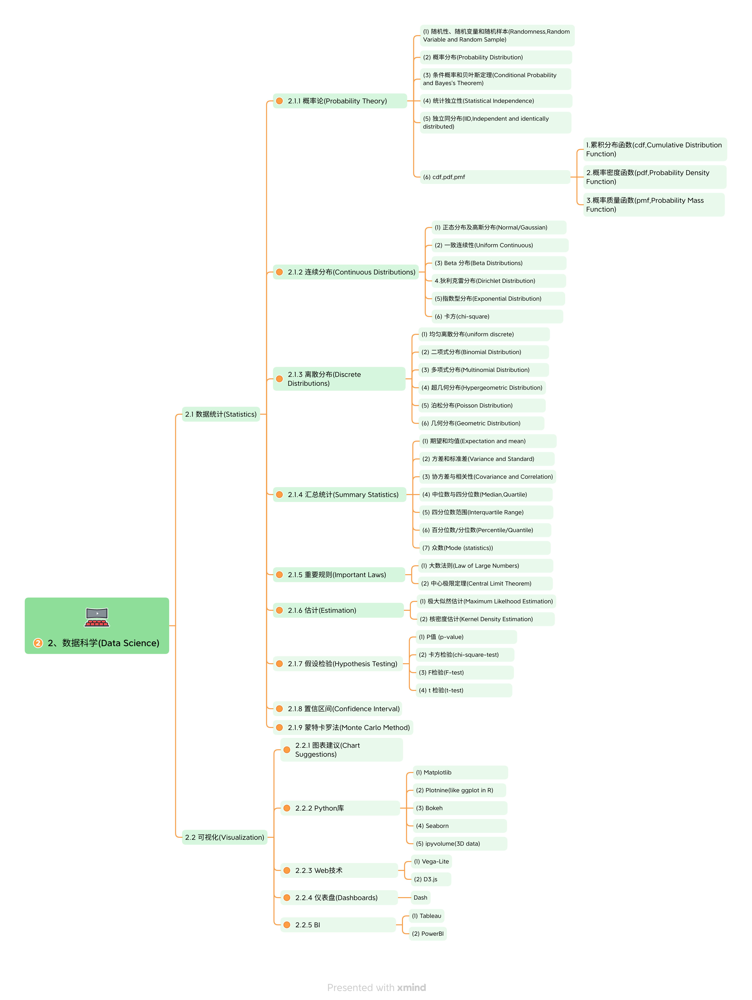
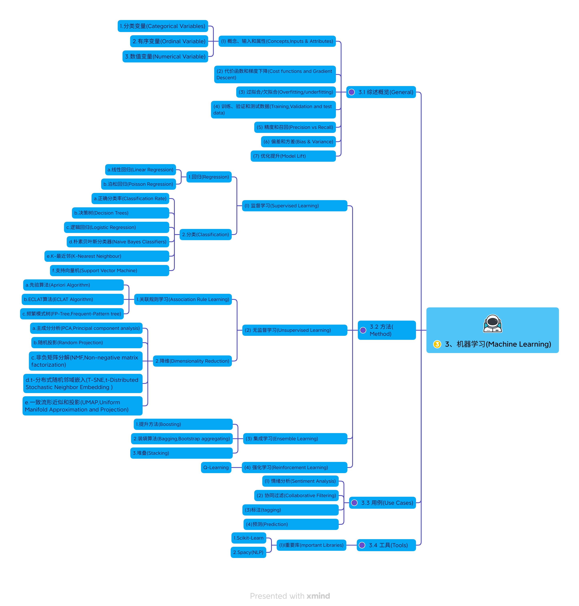
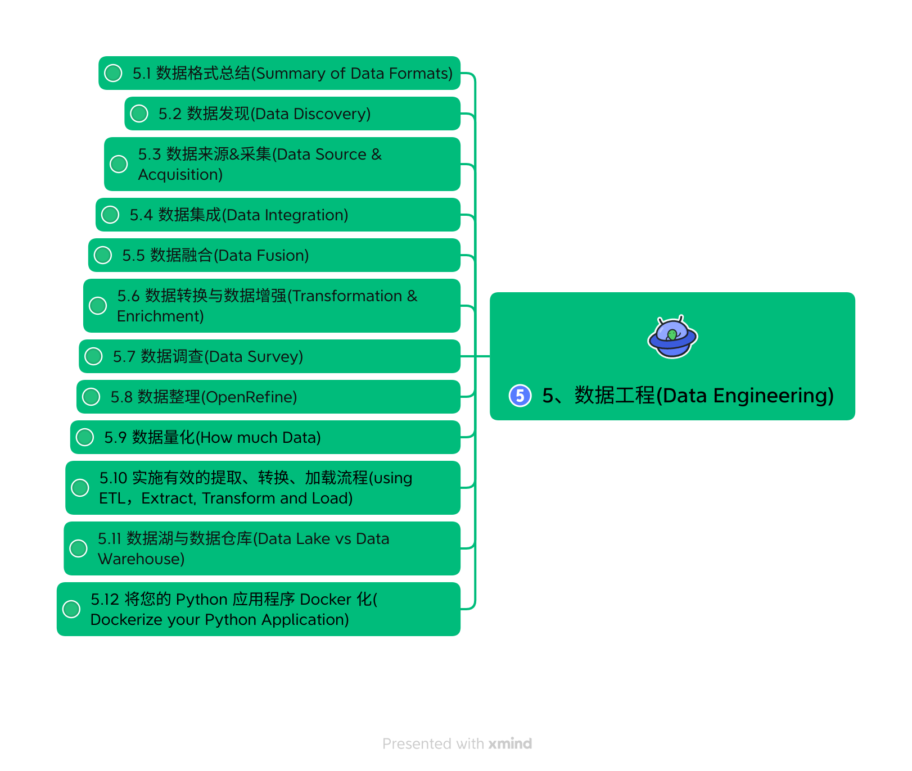

# awesome-road-map

awesome road map

[English](README.md) | [简体中文](README.zh-CN.md)

---

   
       

# 列表

- [在线阅读](https://github.com/isLinXu/awesome-road-map#Read-online)
- 路线图
  - [微软](https://github.com/isLinXu/awesome-road-map#Microsoft)
  - [Meta](https://github.com/isLinXu/awesome-road-map#Meta)
  - [英特尔](https://github.com/isLinXu/awesome-road-map#Intel)
  - [谷歌](https://github.com/isLinXu/awesome-road-map#Google)
  - [苹果](https://github.com/isLinXu/awesome-road-map#Apple)
  - [亚马逊](https://github.com/isLinXu/awesome-road-map#Amazon)
  - [英伟达](https://github.com/isLinXu/awesome-road-map#NVIDIA)
  - [Kaggle](https://github.com/isLinXu/awesome-road-map#Kaggle)
  - [HUAWEI-Cloud](https://github.com/isLinXu/awesome-road-map#HUAWEI-Cloud)
  - [华为-Mindspore](https://github.com/isLinXu/awesome-road-map#HUAWEI-Mindspore)
  - [百度-PaddlePaddle](https://github.com/isLinXu/awesome-road-map#Baidu-PaddlePaddle)
  - [百度技术](https://github.com/isLinXu/awesome-road-map#Baidu-Bit)
  - [Alibaba-TianChi](https://github.com/isLinXu/awesome-road-map#Alibaba-TianChi)
  - [腾讯云](https://github.com/isLinXu/awesome-road-map#Alibaba-TianChi)
  - [慕课](https://github.com/isLinXu/awesome-road-map#Mooc)
  - [启智社区](https://github.com/isLinXu/awesome-road-map#OpenL)

# 在线阅读

- [https://islinxu.github.io/awesome-road-map/](https://islinxu.github.io/awesome-road-map/)

# 路线图

- **PDF file**：[pdf](./docs/pdf/Awesome-Road-Map.pdf)

|     |        |    |
| :-----------------------------------: | :--------------------------------------: | :--------------------------------------: |
| [pdf](./docs/pdf/1.Fundamentals.pdf)  |   [pdf](./docs/pdf/2.Data_Science.pdf)   | [pdf](./docs/pdf/3.Machine_Learning.pdf) |
|    |    |            |
| [pdf](./docs/pdf/4.Deep_Learning.pdf) | [pdf](./docs/pdf/5.Data_Engineering.pdf) |     [pdf](./docs/pdf/6.Big_data.pdf)     |

## 微软

------

- https://learn.microsoft.com/zh-cn/
- https://microsoft.github.io/ai-edu/
- https://microsoft.github.io/ML-For-Beginners/#/
- https://www.coursera.org/learn/microsoft-azure-machine-learning

| 课号 | 话题                                      | 课程分组                                                     | 学习目标                                                     | 链接课程                                                     | 作者                     |
| ---- | ----------------------------------------- | ------------------------------------------------------------ | ------------------------------------------------------------ | ------------------------------------------------------------ | ------------------------ |
| 01   | 机器学习简介                              | [介绍](https://microsoft.github.io/ML-For-Beginners/#/1-Introduction/README) | 了解机器学习背后的基本概念                                   | [课程](https://microsoft.github.io/ML-For-Beginners/#/1-Introduction/1-intro-to-ML/README) | 穆罕默德                 |
| 02   | 机器学习的历史                            | [介绍](https://microsoft.github.io/ML-For-Beginners/#/1-Introduction/README) | 了解该领域的历史                                             | [课程](https://microsoft.github.io/ML-For-Beginners/#/1-Introduction/2-history-of-ML/README) | 珍和艾米                 |
| 03   | 公平与机器学习                            | [介绍](https://microsoft.github.io/ML-For-Beginners/#/1-Introduction/README) | 学生在构建和应用机器学习模型时应该考虑哪些关于公平的重要哲学问题？ | [课程](https://microsoft.github.io/ML-For-Beginners/#/1-Introduction/3-fairness/README) | 友美                     |
| 04   | 机器学习技术                              | [介绍](https://microsoft.github.io/ML-For-Beginners/#/1-Introduction/README) | 机器学习研究人员使用哪些技术来构建机器学习模型？             | [课程](https://microsoft.github.io/ML-For-Beginners/#/1-Introduction/4-techniques-of-ML/README) | 克里斯和珍               |
| 05   | 回归简介                                  | [回归](https://microsoft.github.io/ML-For-Beginners/#/2-Regression/README) | 开始使用 Python 和 Scikit-learn 构建回归模型                 | [Python ](https://microsoft.github.io/ML-For-Beginners/#/2-Regression/1-Tools/README)[R](https://microsoft.github.io/ML-For-Beginners/#/2-Regression/1-Tools/solution/R/lesson_1-R.ipynb) | 詹埃里克·万贾            |
| 06   | 北美南瓜价格🎃                             | [回归](https://microsoft.github.io/ML-For-Beginners/#/2-Regression/README) | 可视化和清理数据，为机器学习做好准备                         | [Python ](https://microsoft.github.io/ML-For-Beginners/#/2-Regression/2-Data/README)[R](https://microsoft.github.io/ML-For-Beginners/#/2-Regression/2-Data/solution/R/lesson_2-R.ipynb) | 詹埃里克·万贾            |
| 07   | 北美南瓜价格🎃                             | [回归](https://microsoft.github.io/ML-For-Beginners/#/2-Regression/README) | 建立线性和多项式回归模型                                     | [Python ](https://microsoft.github.io/ML-For-Beginners/#/2-Regression/3-Linear/README)[R](https://microsoft.github.io/ML-For-Beginners/#/2-Regression/3-Linear/solution/R/lesson_3-R.ipynb) | 珍和德米特里·埃里克·万贾 |
| 08   | 北美南瓜价格🎃                             | [回归](https://microsoft.github.io/ML-For-Beginners/#/2-Regression/README) | 构建逻辑回归模型                                             | [Python ](https://microsoft.github.io/ML-For-Beginners/#/2-Regression/4-Logistic/README)[R](https://microsoft.github.io/ML-For-Beginners/#/2-Regression/4-Logistic/solution/R/lesson_4-R.ipynb) | 詹埃里克·万贾            |
| 09   | 网络应用程序🔌                             | [网页应用程序](https://microsoft.github.io/ML-For-Beginners/#/3-Web-App/README) | 构建一个网络应用程序来使用您训练过的模型                     | [Python](https://microsoft.github.io/ML-For-Beginners/#/3-Web-App/1-Web-App/README) | 只是                     |
| 10   | 分类简介                                  | [分类](https://microsoft.github.io/ML-For-Beginners/#/4-Classification/README) | 清理、准备和可视化您的数据；分类简介                         | [Python ](https://microsoft.github.io/ML-For-Beginners/#/4-Classification/1-Introduction/README)[R](https://microsoft.github.io/ML-For-Beginners/#/4-Classification/1-Introduction/solution/R/lesson_10-R.ipynb) | Jen 和 CassieEric Wanjau |
| 11   | 美味的亚洲和印度美食🍜                     | [分类](https://microsoft.github.io/ML-For-Beginners/#/4-Classification/README) | 分类器简介                                                   | [Python ](https://microsoft.github.io/ML-For-Beginners/#/4-Classification/2-Classifiers-1/README)[R](https://microsoft.github.io/ML-For-Beginners/#/4-Classification/2-Classifiers-1/solution/R/lesson_11-R.ipynb) | Jen 和 CassieEric Wanjau |
| 12   | 美味的亚洲和印度美食🍜                     | [分类](https://microsoft.github.io/ML-For-Beginners/#/4-Classification/README) | 更多分类器                                                   | [Python ](https://microsoft.github.io/ML-For-Beginners/#/4-Classification/3-Classifiers-2/README)[R](https://microsoft.github.io/ML-For-Beginners/#/4-Classification/3-Classifiers-2/solution/R/lesson_12-R.ipynb) | Jen 和 CassieEric Wanjau |
| 13   | 美味的亚洲和印度美食🍜                     | [分类](https://microsoft.github.io/ML-For-Beginners/#/4-Classification/README) | 使用您的模型构建推荐网络应用程序                             | [Python](https://microsoft.github.io/ML-For-Beginners/#/4-Classification/4-Applied/README) | 只是                     |
| 14   | 聚类简介                                  | [聚类](https://microsoft.github.io/ML-For-Beginners/#/5-Clustering/README) | 清理、准备和可视化您的数据；聚类简介                         | [Python ](https://microsoft.github.io/ML-For-Beginners/#/5-Clustering/1-Visualize/README)[R](https://microsoft.github.io/ML-For-Beginners/#/5-Clustering/1-Visualize/solution/R/lesson_14-R.ipynb) | 詹埃里克·万贾            |
| 15   | 探索尼日利亚音乐品味🎧                     | [聚类](https://microsoft.github.io/ML-For-Beginners/#/5-Clustering/README) | 探索K-Means聚类方法                                          | [Python ](https://microsoft.github.io/ML-For-Beginners/#/5-Clustering/2-K-Means/README)[R](https://microsoft.github.io/ML-For-Beginners/#/5-Clustering/2-K-Means/solution/R/lesson_15-R.ipynb) | 詹埃里克·万贾            |
| 16   | 自然语言处理简介☕️                         | [自然语言处理](https://microsoft.github.io/ML-For-Beginners/#/6-NLP/README) | 通过构建简单的机器人来了解 NLP 的基础知识                    | [Python](https://microsoft.github.io/ML-For-Beginners/#/6-NLP/1-Introduction-to-NLP/README) | 斯蒂芬                   |
| 17   | 常见的 NLP 任务 ☕️                         | [自然语言处理](https://microsoft.github.io/ML-For-Beginners/#/6-NLP/README) | 通过了解处理语言结构时所需的常见任务来加深您的 NLP 知识      | [Python](https://microsoft.github.io/ML-For-Beginners/#/6-NLP/2-Tasks/README) | 斯蒂芬                   |
| 18   | 翻译和情感分析♥️                           | [自然语言处理](https://microsoft.github.io/ML-For-Beginners/#/6-NLP/README) | 简·奥斯汀的翻译和情感分析                                    | [Python](https://microsoft.github.io/ML-For-Beginners/#/6-NLP/3-Translation-Sentiment/README) | 斯蒂芬                   |
| 19   | 欧洲浪漫酒店♥️                             | [自然语言处理](https://microsoft.github.io/ML-For-Beginners/#/6-NLP/README) | 酒店评论的情感分析 1                                         | [Python](https://microsoft.github.io/ML-For-Beginners/#/6-NLP/4-Hotel-Reviews-1/README) | 斯蒂芬                   |
| 20   | 欧洲浪漫酒店♥️                             | [自然语言处理](https://microsoft.github.io/ML-For-Beginners/#/6-NLP/README) | 酒店评论的情感分析 2                                         | [Python](https://microsoft.github.io/ML-For-Beginners/#/6-NLP/5-Hotel-Reviews-2/README) | 斯蒂芬                   |
| 21   | 时间序列预测简介                          | [时间序列](https://microsoft.github.io/ML-For-Beginners/#/7-TimeSeries/README) | 时间序列预测简介                                             | [Python](https://microsoft.github.io/ML-For-Beginners/#/7-TimeSeries/1-Introduction/README) | 弗朗西斯卡               |
| 22   | ⚡️世界用电量⚡️- 使用 ARIMA 进行时间序列预测 | [时间序列](https://microsoft.github.io/ML-For-Beginners/#/7-TimeSeries/README) | 使用 ARIMA 进行时间序列预测                                  | [Python](https://microsoft.github.io/ML-For-Beginners/#/7-TimeSeries/2-ARIMA/README) | 弗朗西斯卡               |
| 23   | ⚡️世界用电量⚡️- 使用SVR进行时间序列预测     | [时间序列](https://microsoft.github.io/ML-For-Beginners/#/7-TimeSeries/README) | 使用支持向量回归器进行时间序列预测                           | [Python](https://microsoft.github.io/ML-For-Beginners/#/7-TimeSeries/3-SVR/README) | 阿尼班                   |
| 24   | 强化学习简介                              | [强化学习](https://microsoft.github.io/ML-For-Beginners/#/8-Reinforcement/README) | Q-Learning 强化学习简介                                      | [Python](https://microsoft.github.io/ML-For-Beginners/#/8-Reinforcement/1-QLearning/README) | 德米特里                 |
| 25   | 帮助彼得躲避狼！🐺                         | [强化学习](https://microsoft.github.io/ML-For-Beginners/#/8-Reinforcement/README) | 强化学习健身房                                               | [Python](https://microsoft.github.io/ML-For-Beginners/#/8-Reinforcement/2-Gym/README) | 德米特里                 |
| 后记 | 真实世界的机器学习场景和应用              | [机器学习](https://microsoft.github.io/ML-For-Beginners/#/9-Real-World/README) | 经典机器学习的有趣且富有启发性的现实应用                     | [课程](https://microsoft.github.io/ML-For-Beginners/#/9-Real-World/1-Applications/README) | 团队                     |

## Meta

---

- https://research.facebook.com/blog/

- https://research.facebook.com/blog/2018/05/the-facebook-field-guide-to-machine-learning-video-series/

- https://www.youtube.com/@FacebookAI

## 英特尔

- https://www.intel.cn/content/www/cn/zh/developer/topic-technology/artificial-intelligence/overview.html
- https://www.intel.com/content/www/us/en/developer/learn/course-machine-learning.html
- https://github.com/dohahelmy/resources-intel-edge-ai-scholarship-2020

**通过英特尔® AI 学院为软件开发人员、数据科学家和学生提供的免费课程，学习 AI 理论并进行实践练习。这些课程涵盖人工智能主题，并探索在个人计算机和服务器工作站中利用英特尔® 处理器的工具和优化库。** 从人工智能基础知识到人工智能技术理论的研究生水平主题，这些课程解释了人工智能背后的直觉和数学。

### 1. 机器学习

概述现代英特尔® 架构上的机器学习基础知识。（12 周） [开始使用](https://software.intel.com/content/www/us/en/develop/training/course-machine-learning.html)

### 2.深度学习

了解现代英特尔架构上深度学习的基本技术和基础。（12 周） [开始使用](https://software.intel.com/content/www/us/en/develop/training/course-deep-learning.html)

### 3. 人工智能简介

在这门入门课程中探索人工智能的基础知识——无需数学知识。（8 周） [开始使用](https://software.intel.com/content/www/us/en/develop/training/course-artificial-intelligence.html)

## 谷歌

------

- https://developers.google.com/machine-learning/crash-course?hl=zh-cn

- https://www.tensorflow.org/resources/learn-ml?hl=zh-cn

  

## 苹果

------

- https://developer.apple.com/machine-learning/
- https://developer.apple.com/learn/curriculum/

## 亚马逊

------

- https://aws.amazon.com/cn/training/learn-about/machine-learning/
- https://solutionsreview.com/business-intelligence/the-best-aws-machine-learning-courses/

## 英伟达

------

https://www.nvidia.com/en-us/training/online/

## 卡格尔

------

- https://www.kaggle.com/general/217218
- https://www.kaggle.com/learn

| 在一个 |                                                              | 课程                                                         | 描述                                                      | 其他 |
| ------ | ------------------------------------------------------------ | ------------------------------------------------------------ | --------------------------------------------------------- | ---- |
| 1      |  | [编程入门](https://www.kaggle.com/learn/intro-to-programming) | 如果您没有编码经验，请开始使用 Python。                   |      |
| 2      |  | [Python](https://www.kaggle.com/learn/python)                | 学习数据科学最重要的语言。                                |      |
| 3      |  | [机器学习简介](https://www.kaggle.com/learn/intro-to-machine-learning) | 了解机器学习中的核心思想，并构建您的第一个模型。          |      |
| 4      |  | [熊猫](https://www.kaggle.com/learn/pandas)                  | 解决简短的实践挑战，以完善您的数据操作技能。              |      |
| 5      |  | [中级机器学习](https://www.kaggle.com/learn/intermediate-machine-learning) | 处理缺失值、非数字值、数据泄漏等。                        |      |
| 6      |  | [数据可视化](https://www.kaggle.com/learn/data-visualization) | 制作出色的数据可视化。这是了解编码力量的好方法！          |      |
| 7      |  | [特征工程](https://www.kaggle.com/learn/feature-engineering) | 更好的功能可以打造更好的模型。了解如何充分利用您的数据。  |      |
| 8      |  | [SQL 简介](https://www.kaggle.com/learn/intro-to-sql)        | 使用 Google BigQuery 了解用于处理数据库的 SQL。           |      |
| 9      |  | [高级SQL](https://www.kaggle.com/learn/advanced-sql)         | 将您的 SQL 技能提升到一个新的水平。                       |      |
| 10     |  | [深度学习简介](https://www.kaggle.com/learn/intro-to-deep-learning) | 使用 TensorFlow 和 Keras 构建和训练结构化数据的神经网络。 |      |
| 11     |  | [计算机视觉](https://www.kaggle.com/learn/computer-vision)   | 使用 TensorFlow 和 Keras 构建卷积神经网络。               |      |
| 12     |  | [时间序列](https://www.kaggle.com/learn/time-series)         | 将机器学习应用于现实世界的预测任务。                      |      |
| 13     |  | [数据清理](https://www.kaggle.com/learn/data-cleaning)       | 掌握有效的工作流程来清理现实世界中的混乱数据。            |      |
| 14     |  | [人工智能伦理简介](https://www.kaggle.com/learn/intro-to-ai-ethics) | 探索指导人工智能系统道德设计的实用工具。                  |      |
| 15     |  | [地理空间分析](https://www.kaggle.com/learn/geospatial-analysis) | 创建交互式地图并发现地理空间数据中的模式。                |      |
| 16     |  | [机器学习的可解释性](https://www.kaggle.com/learn/machine-learning-explainability) | 从任何模型中提取人类可以理解的见解。                      |      |
| 17     |  | [游戏人工智能和强化学习简介](https://www.kaggle.com/learn/intro-to-game-ai-and-reinforcement-learning) | 使用经典和前沿算法构建您自己的视频游戏机器人。            |      |

