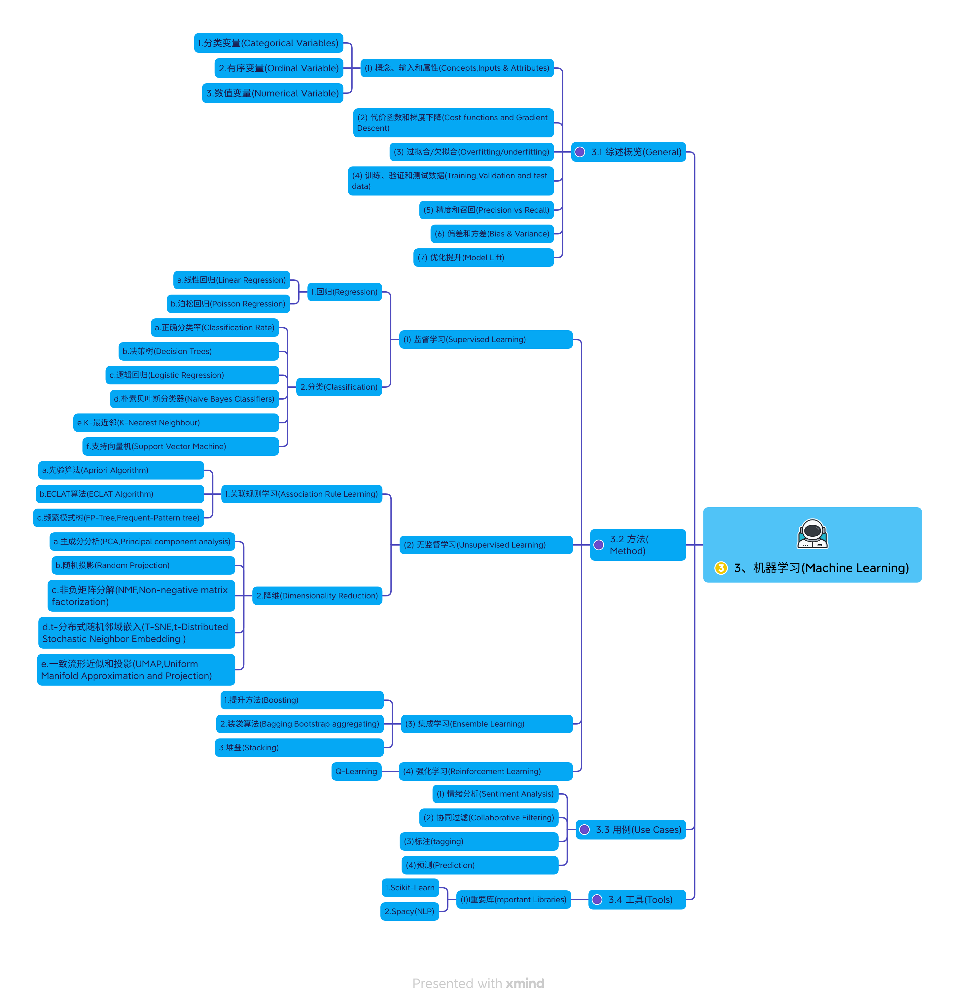

# 3.Machine Learning

---

---

# 3、机器学习(Machine Learning)

## 3.1 综述概览(General)

### (1) 概念、输入和属性(Concepts,Inputs & Attributes)

#### 1.分类变量(Categorical Variables)

#### 2.有序变量(Ordinal Variable)

#### 3.数值变量(Numerical Variable)

### (2) 代价函数和梯度下降(Cost functions and Gradient Descent)

### (3) 过拟合/欠拟合(Overfitting/underfitting)

### (4) 训练、验证和测试数据(Training,Validation and test data)

### (5) 精度和召回(Precision vs Recall)

### (6) 偏差和方差(Bias & Variance)

### (7) 优化提升(Model Lift)

## 3.2 方法(Method)

### (1) 监督学习(Supervised Learning)

#### 1.回归(Regression)

#### a.线性回归(Linear Regression)

#### b.泊松回归(Poisson Regression)

#### 2.分类(Classification)

#### a.正确分类率(Classification Rate)

#### b.决策树(Decision Trees)

#### c.逻辑回归(Logistic Regression)

#### d.朴素贝叶斯分类器(Naive Bayes Classifiers)

#### e.K-最近邻(K-Nearest Neighbour)

#### f.支持向量机(Support Vector Machine)

### (2) 无监督学习(Unsupervised Learning)

#### 1.关联规则学习(Association Rule Learning)

#### a.先验算法(Apriori Algorithm)

#### b.ECLAT算法(ECLAT Algorithm)

#### c.频繁模式树(FP-Tree,Frequent-Pattern tree)

#### 2.降维(Dimensionality Reduction)

#### a.主成分分析(PCA,Principal component analysis)

#### b.随机投影(Random Projection)

#### c.非负矩阵分解(NMF,Non-negative matrix factorization)

#### d.t-分布式随机邻域嵌入(T-SNE,t-Distributed Stochastic Neighbor Embedding )

#### e.一致流形近似和投影(UMAP,Uniform Manifold Approximation and Projection)

### (3) 集成学习(Ensemble Learning)

#### 1.提升方法(Boosting)

#### 2.装袋算法(Bagging,Bootstrap aggregating)

#### 3.堆叠(Stacking)

#### (4) 强化学习(Reinforcement Learning)

#### Q-Learning

## 3.3 用例(Use Cases)

### (1) 情绪分析(Sentiment Analysis)

### (2) 协同过滤(Collaborative Filtering)

### (3)标注(tagging)

### (4)预测(Prediction)

## 3.4 工具(Tools)

### (1)I重要库(mportant Libraries)

#### 1.Scikit-Learn

#### 2.Spacy(NLP)
