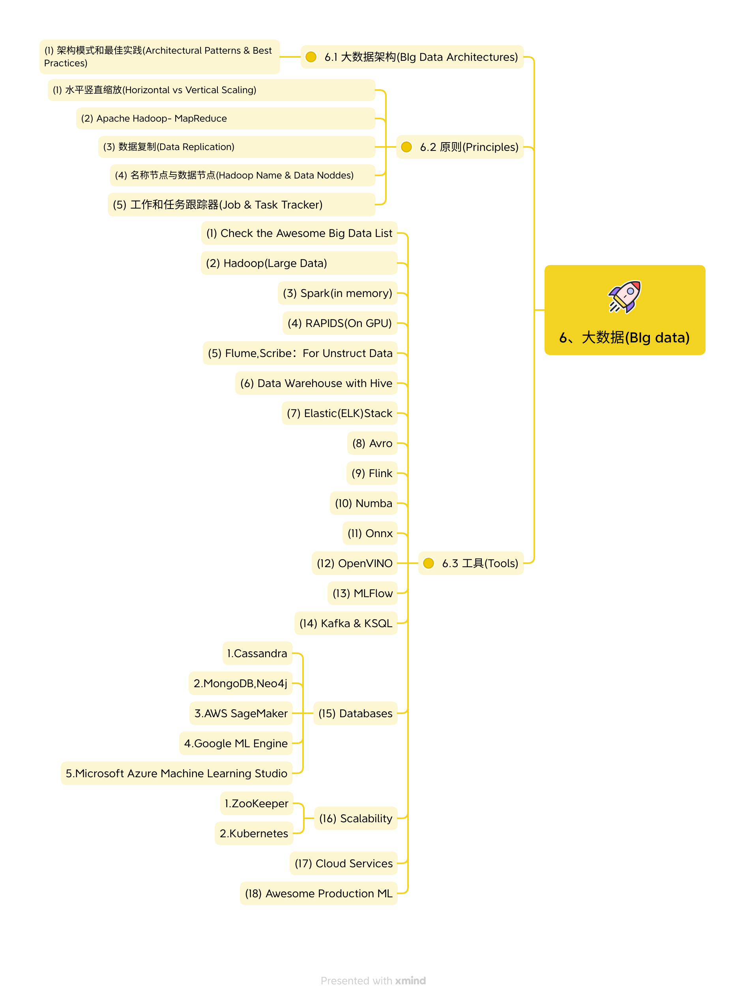

# 6.Big Data

---

---

# 6、大数据(BIg data)

## 6.1 大数据架构(BIg Data Architectures)

### (1) 架构模式和最佳实践(Architectural Patterns & Best Practices)

## 6.2 原则(Principles)

### (1) 水平竖直缩放(Horizontal vs Vertical Scaling)

#### (2) Apache Hadoop- MapReduce

#### (3) 数据复制(Data Replication)

#### (4) 名称节点与数据节点(Hadoop Name & Data Noddes)

#### (5) 工作和任务跟踪器(Job & Task Tracker)

## 6.3 工具(Tools)

### (1) Check the Awesome Big Data List

### (2) Hadoop(Large Data)

### (3) Spark(in memory)

### (4) RAPIDS(On GPU)

### (5) Flume,Scribe：For Unstruct Data

### (6) Data Warehouse with Hive

### (7) Elastic(ELK)Stack

### (8) Avro

### (9) Flink

### (10) Numba

### (11) Onnx

### (12) OpenVINO

### (13) MLFlow

### (14) Kafka & KSQL

### (15) Databases

#### 1.Cassandra

#### 2.MongoDB,Neo4j

#### 3.AWS SageMaker

#### 4.Google ML Engine

#### 5.Microsoft Azure Machine Learning Studio

### (16) Scalability

#### 1.ZooKeeper

#### 2.Kubernetes

### (17) Cloud Services

### (18) Awesome Production ML
